---
## Front matter
lang: ru-RU
title: Презентация по лабораторной работе №1
subtitle: Введение в Mininet
author:
  - Танрибергенов Э.
institute:
  - Российский университет дружбы народов, Москва, Россия
date: 2026 г.

## i18n babel
babel-lang: russian
babel-otherlangs: english
## Fonts
mainfont: IBM Plex Serif
romanfont: IBM Plex Serif
sansfont: IBM Plex Sans
monofont: IBM Plex Mono
mathfont: STIX Two Math
mainfontoptions: Ligatures=Common,Ligatures=TeX,Scale=0.94
romanfontoptions: Ligatures=Common,Ligatures=TeX,Scale=0.94
sansfontoptions: Ligatures=Common,Ligatures=TeX,Scale=MatchLowercase,Scale=0.94
monofontoptions: Scale=MatchLowercase,Scale=0.94,FakeStretch=0.9
## Formatting pdf
toc: false
toc-title: Содержание
slide_level: 2
aspectratio: 169
section-titles: true
theme: metropolis
header-includes:
 - \metroset{progressbar=frametitle,sectionpage=progressbar,numbering=fraction}
---

# Информация

## Докладчик

  - Танрибергенов Эльдар
  - студент 4 курса из группы НПИбд-01-22
  - ФМиЕН, кафедра прикладной информатики и теории вероятностей
  - Российский университет дружбы народов


# Цели и задачи

## Цель работы

 Основной целью работы является развёртывание в системе виртуализации (например, в VirtualBox) mininet, знакомство с основными командами для работы с Mininet через командную строку и через графический интерфейс.


## Задачи

- Настроить стенд виртуальной машины Mininet
- Испытать основы работы в Mininet


# Результаты

## Настройка стенда виртуальной машины Mininet

:::::::::::::: {.columns align=center}
::: {.column width="30%"}
- Образ ВМ: mininet-2.3.0-210211-ubuntu-20.04.1-legacy-server-amd64-ovf
- Сетевые адаптеры: адаптер 1 - NAT, адаптер 2 - host-only network adapter (виртуальный адаптер хоста)

:::
::: {.column width="70%"}
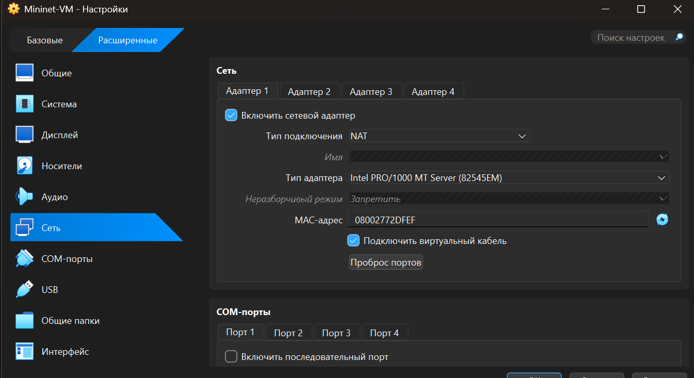{#fig:001 height="40%"}
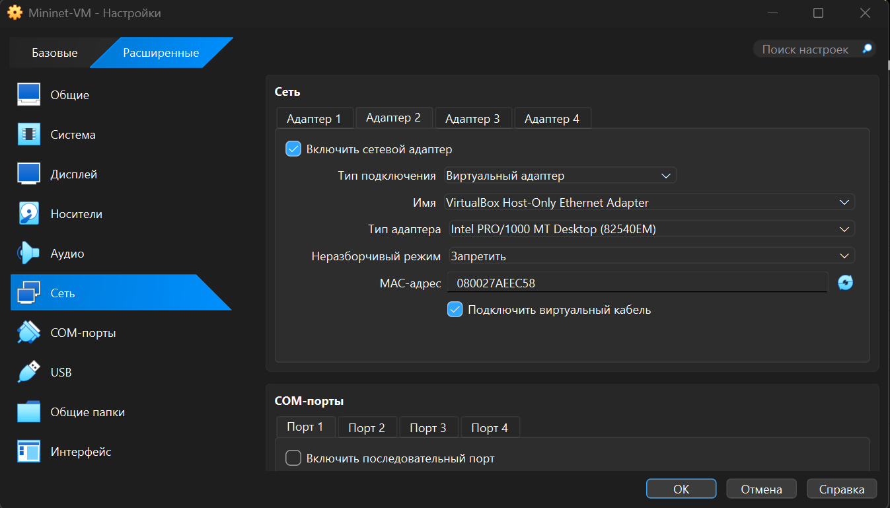{#fig:002 height="40%"}

:::
::::::::::::::

##  Настройка стенда виртуальной машины Mininet

###  Настройка доступа к Интернет

- Добавлено для mininet указание на использование двух адаптеров при запуске.
Для этого перешёл в режим суперпользователя и внёс изменения в файл конфигурации сетевых адаптеров виртуальной машины mininet

- команда:
``` sudo mcedit /etc/netplan/01-netcfg.yaml ```

:::::::::::::: {.columns align=center}
::: {.column width="40%"}
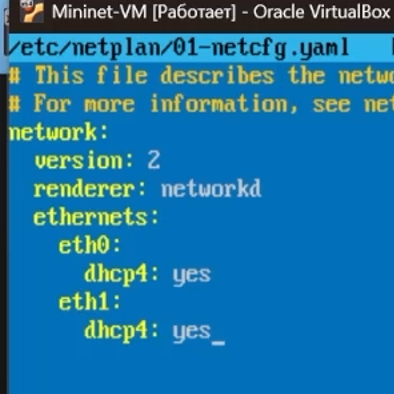{#fig:003 height="40%"}
:::
::::::::::::::

##  Настройка стенда виртуальной машины Mininet

### Настройка соединения X11 для суперпользователя

При попытке запуска приложения из-под суперпользователя возникает ошибка из-за того,
что X-соединение выполняется от имени пользователя mininet, а приложение запускается от имени пользователя root
с использованием sudo. Для исправления этой ситуации заполнил файл полномочий /root/.Xauthority, используя утилиту xauth.
Скопировал значение куки (MIT magic cookie) пользователя mininet в файл для пользователя root

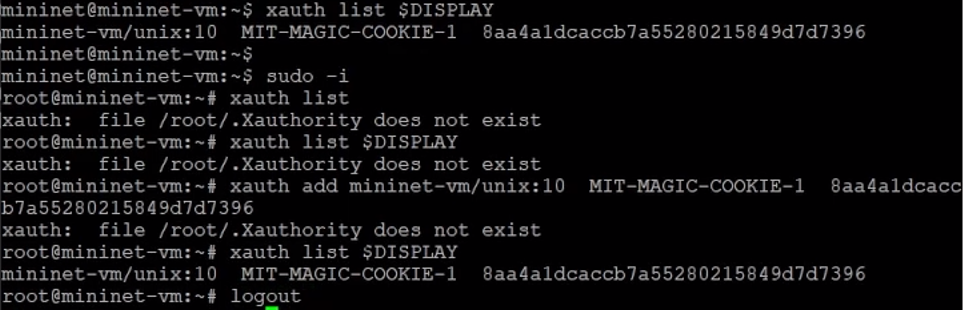{#fig:004 height="40%"}


##  Настройка стенда виртуальной машины Mininet

### Запуск Xserver

- В качестве Xserver был установлен - VcXsrv Windows X Server

:::::::::::::: {.columns align=center}

::: {.column width="40%"}
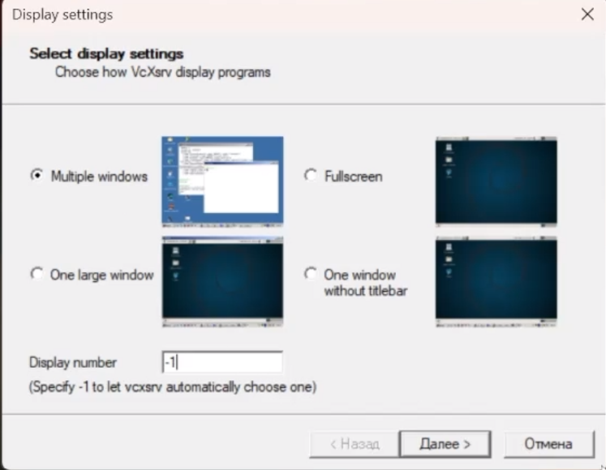{#fig:005}
:::
::: {.column width="40%"}
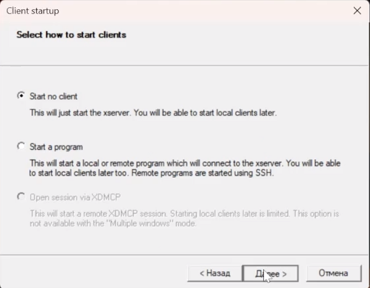{#fig:006}
:::

::::::::::::::

##  Настройка стенда виртуальной машины Mininet

### Подключение к ВМ mininet с ОС Windows при помощи putty

:::::::::::::: {.columns align=center}

::: {.column width="40%"}
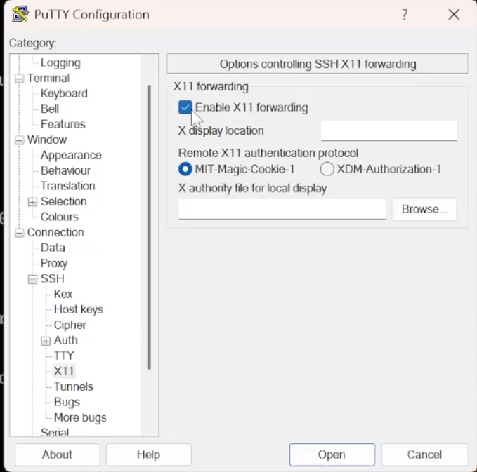{#fig:007}
:::
::: {.column width="40%"}
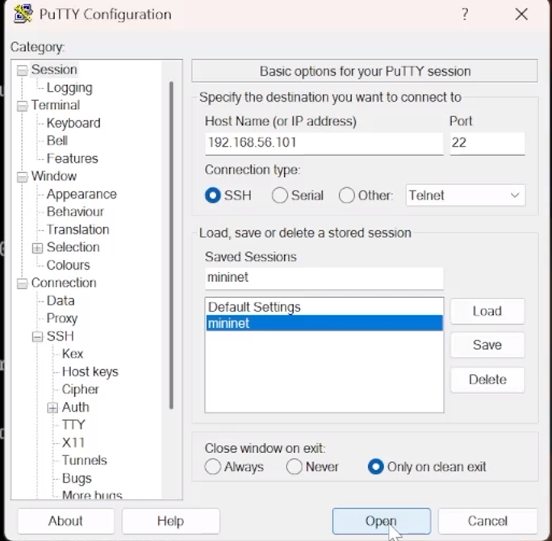{#fig:008}
:::

::::::::::::::


## Основы работы в Mininet

###  Работа с Mininet с помощью командной строки

- Запуск Mininet с минимальной топологией, состоящей из коммутатора, подключённого к двум хостам
- Просмотр доступных узлов и связей

:::::::::::::: {.columns align=center}

::: {.column width="30%"}
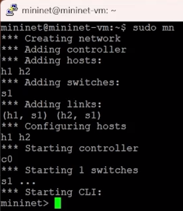{#fig:009 height="30%"}
:::
::: {.column width="30%"}
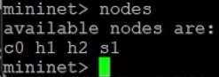{#fig:010}
:::
::: {.column width="30%"}
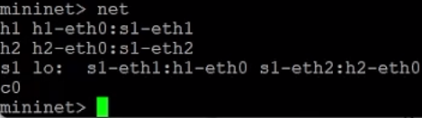{#fig:011}
:::

::::::::::::::

## Основы работы в Mininet

###  Работа с Mininet с помощью командной строки

- Проверка связности

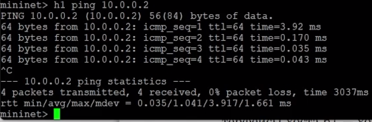{#fig:012}


## Основы работы в Mininet

### Построение и эмуляция сети в Mininet с использованием графического интерфейса

- Приложение с графическим интерфейсом - MiniEdit

``` sudo ~/mininet/mininet/examples/miniedit.py ```

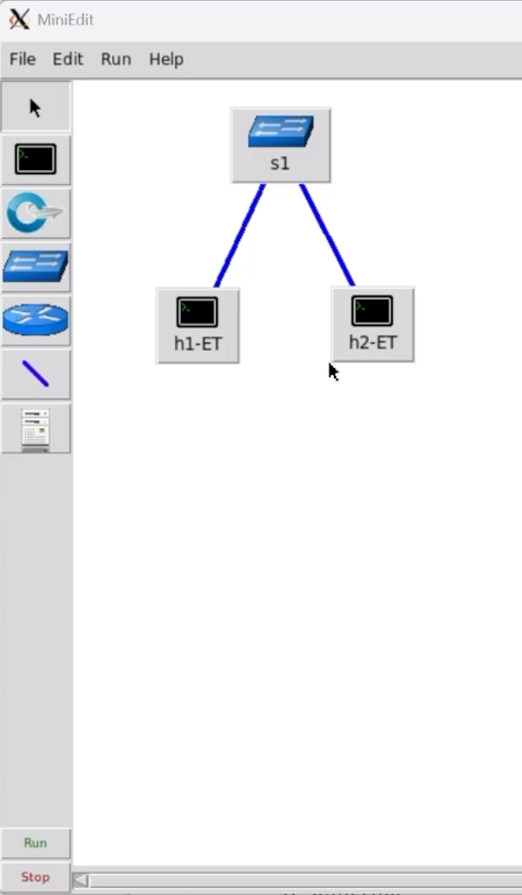{#fig:013 width="50%" height="50%"}


## Основы работы в Mininet

### Проверка связности

:::::::::::::: {.columns align=center}

::: {.column width="40%"}
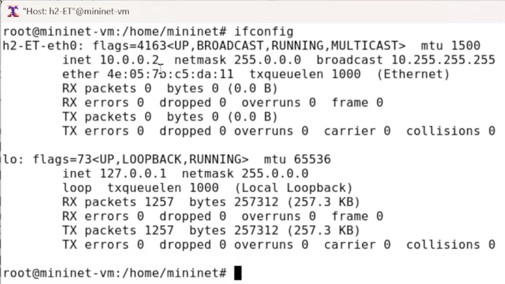{#fig:014}
:::
::: {.column width="40%"}
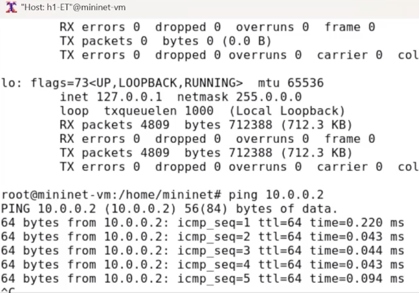{#fig:015}
:::

::::::::::::::


# Выводы
  
## Вывод

 В результате выполнения работы я освоил развёртывание в системе виртуализации VirtualBox mininet, познакомился с основными командами для работы с Mininet через командную строку и через графический интерфейс.