---
## Front matter
title: "Отчёт по лабораторной работе №1"
subtitle: "Дисциплина: Моделирование сетей передачи данных"
author: "Выполнил: Танрибергенов Эльдар (НПИбд-01-22)"

## Generic otions
lang: ru-RU
toc-title: "Содержание"

## Bibliography
bibliography: bib/cite.bib
csl: pandoc/csl/gost-r-7-0-5-2008-numeric.csl

## Pdf output format
toc: true # Table of contents
toc-depth: 2
lof: true # List of figures
lot: true # List of tables
fontsize: 12pt
linestretch: 1.5
papersize: a4
documentclass: scrreprt
## I18n polyglossia
polyglossia-lang:
  name: russian
  options:
	- spelling=modern
	- babelshorthands=true
polyglossia-otherlangs:
  name: english
## I18n babel
babel-lang: russian
babel-otherlangs: english
## Fonts
mainfont: IBM Plex Serif
romanfont: IBM Plex Serif
sansfont: IBM Plex Sans
monofont: IBM Plex Mono
mathfont: STIX Two Math
mainfontoptions: Ligatures=Common,Ligatures=TeX,Scale=0.94
romanfontoptions: Ligatures=Common,Ligatures=TeX,Scale=0.94
sansfontoptions: Ligatures=Common,Ligatures=TeX,Scale=MatchLowercase,Scale=0.94
monofontoptions: Scale=MatchLowercase,Scale=0.94,FakeStretch=0.9
mathfontoptions:
## Biblatex
biblatex: true
biblio-style: "gost-numeric"
biblatexoptions:
  - parentracker=true
  - backend=biber
  - hyperref=auto
  - language=auto
  - autolang=other*
  - citestyle=gost-numeric
## Pandoc-crossref LaTeX customization
figureTitle: "Рис."
tableTitle: "Таблица"
listingTitle: "Листинг"
lofTitle: "Список иллюстраций"
lotTitle: "Список таблиц"
lolTitle: "Листинги"
## Misc options
indent: true
header-includes:
  - \usepackage{indentfirst}
  - \usepackage{float} # keep figures where there are in the text
  - \floatplacement{figure}{H} # keep figures where there are in the text
---

# Цель работы

Основной целью работы является развёртывание в системе виртуализации (например, в VirtualBox) mininet, знакомство с основными командами для работы с Mininet через командную строку и через графический интерфейс.

# Теоретическое введение

Mininet (http://mininet.org/) — это виртуальная среда, которая позволяет разрабатывать и тестировать сетевые инструменты и протоколы. В сетях Mininet работают реальные сетевые приложения Unix/Linux, а также реальное ядро Linux и сетевой стек.

# Выполнение лабораторной работы

**1. Настройка стенда виртуальной машины Mininet**

**1.1. Общая информация**

1.1.1. Репозиторий Mininet: https://github.com/mininet/mininet
1.1.2. Установил рекомендуемый образ виртуальной машины: mininet-2.3.0-210211-ubuntu-20.04.1-legacy-server-amd64-ovf.

**1.2. Настройка образа VirtualBox**
 
1.2.1. Запустил систему виртуализации и импортировал файл .ovf.

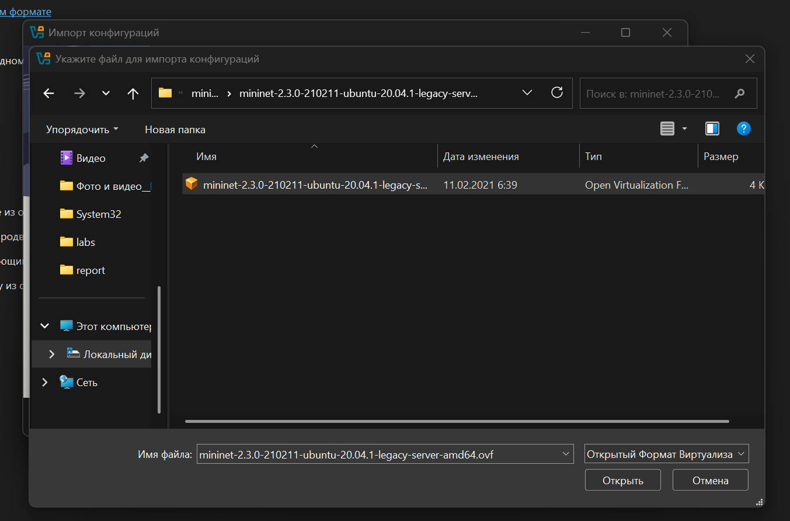{#fig:001}

1.2.2. Перешёл в настройки системы виртуализации и уточнил параметры настройки виртуальной машины. Внизу этого окна есть сообщение об обнаружении неправильных настроек, следуя рекомендациям, внёс исправления: изменил тип графического контроллера.

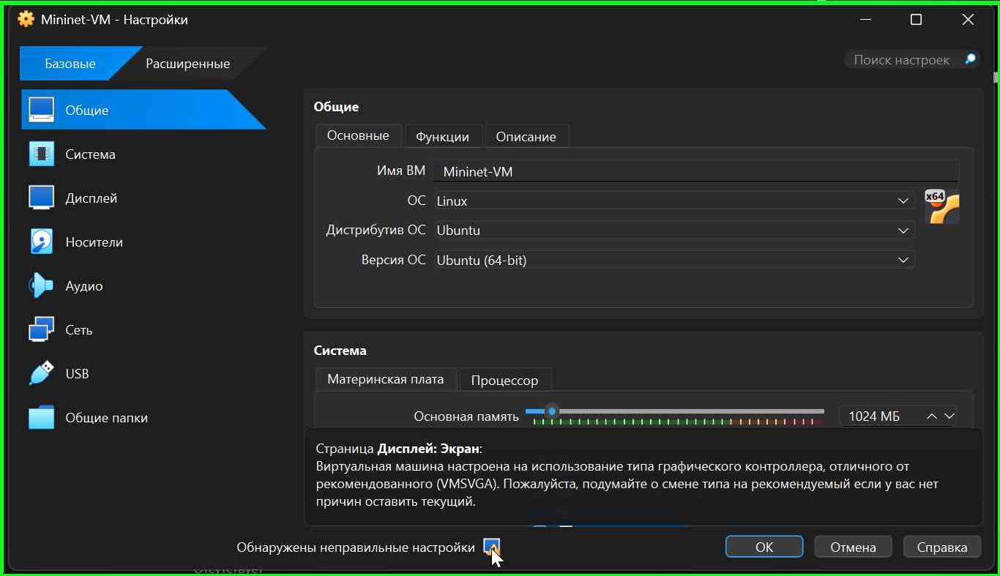{#fig:002}

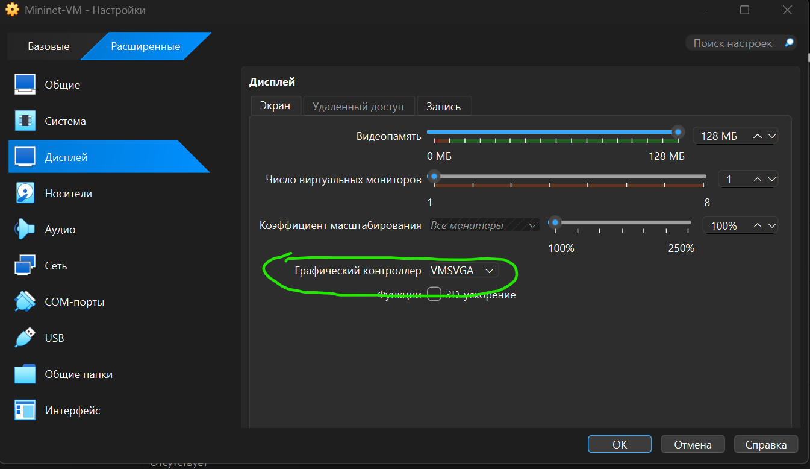{#fig:003}

В настройках сети первый адаптер имеет подключение типа NAT. Для второго адаптера указал тип подключения host-only network adapter
(виртуальный адаптер хоста), который в дальнейшем буду использовать для входа в образ виртуальной машины. В этом режиме адаптер хоста
использует специальное устройство vboxnet0, создает подсеть и назначает IP-адрес сетевой карте гостевой операционной системы.

{#fig:004}

{#fig:005}

**1.3. Подключение к виртуальной машине**

1.3.1. Запустил виртуальную машину с Mininet, залогинился.

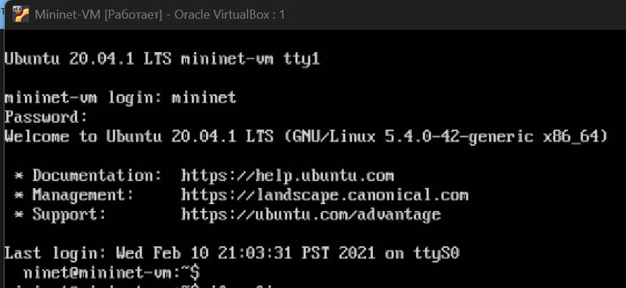{#fig:006}

1.3.2. Посмотрел адрес машины.

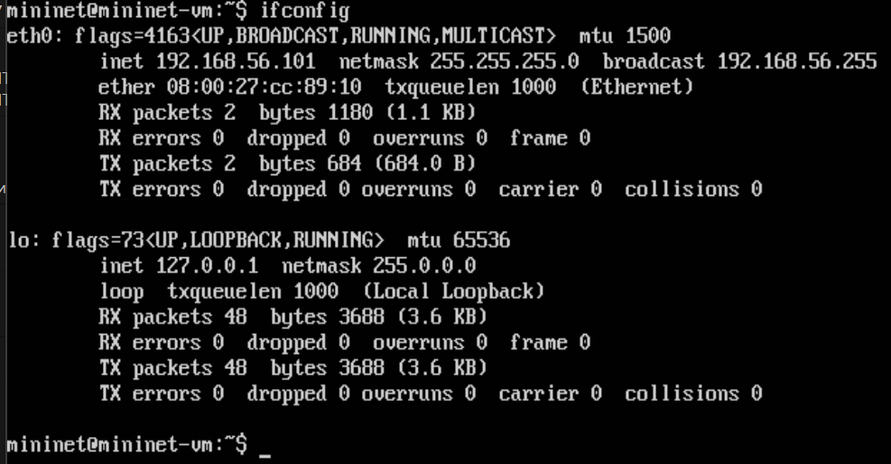{#fig:007}

**1.4. Настройка доступа к Интернету**

1.4.1. Активен только внутренний адрес машины 192.168.56.101, поэтому активировал второй интерфейс для доступа к сети Интернет.

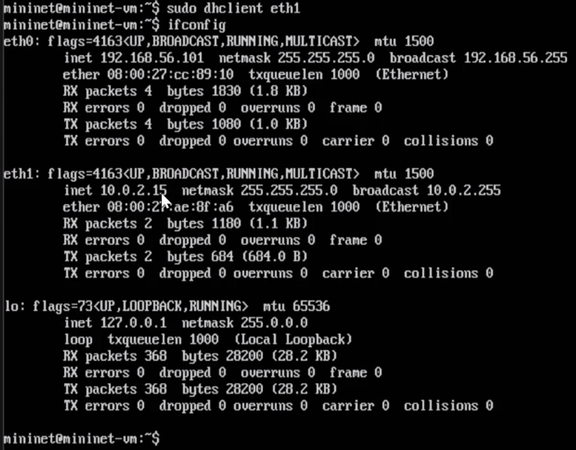{#fig:008}

1.4.2. Для удобства дальнейшей работы установил mc.

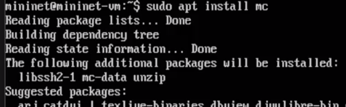{#fig:009}

1.4.3. Для удобства дальнейшей работы добавил для mininet указание на использование двух адаптеров при запуске. Для этого перешёл
в режим суперпользователя и внёс изменения в файл */etc/netplan/01-netcfg.yaml* виртуальной машины mininet.

{#fig:010}

**1.5. Обновление версии Mininet**

1.5.1. В виртуальной машине mininet переименовал предыдущую установку Mininet

{#fig:011}

1.5.2. Скачал новую версию Mininet

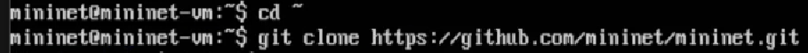{#fig:012}

1.5.3. Обновил исполняемые файлы

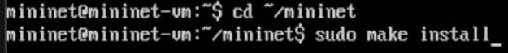{#fig:013}

1.5.4. Проверил номер установленной версии mininet

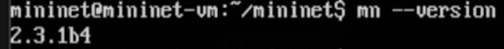{#fig:014}

**1.6. Настройка параметров XTerm**

По умолчанию XTerm использует растровые шрифты малого кегля. Для увеличения размера шрифта и применения векторных шрифтов вместо растровых внёс изменения в файл /etc/X11/app-defaults/XTerm, добавив в конце файла строки. Здесь выбран системный моноширинный шрифт, кегль шрифта — 12 пунктов.

{#fig:015}

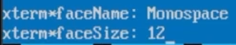{#fig:016}

**1.7. Настройка соединения X11 для суперпользователя**

При попытке запуска приложения из-под суперпользователя возникает ошибка:
X11 connection rejected because of wrong authentication.
Ошибка возникает из-за того, что X-соединение выполняется от имени пользователя mininet, а приложение запускается от имени пользователя root
с использованием sudo. Для исправления этой ситуации необходимо заполнить файл полномочий /root/.Xauthority, используя утилиту xauth.
Скопировал значение куки (MIT magic cookie)1 пользователя mininet в файл для пользователя root:

{#fig:017}

После выполнения этих действий графические приложения запускаются под пользователем mininet.

**1.8. Работа с Mininet из-под Windows**

1.8.1. Установил putty и VcXsrv Windows X Server.

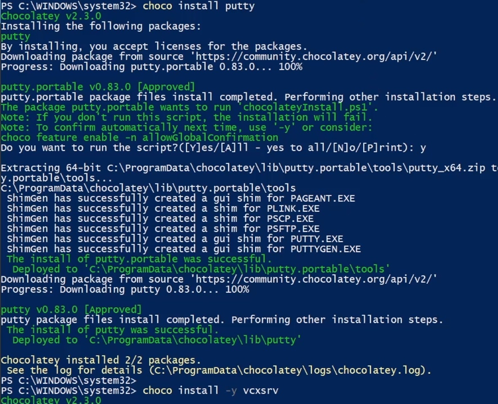{#fig:018}

1.8.2. Запуск Xserver.
– Запустил XLaunch.
– Выбрал опции: Multiple windows; Display number: -1; Start no client.

{#fig:019}

{#fig:020}

1.8.3. Запуск putty. 

{#fig:021}

При подключении добавил опцию перенаправления X11.

{#fig:022}

**2. Основы работы в Mininet**

**2.1. Работа с Mininet с помощью командной строки**

2.1.1. Вызов Mininet с использованием топологии по умолчанию.

{#fig:023}

Эта команда запускает Mininet с минимальной топологией, состоящей из коммутатора, подключённого к двум хостам.

2.1.2. Отображение списка команд интерфейса командной строки Mininet и примеров их использования.

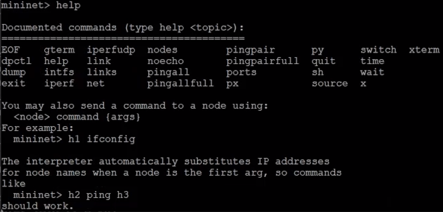{#fig:024}

2.1.3. Отображение доступных узлов.

{#fig:025}

Вывод этой команды показывает, что есть два хоста (хост h1 и хост h2) и коммутатор (s1).

2.1.4. Иногда бывает полезно отобразить связи между устройствами в Mininet, чтобы понять топологию. Просмотрел доступные линки.

{#fig:026}

Вывод этой команды показывает:
– Хост h1 подключён через свой сетевой интерфейс h1-eth0 к коммутатору на интерфейсе s1-eth1.
– Хост h2 подключён через свой сетевой интерфейс h2-eth0 к коммутатору на интерфейсе s1-eth2.
– Коммутатор s1:
– имеет петлевой интерфейс lo.
– подключается к h1-eth0 через интерфейс s1-eth1.
– подключается к h2-eth0 через интерфейс s1-eth2.

2.1.5. Mininet позволяет выполнять команды на конкретном устройстве. Чтобы выполнить команду для определённого узла, сначала указал устройство, а затем команду.

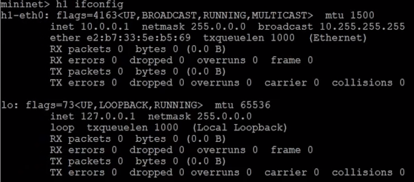{#fig:027}

Эта запись выполняет команду ifconfig на хосте h1 и показывает интерфейсы хоста h1 — хост h1 имеет интерфейс h1-eth0, настроенный
с IP-адресом 10.0.0.1, и другой интерфейс lo, настроенный с IP-адресом 127.0.0.1.

2.1.6. Посмотрел конфигурацию всех узлов. Хост h2 имеет интерфейс h2-eth0, настроенный
с IP-адресом 10.0.0.2, и другой интерфейс lo, настроенный с IP-адресом 127.0.0.1.

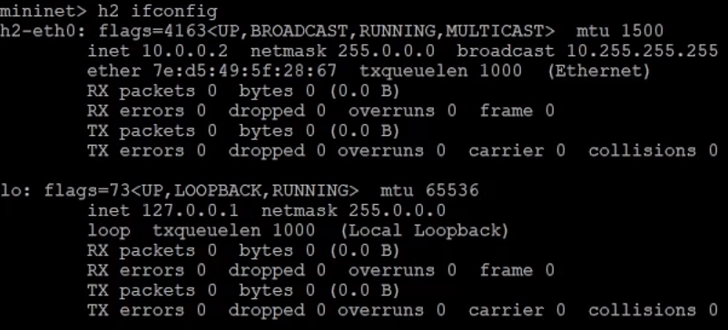{#fig:028}

2.1.7. Проверка связности.

По умолчанию узлам h1 и h2 назначаются IP-адреса 10.0.0.1/8 и 10.0.0.2/8 соответственно. Чтобы проверить связь между ними, использовал команду ping. Команда ping работает, отправляя сообщения
эхо-запроса протокола управляющих сообщений Интернета (ICMP) на удалённый компьютер и ожидая ответа.

{#fig:029}

Команда проверяет соединение между хостами h1 и h2.

2.1.8. Остановка эмуляции.

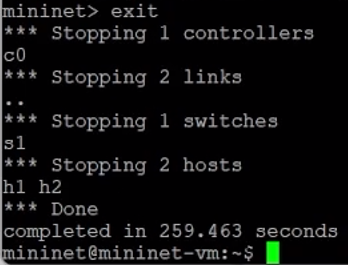{#fig:030}

Команда sudo mn -c часто используется в терминале для очистки предыдущего экземпляра Mininet (например, после сбоя).

**2.2. Построение и эмуляция сети в Mininet с использованием графического интерфейса**

2.2.1. Построение топологии сети.
– В терминале виртуальной машины mininet запустил MiniEdit:

{#fig:031}

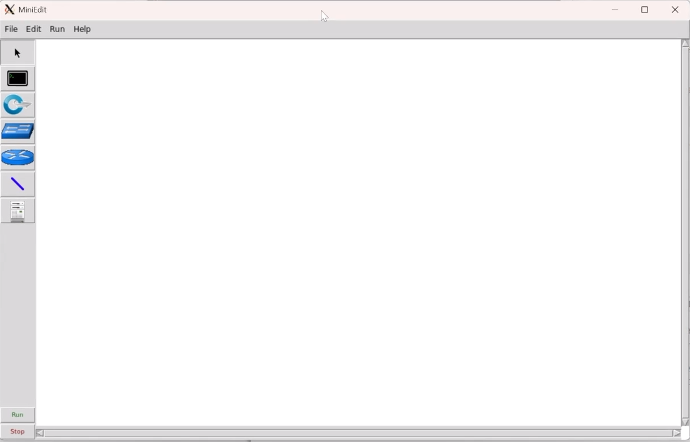{#fig:032}

Основные кнопки:
– Select: позволяет выбирать/перемещать устройства.
– Host: позволяет добавить новый хост в топологию.
– Switch: позволяет добавить в топологию новый коммутатор.
– Link: соединяет устройства в топологии.
– Run: запускает эмуляцию.
– Stop: останавливает эмуляцию.

– Добавил два хоста и один коммутатор, соединил хосты с коммутатором.

{#fig:033}

– Настроил IP-адреса на хостах h1 и h2. Для хоста h1 указал IP-адрес 10.0.0.1/8, а для хоста h2 — 10.0.0.2/8.

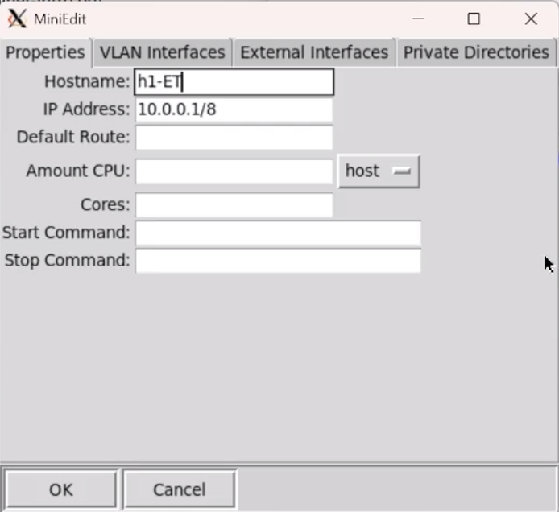{#fig:034}

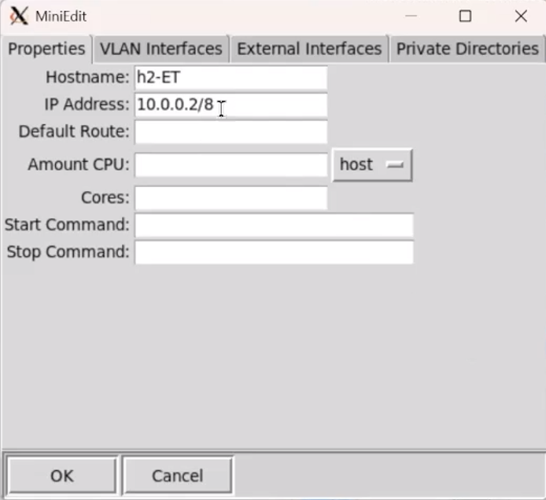{#fig:035}

2.2.2. Проверка связности.

– Перед проверкой соединения между хостом h1 и хостом h2 запустил эмуляцию, нажав кнопку Run. После начала эмуляции кнопки панели MiniEdit стали серыми, указывая на то, что в настоящее время они отключены.
– Открыл терминал на хосте h1. Ввёл команду ifconfig, чтобы отобразить назначенные ему IP-адреса. Интерфейс h1-eth0 на хосте h1 настроен с IP-адресом 10.0.0.1 и маской подсети 255.0.0.0.

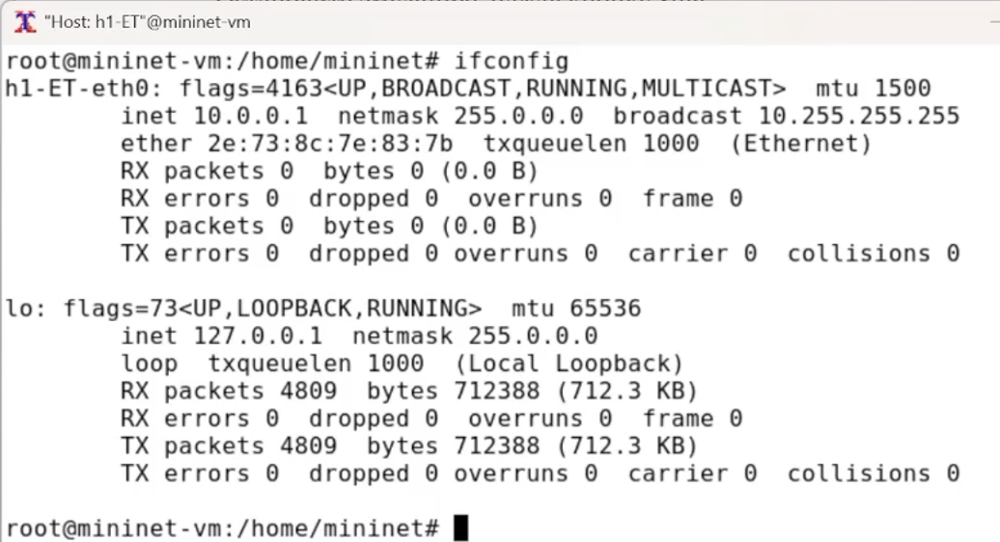{#fig:036}

– Открыл терминал на хосте h2. Ввёл команду ifconfig, чтобы отобразить назначенные ему IP-адреса. Интерфейс h2-eth0 на хосте h2 настроен с IP-адресом 10.0.0.2 и маской подсети 255.0.0.0.

{#fig:037}

– Проверил соединение между хостами, введя в терминале хоста h1 команду ping 10.0.0.2.

{#fig:038}

- Остановил эмуляцию, нажав кнопку Stop.

2.2.3. Автоматическое назначение IP-адресов.

Ранее IP-адреса узлам h1 и h2 были назначены вручную. В качестве альтернативы можно полагаться на Mininet для автоматического назначения IP-адресов.
– Удалил назначенный вручную IP-адрес с хостов h1 и h2. В MiniEdit нажал *Edit*->*Preferences*. По умолчанию в поле базовые значения IP-адресов (IP Base) установлено 10.0.0.0/8. Изменил это значение на 15.0.0.0/8.

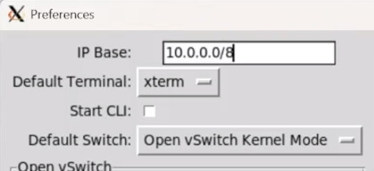{#fig:039}

– Запустил эмуляцию, нажав кнопку Run.
– Открыл терминал на хосте h1, удерживая правую кнопку мыши на хосте h1 и выбрав Terminal. Просмотрел IP-адреса, назначенные хосту h1.

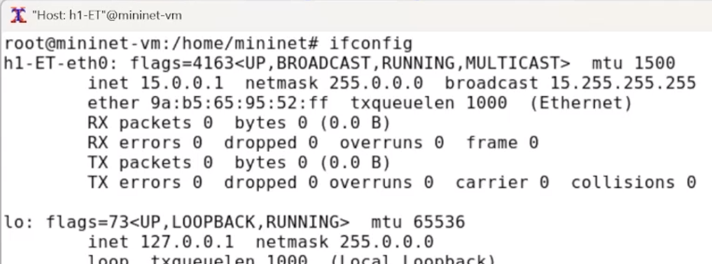{#fig:040}

Интерфейс h1-eth0 на узле h1 теперь имеет IP-адрес 15.0.0.1 и маску подсети 255.0.0.0.

– Также проверил IP-адрес, назначенный хосту h2. Соответствующий интерфейс h2-eth0 на хосте h2 имеет IP-адрес 15.0.0.2 и маску подсети 255.0.0.0.

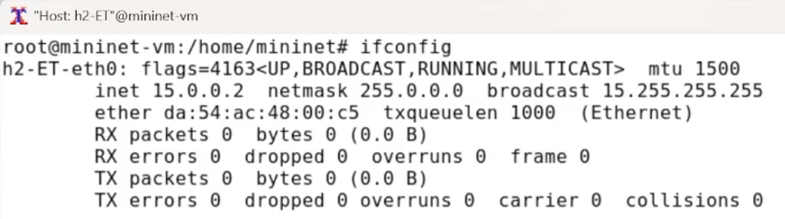{#fig:041}

2.2.4. Сохранение и загрузка топологии Mininet.

– В домашнем каталоге виртуальной машины mininet создал каталог для работы с проектами mininet.

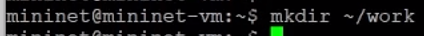{#fig:042}

– Для сохранения топологии сети в файл нажал в MiniEdit *File*->*Save* . Указал имя для топологии и сохранил на своём компьютере.

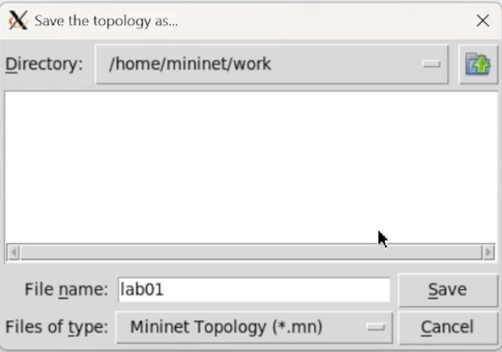{#fig:043}

– После сохранения проекта поменял права доступа к файлам в каталоге проекта:

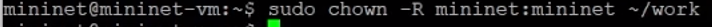{#fig:044}

– Для загрузки топологии в MiniEdit нажал *File*->*Open*.

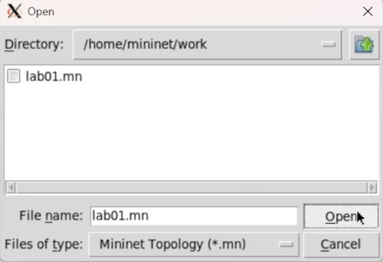{#fig:045}

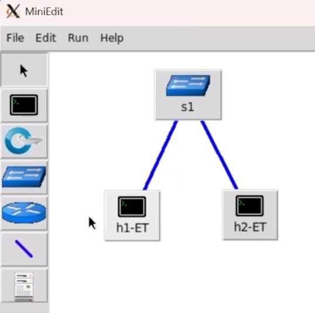{#fig:046}

2.2.5. Завершиил соединение с виртуальной машиной mininet и выключил её.

# Выводы

 В результате выполнения лабораторной работы, я освоил развёртывание в системе виртуализации (например, в VirtualBox) mininet, познакомился с основными командами для работы с Mininet через командную строку и через графический интерфейс.
