---
## Front matter
title: "Отчёт по лабораторной работе №2"
subtitle: "Дисциплина: Моделирование сетей передачи данных"
author: "Выполнил: Танрибергенов Эльдар (НПИбд-01-22)"

## Generic otions
lang: ru-RU
toc-title: "Содержание"

## Bibliography
bibliography: bib/cite.bib
csl: pandoc/csl/gost-r-7-0-5-2008-numeric.csl

## Pdf output format
toc: true # Table of contents
toc-depth: 2
lof: true # List of figures
lot: true # List of tables
fontsize: 12pt
linestretch: 1.5
papersize: a4
documentclass: scrreprt
## I18n polyglossia
polyglossia-lang:
  name: russian
  options:
	- spelling=modern
	- babelshorthands=true
polyglossia-otherlangs:
  name: english
## I18n babel
babel-lang: russian
babel-otherlangs: english
## Fonts
mainfont: IBM Plex Serif
romanfont: IBM Plex Serif
sansfont: IBM Plex Sans
monofont: IBM Plex Mono
mathfont: STIX Two Math
mainfontoptions: Ligatures=Common,Ligatures=TeX,Scale=0.94
romanfontoptions: Ligatures=Common,Ligatures=TeX,Scale=0.94
sansfontoptions: Ligatures=Common,Ligatures=TeX,Scale=MatchLowercase,Scale=0.94
monofontoptions: Scale=MatchLowercase,Scale=0.94,FakeStretch=0.9
mathfontoptions:
## Biblatex
biblatex: true
biblio-style: "gost-numeric"
biblatexoptions:
  - parentracker=true
  - backend=biber
  - hyperref=auto
  - language=auto
  - autolang=other*
  - citestyle=gost-numeric
## Pandoc-crossref LaTeX customization
figureTitle: "Рис."
tableTitle: "Таблица"
listingTitle: "Листинг"
lofTitle: "Список иллюстраций"
lotTitle: "Список таблиц"
lolTitle: "Листинги"
## Misc options
indent: true
header-includes:
  - \usepackage{indentfirst}
  - \usepackage{float} # keep figures where there are in the text
  - \floatplacement{figure}{H} # keep figures where there are in the text
---

# Цель работы

Основной целью работы является знакомство с инструментом для измерения
пропускной способности сети в режиме реального времени — iPerf3, а также
получение навыков проведения интерактивного эксперимента по измерению
пропускной способности моделируемой сети в среде Mininet.


# Теоретическое введение

В контексте сеанса связи между двумя конечными устройствами на сетевом
пути под пропускной способностью (throughput) понимается скорость в битах
в секунду, с которой процесс-отправитель может доставлять данные процессуполучателю. В тоже время под полосой пропускания (Bandwidth) понимается
физическое свойство среды передачи данных, зависящее, например, от конструкции и длины провода или волокна. Иногда термины «пропускная способность»
(throughput) и «полоса пропускания» (bandwidth) используются взаимозаменяемо.
iPerf3 (сайт: https://iperf.fr/; лицензия: three-clause BSD license;
репозиторий: https://github.com/esnet/iperf) представляет собой кроссплатформенное клиент-серверное приложение с открытым исходным кодом,
которое можно использовать для измерения пропускной способности между
двумя конечными устройствами.
iPerf3 может работать с транспортными протоколами TCP, UDP и SCTP:
– TCP и SCTP:
– измеряет пропускную способность;
– позволяет задать размер MSS/MTU;
– отслеживает размер окна перегрузки TCP (CWnd).
– UDP:
– измеряет пропускную способность;
– измеряет потери пакетов;
– измеряет колебания задержки (jitter);
– поддерживает групповую рассылку пакетов (multicast).
Пользователь взаимодействует с iPerf3 с помощью команды iperf3. Основной
синтаксис iperf3, используемый как на клиенте, так и на сервере, выглядит
следующим образом:

``` iperf3 [-s|-c] [options] ```

Здесь: -s — запуск сервера; -c — запуск клиента.
Описание опций можно посмотреть, введя команду iperf3 -h.
iPerf3 позволяет экспортировать результаты теста в файл с облегчённым
форматом обмена данными JSON (JavaScript Object Notation, нотация объектов JavaScript), что позволяет другим приложениям легко анализировать файл
и интерпретировать результаты.
Для визуализации результатов измерения iPerf3 можно использовать пакет iperf3_plotter. Репозиторий https://github.com/ekfoury/iperf3_
plotter содержит следующие скрипты:
– preprocessor.sh: преобразует файл JSON iPerf3 в файл значений, разделённых запятыми (CSV); использует AWK для форматирования полей файла;
– plot_iperf.sh: принимает JSON-файл iPerf3, вызывает препроцессор
и gnuplot для создания выходных PDF-файлов.

# Выполнение лабораторной работы


**1. Установка необходимого программного обеспечения**

1.1. Запустил виртуальную среду с mininet.
1.2. Из основной ОС подключился к виртуальной машине.
1.3. После подключения к виртуальной машине mininet посмотрел IP-адреса машины:

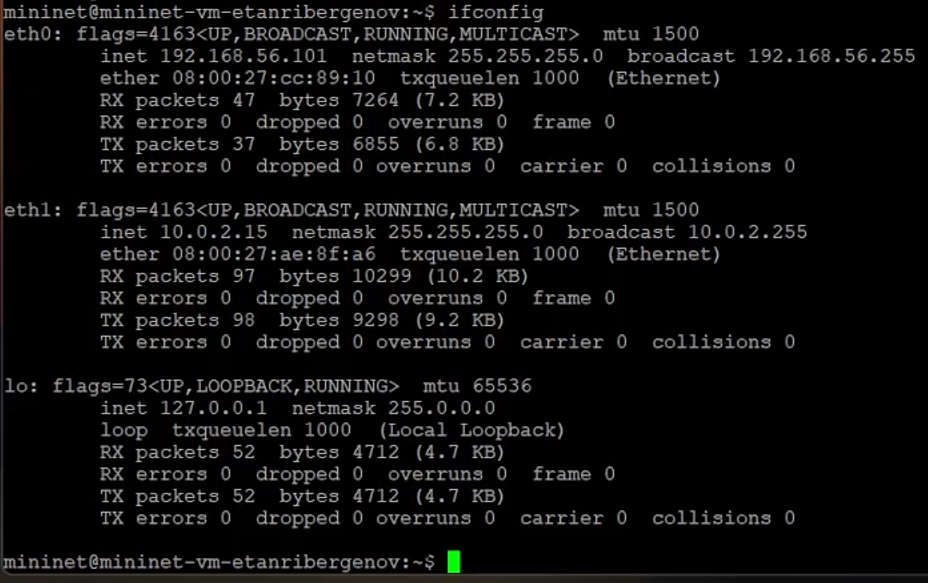{#fig:001}

Для доступа к сети Интернет активен адрес NAT: 10.0.2.15. 


1.4. Обновил репозитории программного обеспечения на виртуальной машине:

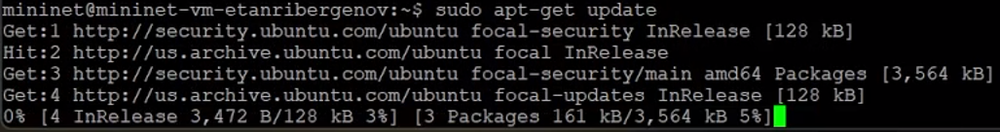{#fig:002}


1.5. Установил iperf3:

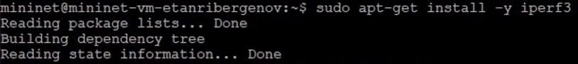{#fig:003}


1.6. Установил необходимое дополнительное программное обеспечение на виртуальную машину:

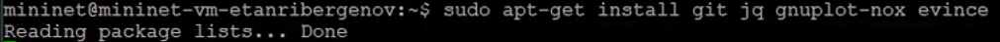{#fig:004}


1.7. Развернул iperf3_plotter. Для этого:

– перешёл во временный каталог и скачал репозиторий:

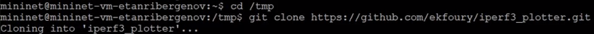{#fig:005}

– установил iperf3_plotter:

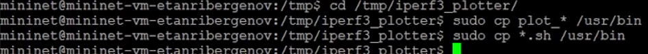{#fig:006}


Обратил внимание, что скрипты не работают с путями, имеющими в названии пробелы и кириллицу.


**2. Интерактивные эксперименты**


2.1. Задал простейшую топологию, состоящую из двух хостов и коммутатора с назначенной по умолчанию mininet сетью 10.0.0.0/8:

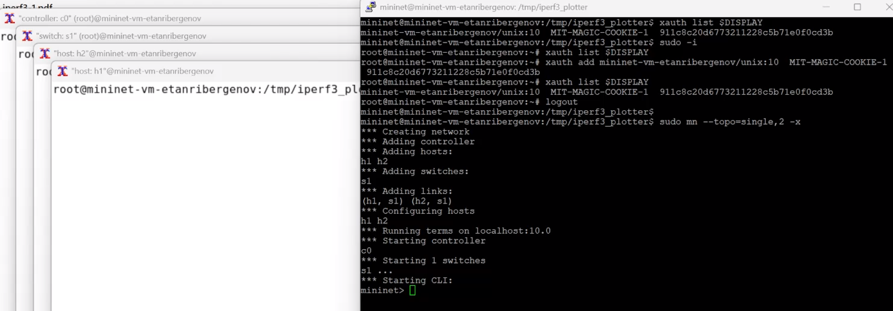{#fig:007}

После введения этой команды запустились терминалы двух хостов, коммутатора и контроллера. Терминалы коммутатора и контроллера закрыл.


2.2. В терминале виртуальной машины посмотрел параметры запущенной в интерактивном режиме топологии:

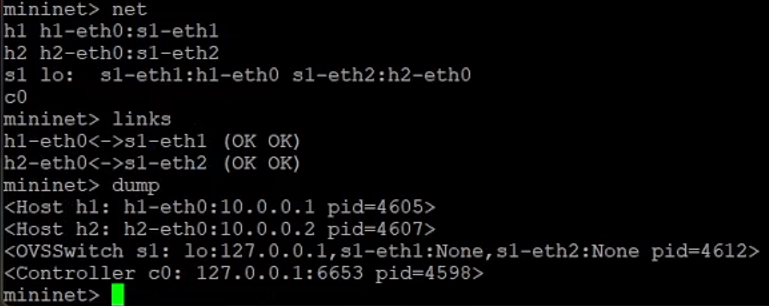{#fig:008}


2.3. Провёл простейший интерактивный эксперимент по измерению пропускной способности с помощью iPerf3:

– В терминале h2 запустил сервер iPerf3:

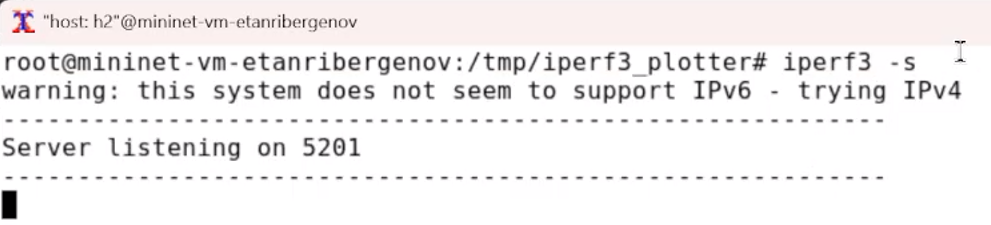{#fig:009}

После запуска этой команды хост h2 перешёл в состояние прослушивания 5201-го порта в ожидании входящих подключений.

– В терминале хоста h1 запустил клиент iPerf3:

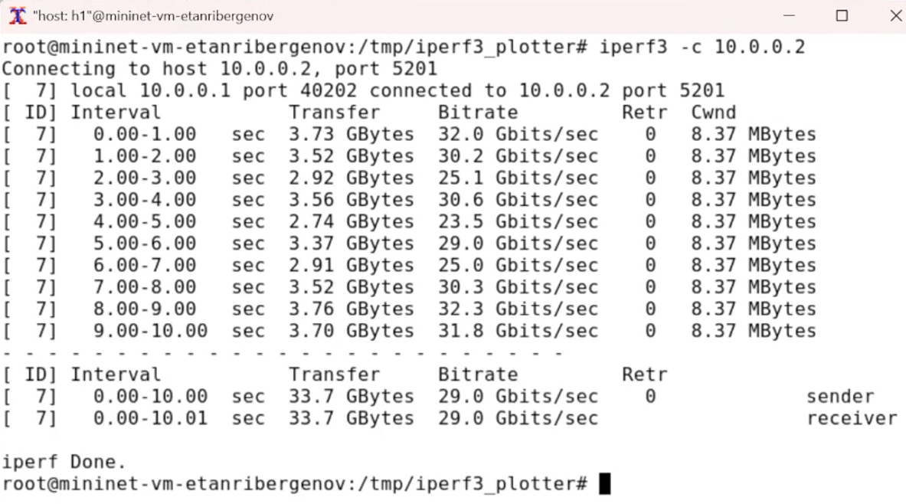{#fig:010}

Здесь параметр -c указывает, что хост h1 настроен как клиент, а параметр 10.0.0.2 является IP-адресом сервера iPerf3 (хост h2).

– Дождался окончания теста. По умолчанию время тестирования установлено в 10 секунд. Для прерывания работы клиента iPerf3 достаточно на
хосте h1 нажать Ctrl + c , при этом сервер iPerf3 на хосте h1 продолжит прослушивать порт 5201. Для остановки как сервера, так и клиента iPerf3
необходимо в терминале хоста h2 нажать Ctrl + c .

– Проанализировал полученный в результате выполнения теста сводный отчёт, отобразившийся как на клиенте, так и на сервере iPerf3, содержащий следующие данные:
– ID: идентификационный номер соединения - 7.
– интервал (Interval): временной интервал для периодических отчетов о пропускной способности (по умолчанию временной интервал равен 1 секунде);
– передача (Transfer): сколько данных было передано за каждый интервал времени - от 2.74 ГБ до 3.76 ГБ;
– пропускная способность (Bitrate): измеренная пропускная способность в каждом временном интервале от 23.5 Гб/с до 32.2 Гб/с;
– Retr: количество повторно переданных TCP-сегментов за каждый временной интервал (это поле увеличивается, когда TCP-сегменты теряются в сети из-за перегрузки или повреждения) - 0;
– Cwnd: указывает размер окна перегрузки в каждом временном интервале (TCP использует эту переменную для ограничения объёма данных,
которые TCP-клиент может отправить до получения подтверждения отправленных данных) - 8.37 МБ.

Суммарные данные на сервере аналогичны данным на стороне клиента iPerf3 и должны интерпретироваться таким же образом.

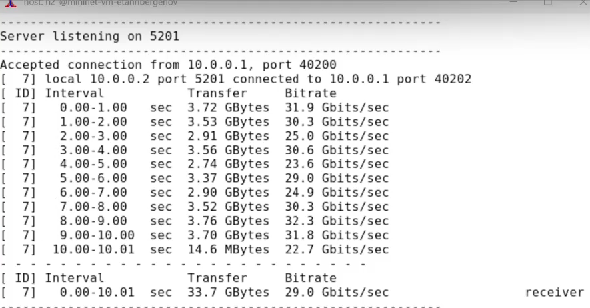{#fig:011}


2.4. Провёл аналогичный эксперимент в интерфейсе mininet.

– Запустил сервер iPerf3 на хосте h2:

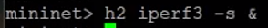{#fig:012}

– Запустил клиент iPerf3 на хосте h1:

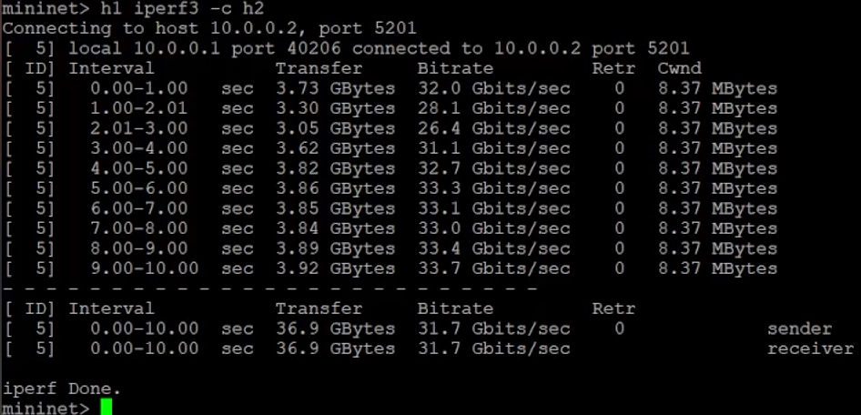{#fig:013}

– Остановил серверный процесс:

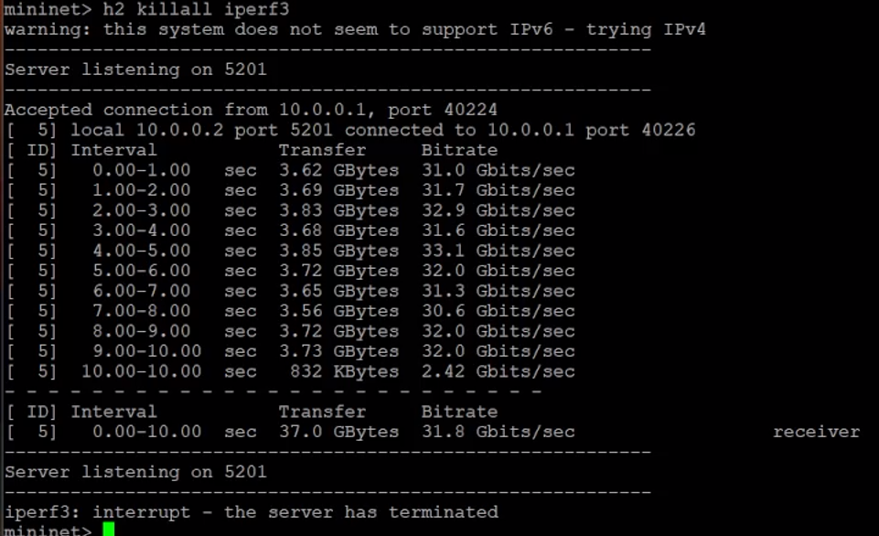{#fig:014}

– Сравнил результат с отчётом предыдущего эксперимента - всё аналогично.


2.5. Для указания iPerf3 периода времени для передачи можно использовать ключ -t (или --time) — время в секундах для передачи (по умолчанию 10 секунд):

– В терминале h2 запустил сервер iPerf3
– В терминале h1 запустил клиент iPerf3 с параметром -t, за которым следует количество секунд:

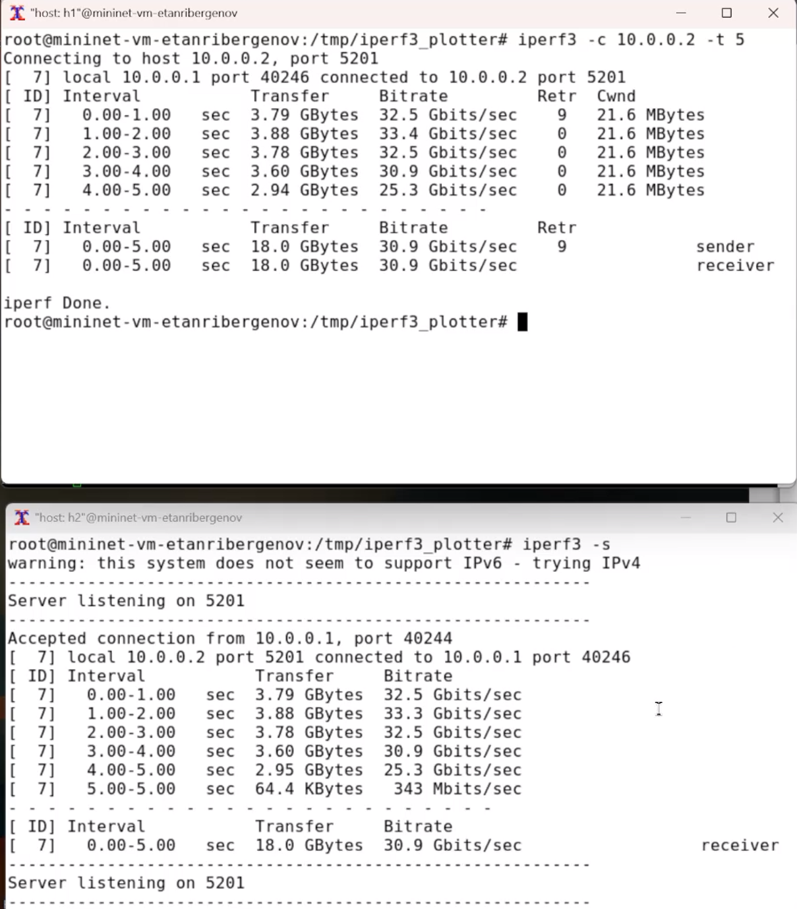{#fig:015}


– Для остановки сервера нажал Ctrl + c в терминале хоста h2.


2.6. Настроил клиент iPerf3 для выполнения теста пропускной способности с 2-секундным интервалом времени отсчёта как на клиенте, так и на сервере.
Использовал опцию -i для установки интервала между отсчётами, измеряемого в секундах:

– В терминале h2 запустил сервер iPerf3:

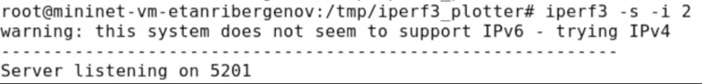{#fig:016}

– В терминале h1 запустил клиент iPerf3:

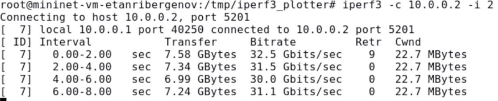{#fig:017}

– Остановил сервер iPerf3, нажав Ctrl+c в терминале хоста h2.
– Сравнил результат с отчётами из предыдущих экспериментов: уменьшилось кол-во передач, выросло кол-во повторно переданных TCP-сегментов за каждый временной интервал (Retr)
и уввеличился размер окна перегрузки в каждом временном интервале (Cwnd).


2.7. Задал на клиенте iPerf3 отправку определённого объёма данных. Использовал опцию -n для установки количества байт для передачи:

– В терминале h2 запустил сервер iPerf3.
– В терминале h1 запустил клиент iPerf3, задав объём данных 16 Гбайт:

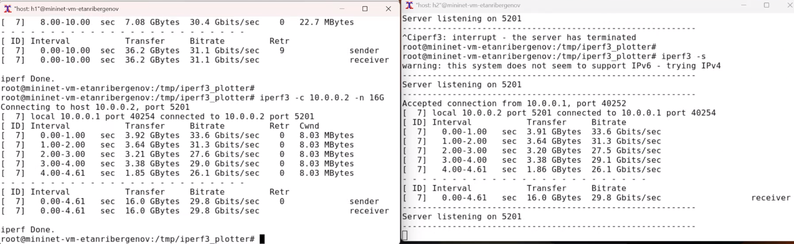{#fig:018}

Обратил внимание, что по умолчанию iPerf3 выполняет измерение пропускной способности в течение 10 секунд, но при задании количества
данных для передачи клиент iPerf3 будет продолжать отправлять пакеты до тех пор, пока не будет отправлен весь объём данных, указанный пользователем.

– Остановил сервер iPerf3, нажав Ctrl+c в терминале хоста h2.

2.8. Изменил в тесте измерения пропускной способности iPerf3 протокол передачи данных с TCP (установлен по умолчанию) на UDP. iPerf3 автоматически
определяет протокол транспортного уровня на стороне сервера. Для изменения протокола использовал опцию -u на стороне клиента iPerf3:

– В терминале h2 запустил сервер iPerf3.
– В терминале h1 запустил клиент iPerf3, задав протокол UDP:

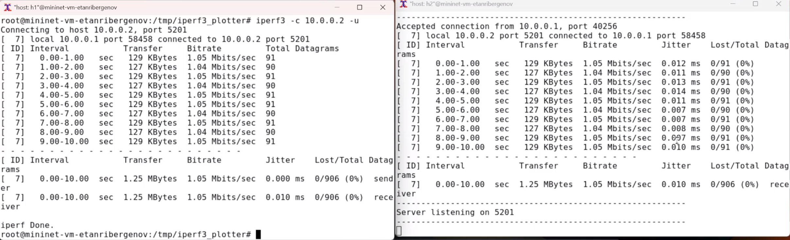{#fig:019}

– После завершения теста отобразились следующие сводные данные:
– ID, интервал, передача, битрейт: то же, что и у TCP.
– Jitter: разница в задержке пакетов.
– Lost/Total: указывает количество потерянных дейтаграмм по сравнению с общим количеством отправленных на сервер (и процентное соотношение).


– Остановил сервер iPerf3, нажав Ctrl+c в терминале хоста h2.


2.9. В тесте измерения пропускной способности iPerf3 изменил номер порта для отправки/получения пакетов или датаграмм через указанный порт.
Использовал для этого опцию -p:

– В терминале h2 запустил сервер iPerf3, используя параметр -p, чтобы указать порт прослушивания:

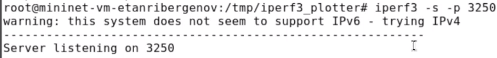{#fig:020}

– В терминале h1 запустил клиент iPerf3, указав порт:

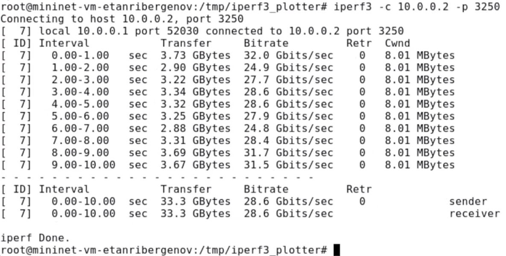{#fig:021}

– Остановил сервер iPerf3, нажав Ctrl+c в терминале хоста h2.


2.10. По умолчанию после запуска сервер iPerf3 постоянно прослушивает входящие соединения. В тесте измерения пропускной способности iPerf3 задал
для сервера параметр обработки данных только от одного клиента с остановкой сервера по завершении теста. Для этого использовал опцию -1 на сервере iPerf3:

– В терминале h2 запустил сервер iPerf3, используя параметр -1, чтобы принять только одного клиента:

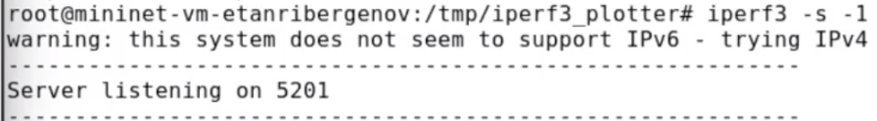{#fig:022}

– В терминале h1 запустил клиент iPerf3:

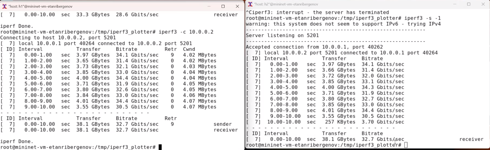{#fig:023}

Обратил внимание, что после завершения этого теста сервер iPerf3 немедленно останавливается.

2.11. Экспортировал результаты теста измерения пропускной способности iPerf3 в файл JSON:

– В виртуальной машине mininet создал каталог для работы над проектом:

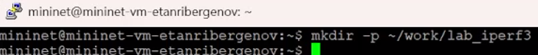{#fig:024}

– В терминале h2 запустил сервер iPerf3.
– В терминале h1 запустил клиент iPerf3, указав параметр -J для отображения вывода результатов в формате JSON:

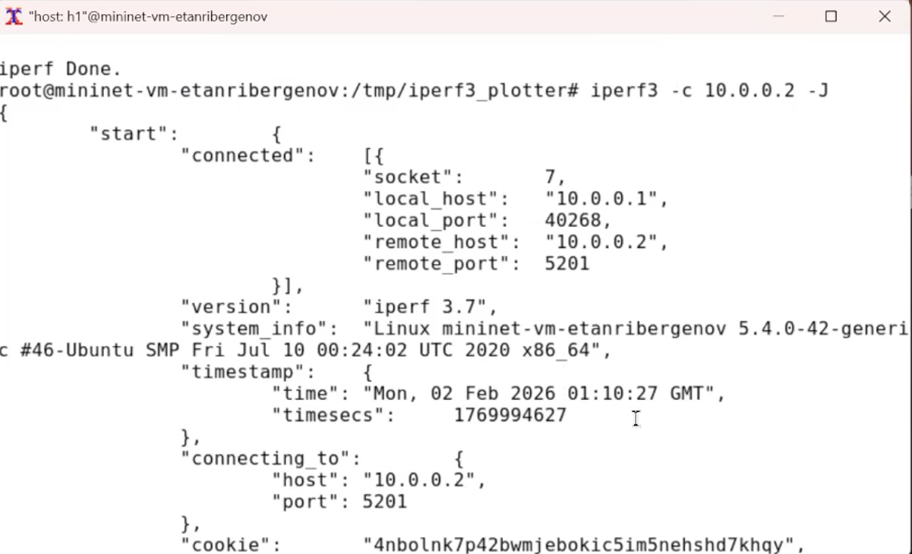{#fig:025}


В данном случае параметр -J вывел текст JSON на экран через стандартный вывод (stdout) после завершения теста.
– Экспортировал вывод результатов теста в файл, перенаправив стандартный вывод в файл:

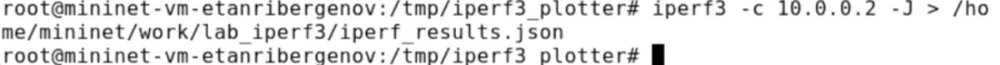{#fig:026}

– Убедился, что файл iperf_results.json создан в указанном каталоге.

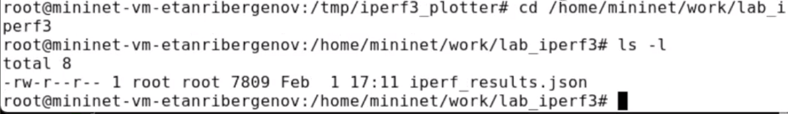{#fig:027}

Команда cat может использоваться для отображения содержимого файла.
– Остановил сервер iPerf3, нажав Ctrl+c в терминале хоста h2.

– Завершил работу mininet в интерактивном режиме, введя в интерфейсе mininet: *exit*.

12. Визуализировал результаты эксперимента:

– В виртуальной машине mininet исправил права запуска X-соединения.
Скопировал значение куки (MIT magic cookie) своего пользователя mininet в файл для пользователя root:

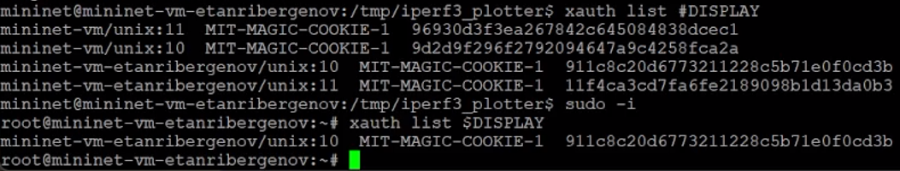{#fig:028}

После выполнения этих действий графические приложения запускаются под пользователем mininet.

– В виртуальной машине mininet перешёл в каталог для работы над проектом, проверил и скорректировал права доступа к файлу JSON:

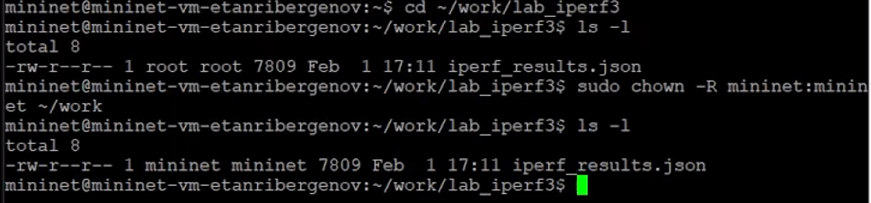{#fig:029}

– Сгенерировал выходные данные для файла JSON iPerf3 (обратил внимание, что скрипт не работает с путями, имеющими в названии файла пробелы):

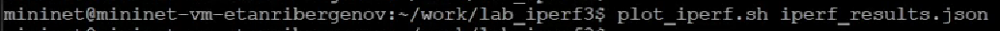{#fig:030}

– Сценарий построения создал файл CSV (1.dat), который может использоваться другими приложениями. В подкаталоге results каталога,
в котором был выполнен скрипт, сценарий создал графики для следующих полей файла JSON:
– окно перегрузки (cwnd.pdf);
– повторная передача (retransmits.pdf);
– время приема-передачи (RTT.pdf);
– отклонение времени приема-передачи (RTT_Var.pdf);
– пропускная способность (throughput.pdf);
– максимальная единица передачи (MTU.pdf);
– количество переданных байтов (bytes.pdf).
– Убедитесь, что файлы с данными и графиками сформировались:

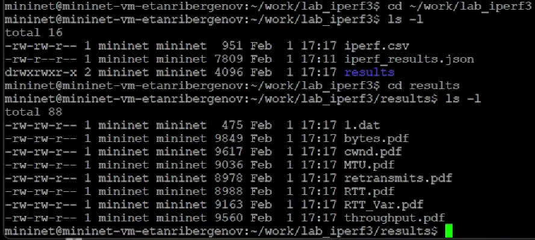{#fig:031}


# Выводы

 В результате выполенения лабораторной работы я познакомился с инструментом для измерения пропускной способности сети в режиме реального времени — iPerf3, а также получил навыки проведения интерактивного эксперимента по измерению
пропускной способности моделируемой сети в среде Mininet.