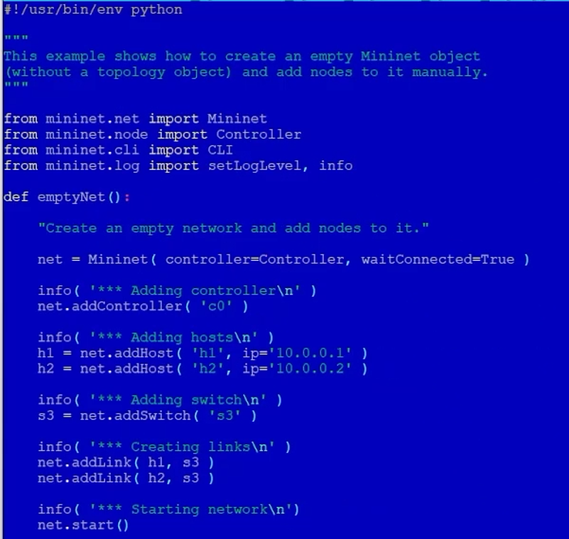
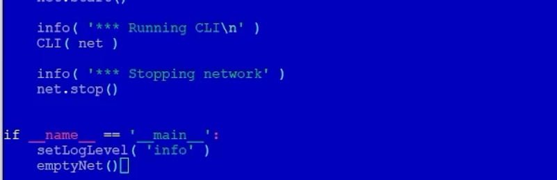

---
## Front matter
lang: ru-RU
title: Презентация по лабораторной работе №3
subtitle: Измерение и тестирование пропускной способности сети. Воспроизводимый эксперимент
author:
  - Танрибергенов Э.
institute:
  - Российский университет дружбы народов, Москва, Россия
date: 2026 г.

## i18n babel
babel-lang: russian
babel-otherlangs: english
## Fonts
mainfont: IBM Plex Serif
romanfont: IBM Plex Serif
sansfont: IBM Plex Sans
monofont: IBM Plex Mono
mathfont: STIX Two Math
mainfontoptions: Ligatures=Common,Ligatures=TeX,Scale=0.94
romanfontoptions: Ligatures=Common,Ligatures=TeX,Scale=0.94
sansfontoptions: Ligatures=Common,Ligatures=TeX,Scale=MatchLowercase,Scale=0.94
monofontoptions: Scale=MatchLowercase,Scale=0.94,FakeStretch=0.9
## Formatting pdf
toc: false
toc-title: Содержание
slide_level: 2
aspectratio: 169
section-titles: true
theme: metropolis
header-includes:
 - \metroset{progressbar=frametitle,sectionpage=progressbar,numbering=fraction}
---

# Информация

## Докладчик

  - Танрибергенов Эльдар
  - студент 4 курса из группы НПИбд-01-22
  - ФМиЕН, кафедра прикладной информатики и теории вероятностей
  - Российский университет дружбы народов


# Цели и задачи

## Цель работы


- Основной целью работы является знакомство с инструментом для измерения
пропускной способности сети в режиме реального времени — iPerf3, а также
получение навыков проведения воспроизводимого эксперимента по измерению
пропускной способности моделируемой сети в среде Mininet.


## Задачи

1. Воспроизвести посредством API Mininet эксперименты по измерению пропускной способности с помощью iPerf3.
2. Построить графики по проведённому эксперименту.


# Результаты

## Эксперименты по измерению пропускной способности с помощью iPerf3

:::::::::::::: {.columns align=center}
::: {.column width="40%"}

– addSwitch(): добавляет коммутатор в топологию и возвращает имя коммутатора; ddHost(): добавляет хост в топологию и возвращает имя хоста; addLink(): добавляет двунаправленную ссылку в топологию (и возвращает ключ ссылки);
– Mininet: основной класс для создания и управления сетью;
– start(): запускает сеть;

:::
::: {.column width="60%"}

{#fig:001 width="60%" height="60%"}

:::
::::::::::::::

## Эксперименты по измерению пропускной способности с помощью iPerf3

:::::::::::::: {.columns align=center}
::: {.column width="40%"}

– pingAll(): проверяет подключение, пытаясь заставить все узлы пинговать друг друга;
– stop(): останавливает сеть;
– net.hosts: все хосты в сети;
– dumpNodeConnections(): сбрасывает подключения к/от набора узлов;
– setLogLevel( 'info' | 'debug' | 'output' ): устанавливает уровень вывода Mininet по умолчанию

:::
::: {.column width="60%"}

{#fig:002 width="60%" height="60%"}

:::
::::::::::::::


## Эксперименты по измерению пропускной способности с помощью iPerf3

### Изменение скрипта:

- IP() возвращает IP-адрес хоста или определенного интерфейса; MAC() возвращает MAC-адрес хоста или определенного интерфейса.

{#fig:003 width="45%" height="45%"}


## Эксперименты по измерению пропускной способности с помощью iPerf3

### Проверка работы скрипта

{#fig:004 width="70%" height="70%"}


## Эксперименты по измерению пропускной способности с помощью iPerf3

### Изменение скрипта:

- Указание производительности процессоров систем хостам

{#fig:005 width="60%" height="60%"}


## Эксперименты по измерению пропускной способности с помощью iPerf3

– параметр пропускной способности (bw) выражается числом в Мбит;
– задержка (delay) выражается в виде строки с заданными единицами измерения (например, 5ms, 100us, 1s);
– потери (loss) выражаются в процентах (от 0 до 100);
– параметр максимального значения очереди (max_queue_size) выражается в пакетах;
– параметр use_htb указывает на использование ограничителя интенсивности входящего потока Hierarchical Token Bucket (HTB).

{#fig:006}


## Эксперименты по измерению пропускной способности с помощью iPerf3

:::::::::::::: {.columns align=center}
::: {.column width="30%"}

### Сравнение результатов работы скриптов

:::
::: {.column width="70%"}

{#fig:007 width="70%" height="70%"}

:::
::::::::::::::


## Построение графиков по проведённому эксперименту

:::::::::::::: {.columns align=center}
::: {.column width="30%"}

### Здесь:

- параметр -D записывает сообщения сервера в файл журнала, -1 - принимает подключение только одного клиента
- параметр -J выводит данные в виде JSON-файла

:::
::: {.column width="70%"}

{#fig:008}

:::
::::::::::::::


## Построение графиков по проведённому эксперименту

### Проверка результатов

{#fig:009 width="50%" height="50%"}


## Построение графиков по проведённому эксперименту

:::::::::::::: {.columns align=center}
::: {.column width="30%"}

- команда:

``` plot_iperf.sh iperf_result.json ```

:::
::: {.column width="70%"}

{#fig:010}

:::
::::::::::::::


# Выводы
  
## Вывод

 В результате выполенения лабораторной работы я познакомился с инструментом для измерения пропускной способности сети в режиме реального времени — iPerf3, а также
получил навыки проведения воспроизводимого эксперимента по измерению пропускной способности моделируемой сети в среде Mininet.