---
## Front matter
title: "Отчёт по лабораторной работе №3"
subtitle: "Дисциплина: Моделирование сетей передачи данных"
author: "Выполнил: Танрибергенов Эльдар (НПИбд-01-22)"

## Generic otions
lang: ru-RU
toc-title: "Содержание"

## Bibliography
bibliography: bib/cite.bib
csl: pandoc/csl/gost-r-7-0-5-2008-numeric.csl

## Pdf output format
toc: true # Table of contents
toc-depth: 2
lof: true # List of figures
lot: true # List of tables
fontsize: 12pt
linestretch: 1.5
papersize: a4
documentclass: scrreprt
## I18n polyglossia
polyglossia-lang:
  name: russian
  options:
	- spelling=modern
	- babelshorthands=true
polyglossia-otherlangs:
  name: english
## I18n babel
babel-lang: russian
babel-otherlangs: english
## Fonts
mainfont: IBM Plex Serif
romanfont: IBM Plex Serif
sansfont: IBM Plex Sans
monofont: IBM Plex Mono
mathfont: STIX Two Math
mainfontoptions: Ligatures=Common,Ligatures=TeX,Scale=0.94
romanfontoptions: Ligatures=Common,Ligatures=TeX,Scale=0.94
sansfontoptions: Ligatures=Common,Ligatures=TeX,Scale=MatchLowercase,Scale=0.94
monofontoptions: Scale=MatchLowercase,Scale=0.94,FakeStretch=0.9
mathfontoptions:
## Biblatex
biblatex: true
biblio-style: "gost-numeric"
biblatexoptions:
  - parentracker=true
  - backend=biber
  - hyperref=auto
  - language=auto
  - autolang=other*
  - citestyle=gost-numeric
## Pandoc-crossref LaTeX customization
figureTitle: "Рис."
tableTitle: "Таблица"
listingTitle: "Листинг"
lofTitle: "Список иллюстраций"
lotTitle: "Список таблиц"
lolTitle: "Листинги"
## Misc options
indent: true
header-includes:
  - \usepackage{indentfirst}
  - \usepackage{float} # keep figures where there are in the text
  - \floatplacement{figure}{H} # keep figures where there are in the text
---

# Цель работы

Основной целью работы является знакомство с инструментом для измерения
пропускной способности сети в режиме реального времени — iPerf3, а также
получение навыков проведения воспроизводимого эксперимента по измерению
пропускной способности моделируемой сети в среде Mininet.

# Теоретическое введение

**API Mininet**

Application Programming Interface (API) — программный интерфейс приложения, или интерфейс программирования приложений) представляет собой
специальный протокол для взаимодействия компьютерных программ, который
позволяет использовать функции одного приложения внутри другого.
API Mininet построен на трех основных уровнях:
– Низкоуровневый API состоит из базовых узлов и классов ссылок (таких как
Host, Switch, Link и их подклассы), которые на самом деле могут быть
созданы по отдельности и использоваться для создания сети, но это немного
громоздко.
– API среднего уровня добавляет объект Mininet, который служит контейнером
для узлов и ссылок. Он предоставляет ряд методов (addHost(), addSwitch(),
addLink()) для добавления узлов и ссылок в сеть, а также настройки сети,
запуска и завершения работы (start(), stop()).
– Высокоуровневый API добавляет абстракцию шаблона топологии (класс Topo),
который предоставляет возможность создавать повторно используемые параметризованные шаблоны топологии. Эти шаблоны можно передать команде
mn (через параметр --custom) и использовать из командной строки.
Низкоуровневый API используется, когда требуется управлять узлами и коммутаторами напрямую.API среднего уровня применяют при запуске и остановке
сети (в частности используется класс Mininet).
Полноценные сети могут быть созданы с использованием любого из уровней API, но обычно для создания сетей выбирают либо API среднего уровня
(например, Mininet.add*()), либо API высокого уровня (Topo. add*()).

# Выполнение лабораторной работы

1. С помощью API Mininet создал простейшую топологию сети, состоящую из двух хостов и коммутатора с назначенной по умолчанию mininet сетью 10.0.0.0/8:
– В каталоге /work/lab_iperf3 для работы над проектом создал подкаталог lab_iperf3_topo и скопировал в него файл с примером скрипта mininet/examples/emptynet.py, описывающего стандартную простую топологию сети mininet:

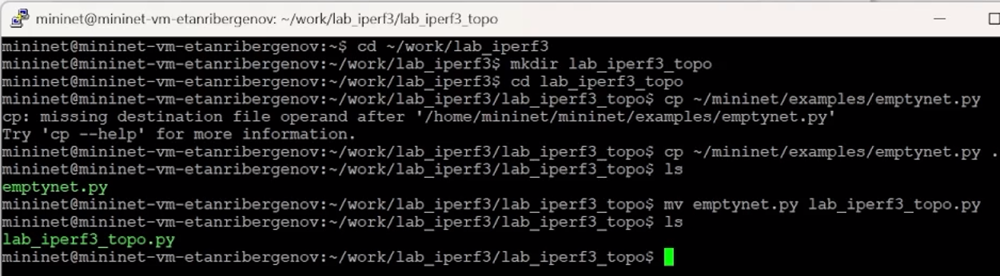{#fig:001}

– Изучил содержание скрипта lab_iperf3_topo.py:

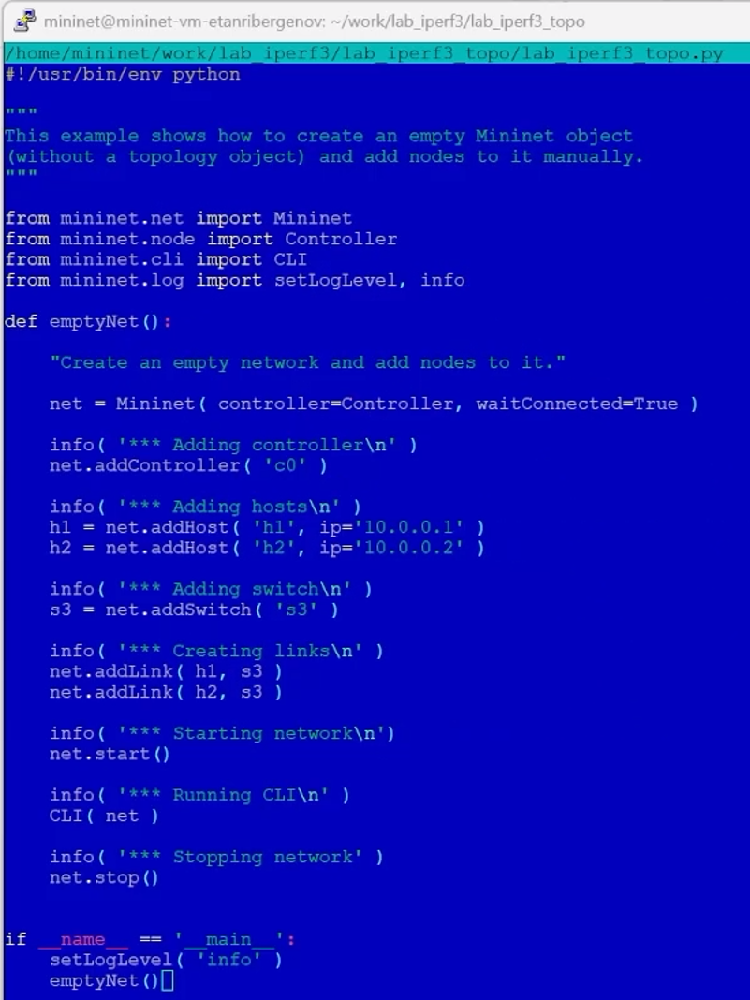{#fig:002}

Основные элементы:
– addSwitch(): добавляет коммутатор в топологию и возвращает имя коммутатора;
– ddHost(): добавляет хост в топологию и возвращает имя хоста;
– addLink(): добавляет двунаправленную ссылку в топологию (и возвращает ключ ссылки; ссылки в Mininet являются двунаправленными, если не указано иное);
– Mininet: основной класс для создания и управления сетью;
– start(): запускает сеть;
– pingAll(): проверяет подключение, пытаясь заставить все узлы пинговать друг друга;
– stop(): останавливает сеть;
– net.hosts: все хосты в сети;
– dumpNodeConnections(): сбрасывает подключения к/от набора узлов;
– setLogLevel( 'info' | 'debug' | 'output' ): устанавливает уровень вывода Mininet по умолчанию; рекомендуется info.

– Запустил скрипт создания топологии lab_iperf3_topo.py:

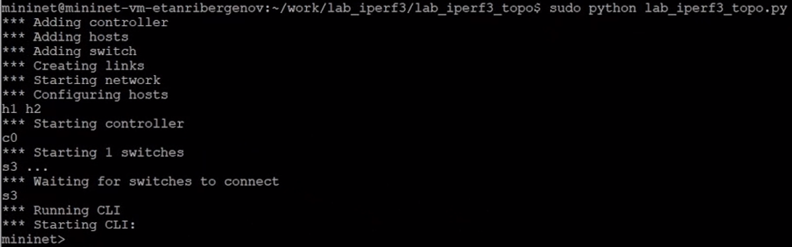{#fig:003}

– После отработки скрипта посмотрел элементы топологии и завершил работу mininet:

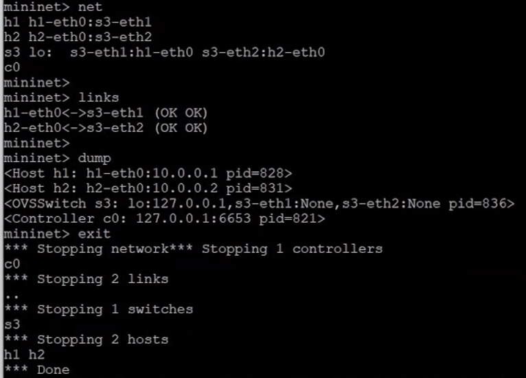{#fig:004}

2. Внёс в скрипт lab_iperf3_topo.py изменение, позволяющее вывести на экран информацию о хосте h1, а именно имя хоста, его IP-адрес, MACадрес:

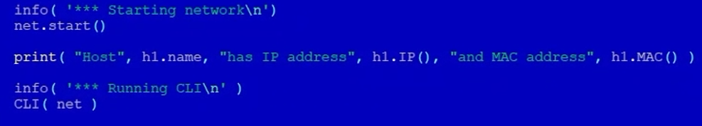{#fig:005}

Здесь:

– IP() возвращает IP-адрес хоста или определенного интерфейса;
– MAC() возвращает MAC-адрес хоста или определенного интерфейса.

3. Проверил корректность отработки изменённого скрипта.

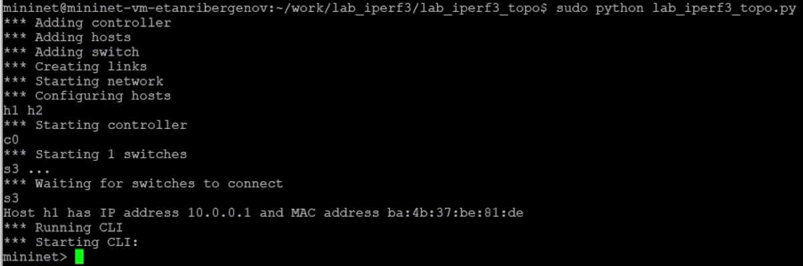{#fig:006}

4. Изменил скрипт lab_iperf3_topo.py так, чтобы на экран выводилась информация об имени, IP-адресе и MAC-адресе обоих хостов сети. 

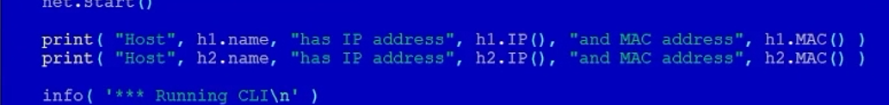{#fig:007}

- Проверил корректность отработки изменённого скрипта.

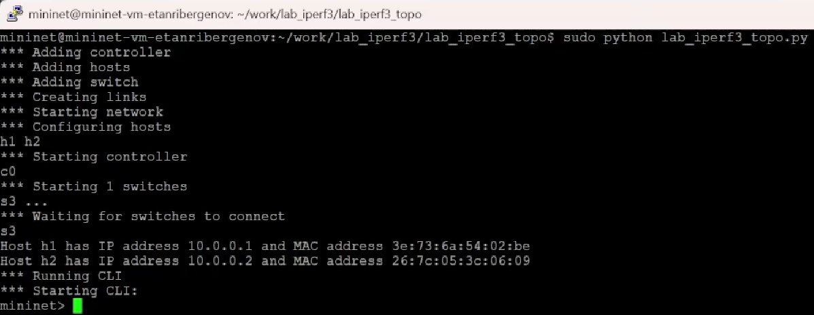{#fig:008}

5. Mininet предоставляет функции ограничения производительности и изоляции с помощью классов CPULimitedHost и TCLink. Добавил в скрипт настройки параметров производительности:
– Сделал копию скрипта lab_iperf3_topo.py:

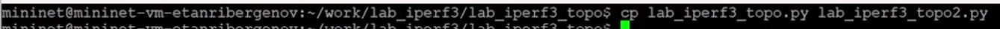{#fig:009}

– В начале скрипта lab_iperf3_topo2.py добавил записи об импорте классов CPULimitedHost и TCLink:

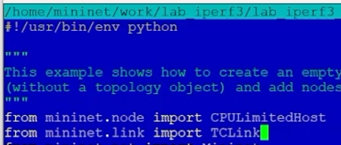{#fig:010}

- В скрипте lab_iperf3_topo2.py изменил строку описания сети, указав на использование ограничения производительности и изоляции:

{#fig:011}

– В скрипте lab_iperf3_topo2.py изменил функцию задания параметров виртуального хоста h1, указав, что ему будет выделено 50% от общих ресурсов процессора системы:
– Аналогичным образом для хоста h2 задал долю выделения ресурсов процессора в 45%.

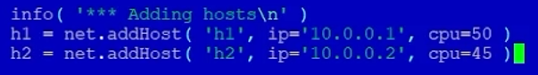{#fig:012}

– В скрипте lab_iperf3_topo2.py изменил функцию параметров соединения между хостом h1 и коммутатором s3:

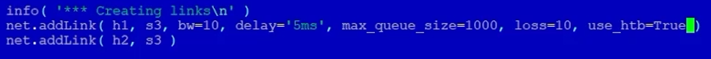{#fig:013}

Здесь добавляется двунаправленный канал с характеристиками пропускной способности, задержки и потерь:
– параметр пропускной способности (bw) выражается числом в Мбит;
– задержка (delay) выражается в виде строки с заданными единицами измерения (например, 5ms, 100us, 1s);
– потери (loss) выражаются в процентах (от 0 до 100);
– параметр максимального значения очереди (max_queue_size) выражается в пакетах;
– параметр use_htb указывает на использование ограничителя интенсивности входящего потока Hierarchical Token Bucket (HTB).

– Запустил на отработку сначала скрипт lab_iperf3_topo2.py, затем lab_iperf3_topo.py и сравнил результат: первый скрипт работал дольше из-за заданной задержки.

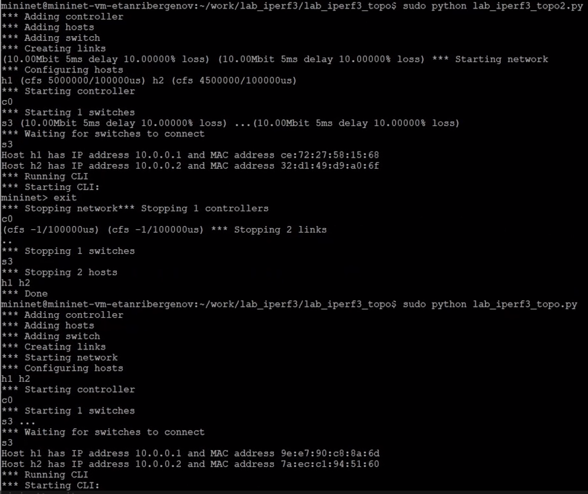{#fig:014}

6. Построил графики по проводимому эксперименту:

– Сделал копию скрипта lab_iperf3_topo2.py и поместил его в подкаталог iperf:

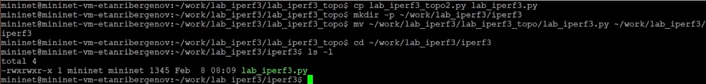{#fig:015}

– В начале скрипта lab_iperf3.py добавил запись

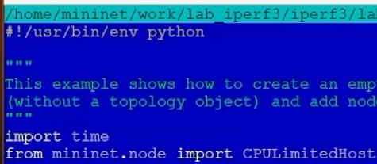{#fig:016}

– Изменил код в скрипте lab_iperf3.py так, чтобы:
– на хостах не было ограничения по использованию ресурсов процессора;
– каналы между хостами и коммутатором были по 100 Мбит/с с задержкой 75 мс, без потерь, без использования ограничителей пропускной способности и максимального размера очереди.

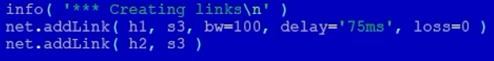{#fig:017}

– После функции старта сети описал запуск на хосте h2 сервера iPerf3, а на хосте h1 запуск с задержкой в 10 секунд клиента iPerf3 с экспортом результатов в JSON-файл, закомментировал строки, отвечающие за запуск CLI-интерфейса:

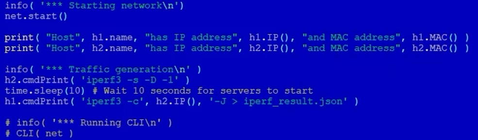{#fig:018}

Здесь:
- параметр -D записывает сообщения сервера в файл журнала, -1 - принимает подключение только одного клиента
- параметр -J выводит данные в виде JSON-файла

– Запустил на отработку скрипт lab_iperf3.py:

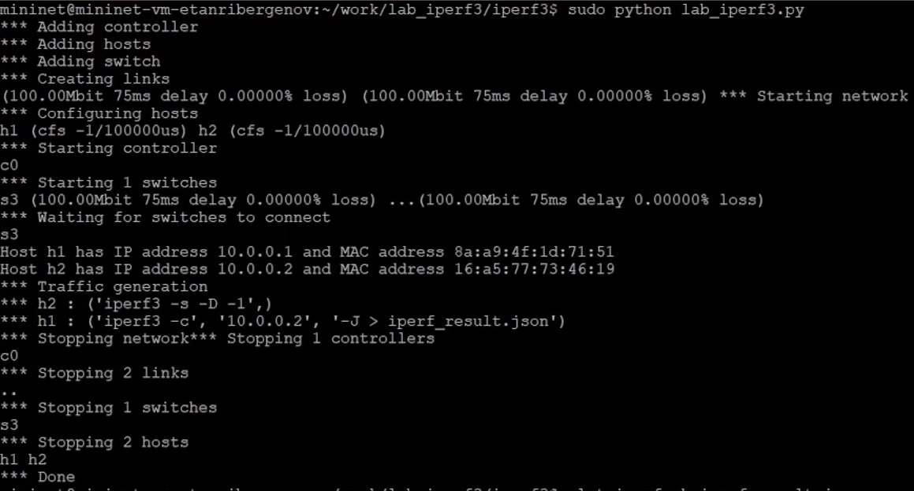{#fig:019}

– Построил графики из получившегося JSON-файла:

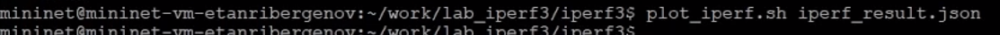{#fig:020}

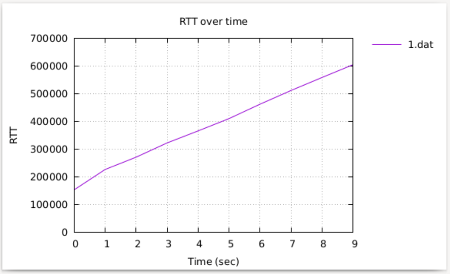{#fig:021}

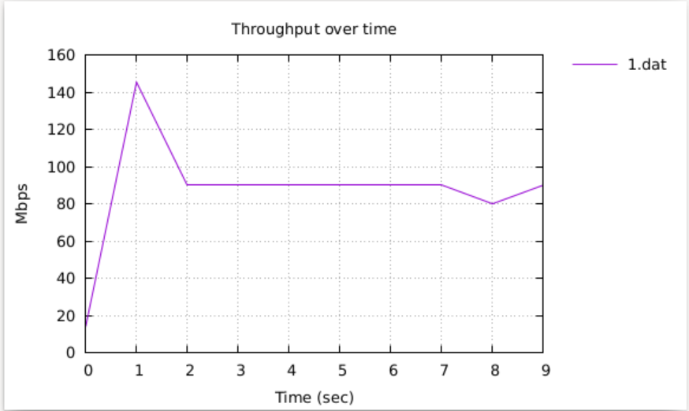{#fig:022}

– Создал Makefile для проведения всего эксперимента:

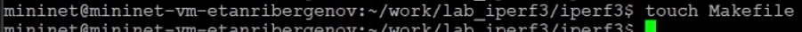{#fig:023}

– В Makefile прописал запуск скрипта эксперимента, построение графиков и очистку каталога от результатов:

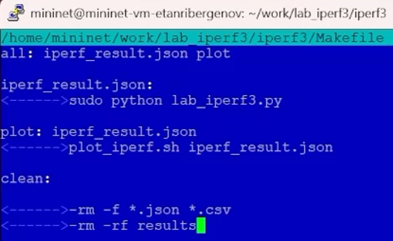{#fig:024}

– Проверил корректность отработки Makefile:

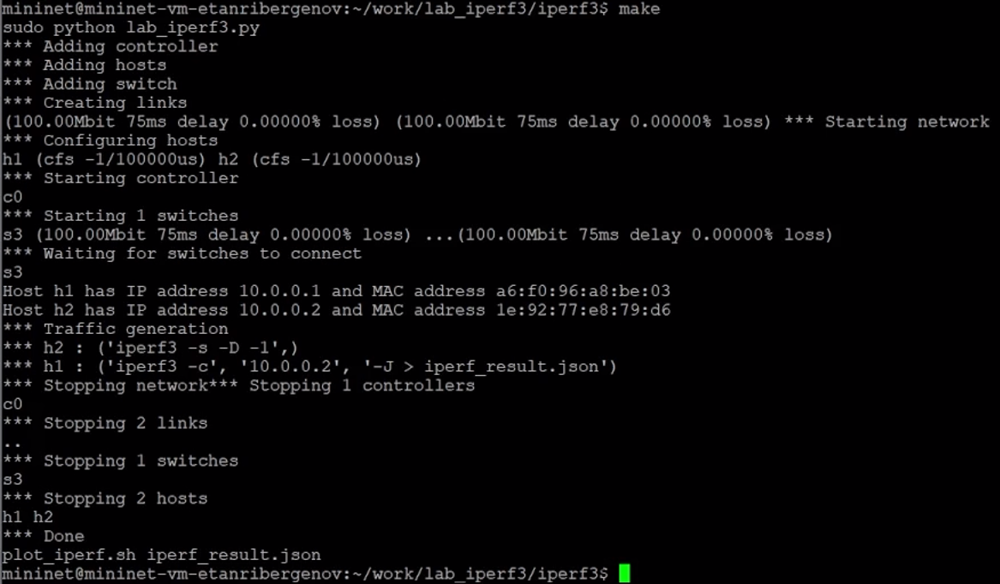{#fig:025}

# Выводы

 В результате выполенения лабораторной работы я познакомился с инструментом для измерения пропускной способности сети в режиме реального времени — iPerf3, а также
получил навыки проведения воспроизводимого эксперимента по измерению пропускной способности моделируемой сети в среде Mininet.
