---
## Front matter
title: "Отчёт по лабораторной работе №4"
subtitle: "Дисциплина: Моделирование сетей передачи данных"
author: "Выполнил: Танрибергенов Эльдар (НПИбд-01-22)"

## Generic otions
lang: ru-RU
toc-title: "Содержание"

## Bibliography
bibliography: bib/cite.bib
csl: pandoc/csl/gost-r-7-0-5-2008-numeric.csl

## Pdf output format
toc: true # Table of contents
toc-depth: 2
lof: true # List of figures
lot: true # List of tables
fontsize: 12pt
linestretch: 1.5
papersize: a4
documentclass: scrreprt
## I18n polyglossia
polyglossia-lang:
  name: russian
  options:
	- spelling=modern
	- babelshorthands=true
polyglossia-otherlangs:
  name: english
## I18n babel
babel-lang: russian
babel-otherlangs: english
## Fonts
mainfont: IBM Plex Serif
romanfont: IBM Plex Serif
sansfont: IBM Plex Sans
monofont: IBM Plex Mono
mathfont: STIX Two Math
mainfontoptions: Ligatures=Common,Ligatures=TeX,Scale=0.94
romanfontoptions: Ligatures=Common,Ligatures=TeX,Scale=0.94
sansfontoptions: Ligatures=Common,Ligatures=TeX,Scale=MatchLowercase,Scale=0.94
monofontoptions: Scale=MatchLowercase,Scale=0.94,FakeStretch=0.9
mathfontoptions:
## Biblatex
biblatex: true
biblio-style: "gost-numeric"
biblatexoptions:
  - parentracker=true
  - backend=biber
  - hyperref=auto
  - language=auto
  - autolang=other*
  - citestyle=gost-numeric
## Pandoc-crossref LaTeX customization
figureTitle: "Рис."
tableTitle: "Таблица"
listingTitle: "Листинг"
lofTitle: "Список иллюстраций"
lotTitle: "Список таблиц"
lolTitle: "Листинги"
## Misc options
indent: true
header-includes:
  - \usepackage{indentfirst}
  - \usepackage{float} # keep figures where there are in the text
  - \floatplacement{figure}{H} # keep figures where there are in the text
---

# Цель работы

Основной целью работы является знакомство с NETEM — инструментом для тестирования производительности приложений в виртуальной сети, а также
получение навыков проведения интерактивного и воспроизводимого экспериментов по измерению задержки и её дрожания (jitter) в моделируемой сети в среде Mininet.


# Теоретическое введение

NETEM — сетевой эмулятор Linux, используемый для тестирования производительности реальных клиент-серверных приложений в виртуальной сети.
Виртуальная сеть в данном случае представляет собой лабораторную среду для
воспроизведения поведения глобальной сети (Wide Area Network, WAN). NETEM
позволяет пользователю задать ряд параметров сети, например, задержку, дрожание задержки (jitter), уровень потери пакетов, дублирование и изменение
порядка пакетов.
NETEM реализован в Linux и состоит из двух частей: модуля ядра для организации очередей и утилиты командной строки для его настройки. Между
протоколом IP и сетевым устройством создаётся очередь с дисциплиной обслуживания. Дисциплина обслуживания очереди реализуется как объект с двумя
интерфейсами. Один интерфейс ставит пакеты в очередь для отправки, а другой
интерфейс отправляет пакеты на сетевое устройство. На основе дисциплины
обслуживания очередей принимается решение о том, какие пакеты отправлять,
какие пакеты задерживать и какие пакеты отбрасывать.
Дисциплины обработки очередей можно разделить на бесклассовые и классовые. Бесклассовые дисциплины, в общем, получают данные, переупорядочивают,
вносят задержку или уничтожают их. Такие дисциплины могут использоватся
для указания ограничений интерфейса целиком, без какого-либо разделения по
классам. Наиболее распространённой бесклассовой дисциплиной является FIFO
(первым пришёл, первым обслужен). В NETEM и в Linux в целом эта дисциплина
обслуживания очереди используется по умолчанию.
Классовые дисциплины широко используются в случаях, когда тот или иной
вид трафика необходимо обрабатывать по разному. Примером классовой дисциплины может служить CBQ — Class Based Queueing (дисциплина обработки
очередей на основе классов). Классы трафика организованы в дерево— у каждого
класса есть не более одного родителя; класс может иметь множество потомков.
Классы, которые не имеют родителей, называются корневыми. Классы, которые
не имеют потомков, называются классами-ветками.
Модуль NETEM входит в ядро ОС Linux и управляется при помощи команды
tc из пакета iproute2. Команда tc выполняет все необходимые действия при
работе с системой управления трафиком.
Основной синтаксис tc, используемый с NETEM:

``` sudo tc qdisc [add|del|replace|change|show] dev dev_id root netem opts ```

Здесь:
– sudo — включить выполнение команды с более высокими привилегиями
безопасности;
– tc — команда, используемая для взаимодействия с NETEM;
– qdisc — дисциплина очереди (qdisc), представляющая собой набор правил,
определяющих порядок, в котором обслуживаются пакеты, поступающие
с выхода протокола IP.
– [add | del | replace | change | show] ([добавить | удалить | заменить | изменить | показать]): указание на использование одной из операций
над qdisc (например, для добавления задержки на определенном интерфейсе
используется опция add, а для изменения или удаления задержки на определенном интерфейсе используется опция change или del соответственно);
– dev_id — параметр указывает интерфейс, подлежащий эмуляции (в данном
случае указан корневой интерфейс — root);
– opts — параметр указывает величину задержки, потери пакетов, дублирования, повреждения и др.


# Выполнение лабораторной работы


**1. Запуск лабораторной топологии**

1.1. Запустил виртуальную среду с mininet.

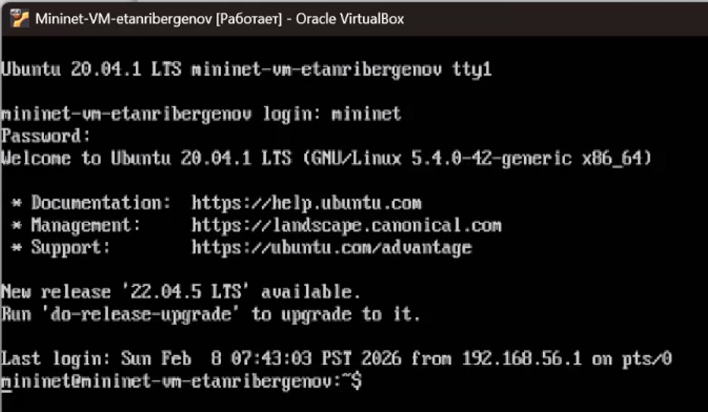{#fig:001}

1.2. Из основной ОС подключился к виртуальной машине:

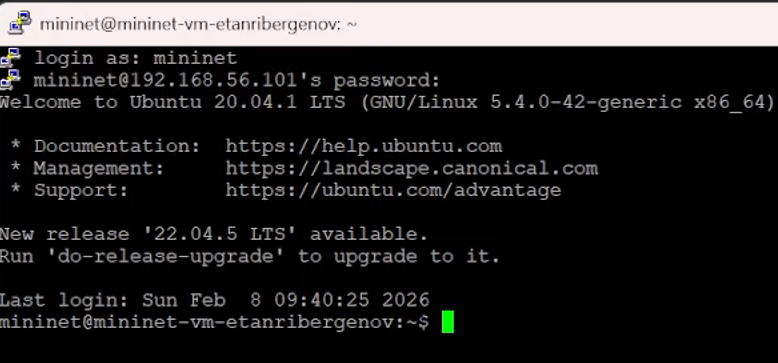{#fig:002}

1.3. В виртуальной машине mininet исправил права запуска X-соединения.

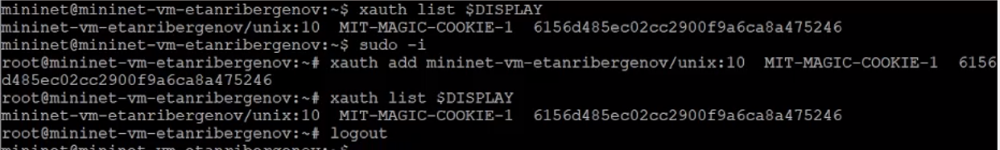{#fig:003}

1.4. Задал простейшую топологию, состоящую из двух хостов и коммутатора с назначенной по умолчанию mininet сетью 10.0.0.0/8:

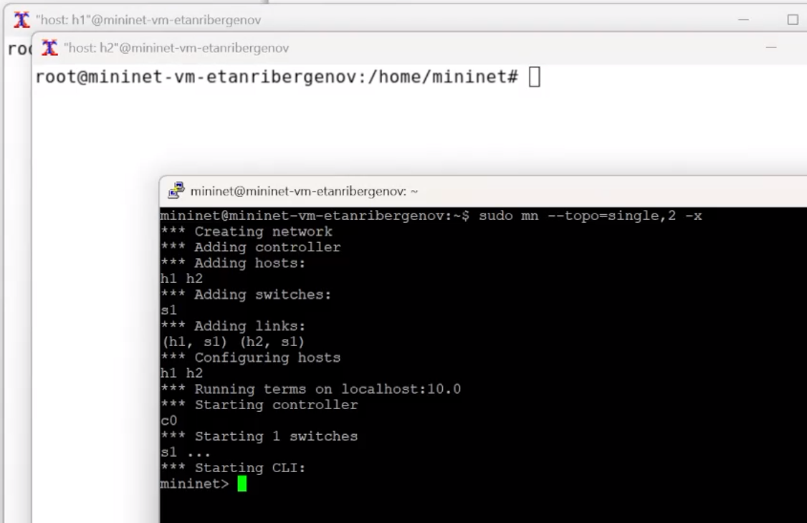{#fig:004}

После введения этой команды запустились терминалы двух хостов, коммутатора и контроллера. Терминалы коммутатора и контроллера закрыл.

1.5. На хостах h1 и h2 ввёл команду ifconfig, чтобы отобразить информацию, относящуюся к их сетевым интерфейсам и назначенным им IP-адресам.
В дальнейшем при работе с NETEM и командой tc будут использоваться интерфейсы h1-eth0 и h2-eth0.

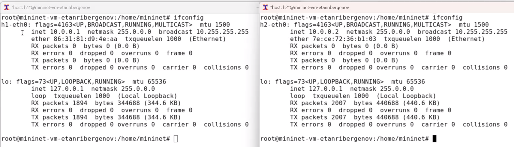{#fig:005}

1.6. Проверил подключение между хостами h1 и h2 с помощью команды ping с параметром -c 6.

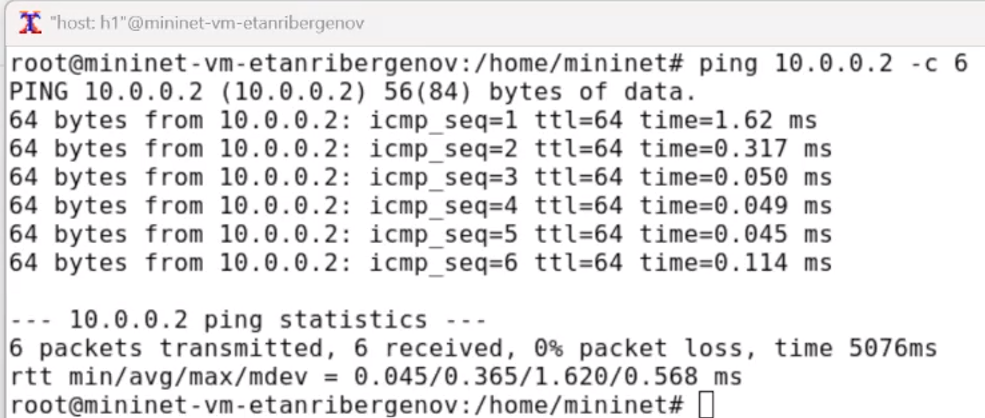{#fig:006}
 
1.7. Минимальное, среднее, максимальное и стандартное отклонение времени приёма-передачи (RTT) = 0.045 / 0.365 / 1.620 / 0.568 ms.


**2. Интерактивные эксперименты**

2.1. Добавление/изменение задержки в эмулируемой глобальной сети.

Сетевые эмуляторы задают задержки на интерфейсе. Например, задержка, вносимая в интерфейс коммутатора A, который подключён к интерфейсу
коммутатора B, может представлять собой задержку распространения WAN, соединяющей оба коммутатора.

2.1.1. На хосте h1 добавил задержку в 100 мс к выходному интерфейсу:

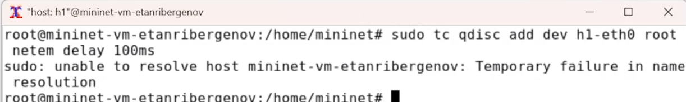{#fig:007}

Здесь:
– sudo: выполнить команду с более высокими привилегиями;
– tc: вызвать управление трафиком Linux;
– qdisc: изменить дисциплину очередей сетевого планировщика;
– add: создать новое правило;
– dev h1-eth0: указать интерфейс, на котором будет применяться правило;
– netem: использовать эмулятор сети;
– delay 100ms: задержка ввода 100 мс.

2.1.2. Проверил, что соединение от хоста h1 к хосту h2 имеет задержку 100 мс, используя команду ping с параметром -c 6 с хоста h1.
Минимальное, среднее, максимальное и стандартное отклонение времени приёма-передачи (RTT) = 100.223 / 100.479 / 100.689 / 0.183 мс.

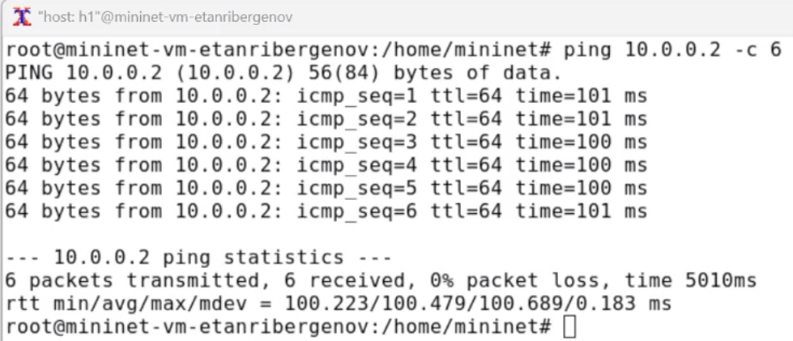{#fig:008}


2.1.3. Для эмуляции глобальной сети с двунаправленной задержкой необходимо к соответствующему интерфейсу на хосте h2 также добавить задержку в 100 миллисекунд:

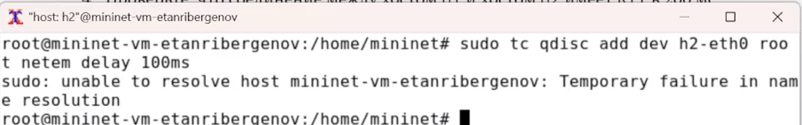{#fig:009}


2.1.4. Проверил, что соединение между хостом h1 и хостом h2 имеет RTT в 200 мс (100 мс от хоста h1 к хосту h2 и 100 мс от хоста h2 к хосту h1), повторив команду ping с параметром -c 6 на терминале хоста h1. 
Минимальное, среднее, максимальное и стандартное отклонение времени приёма-передачи (RTT)  = 100.223 / 100.479 / 100.689 / 0.183 мс .

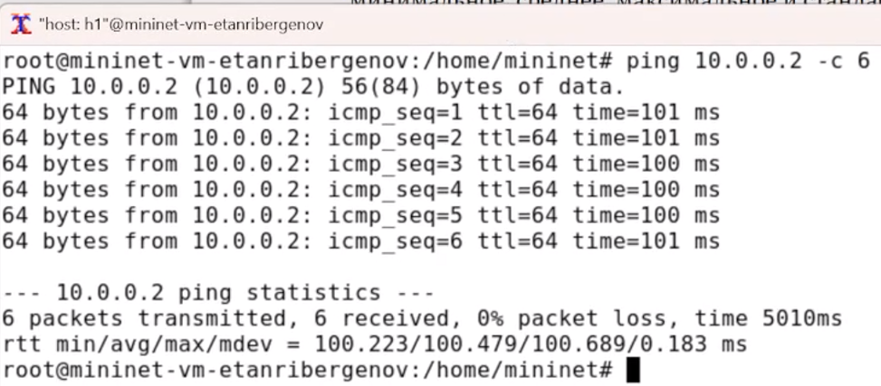{#fig:010}


2.2. Изменение задержки в эмулируемой глобальной сети

2.2.1. Изменил задержку со 100 мс до 50 мс для отправителя h1:

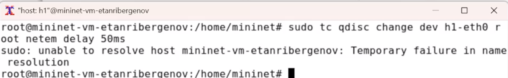{#fig:011}

и для получателя h2:

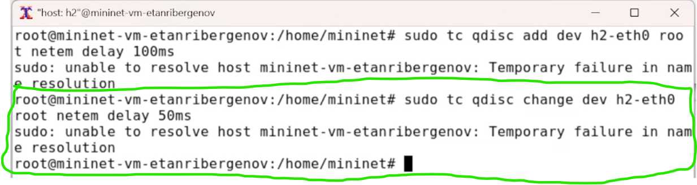{#fig:012}

2.2.2. Проверил, что соединение от хоста h1 к хосту h2 имеет задержку 100 мс, используя команду ping с параметром -c 6 с терминала хоста h1.
Минимальное, среднее, максимальное и стандартное отклонение времени приёма-передачи (RTT)  =  100.280 / 100.862 / 101.266 / 0.321 мс.

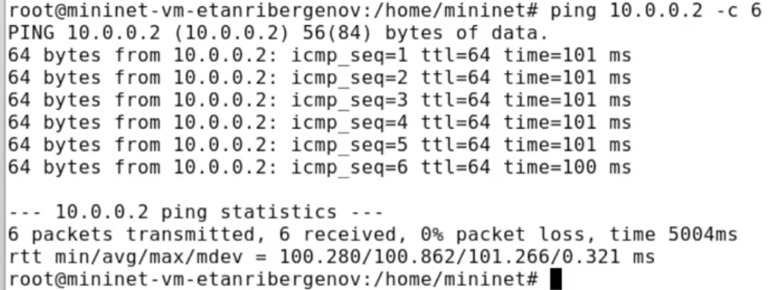{#fig:013}

2.3. Восстановление исходных значений (удаление правил) задержки в эмулируемой глобальной сети.

2.3.1. Восстановил конфигурацию по умолчанию, удалив все правила, применённые к сетевому планировщику соответствующего интерфейса.

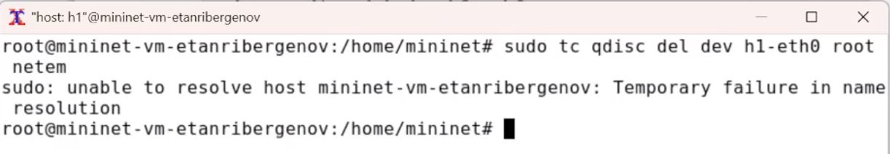{#fig:014}

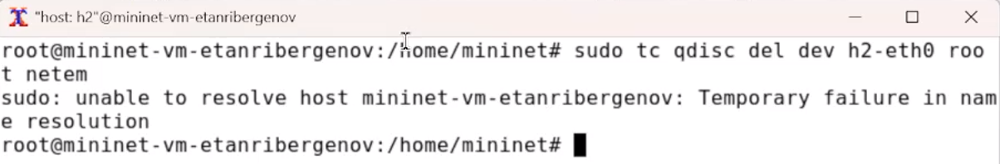{#fig:015}

2.3.2. Проверил, что соединение между хостом h1 и хостом h2 не имеет явно установленной задержки, используя команду ping с параметром -c 6 с терминала хоста h1. 
Минимальное, среднее, максимальное и стандартное отклонение времени приёма-передачи (RTT)  =  0.051 / 0.258 / 0.825 / 0.287 мс.

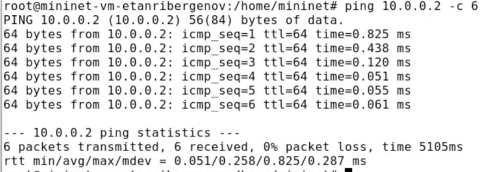{#fig:016}

2.4. Добавление значения дрожания задержки в интерфейс подключения к эмулируемой глобальной сети.

В сетях нет постоянной задержки. Она может варьироваться в зависимости от других потоков трафика, конкурирующих за тот же путь. Джиттер (jitter) —
это изменение времени задержки. Параметры задержки описываются в терминах теории вероятностей средним значением 𝜇, стандартным отклонением
𝜎 и корреляцией. По умолчанию NETEM использует равномерное распределение, так что задержка находится в пределах 𝜇 ± 𝜎. Параметр корреляции управляет
отношением между последовательными псевдослучайными значениями.

2.4.2. Добавил на узле h1 задержку в 100 мс со случайным отклонением 10 мс:

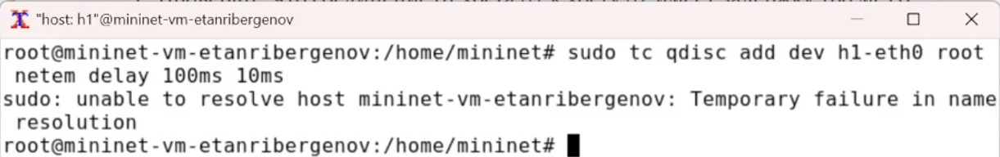{#fig:017}

2.4.3. Проверил, что соединение от хоста h1 к хосту h2 имеет задержку 100 мс со случайным отклонением ±10 мс, используя в терминале хоста h1 команду
ping с параметром -c 6. Минимальное, среднее, максимальное и стандартное отклонение времени приёма-передачи (RTT) = 94.344 / 101.497 / 107.470 / 5.643 мс.

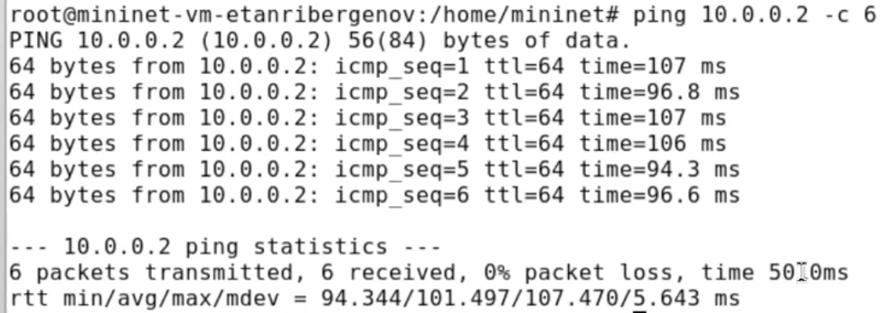{#fig:018}

2.4.4. Восстановил конфигурацию интерфейса по умолчанию на узле h1.

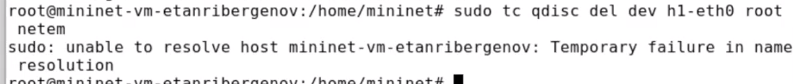{#fig:019}


2.5. Добавление значения корреляции для джиттера и задержки в интерфейс подключения к эмулируемой глобальной сети.

2.5.2. Добавил на интерфейсе хоста h1 задержку в 100 мс с вариацией ±10 мс и значением корреляции в 25%:

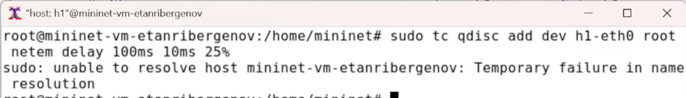{#fig:020}

2.5.3. Убедился, что все пакеты, покидающие устройство h1 на интерфейсе h1-eth0, будут иметь время задержки 100 мс со случайным отклонением ±10 мс,
при этом время передачи следующего пакета зависит от предыдущего значения на 25%. Использовал для этого в терминале хоста h1 команду ping с параметром -c 20.

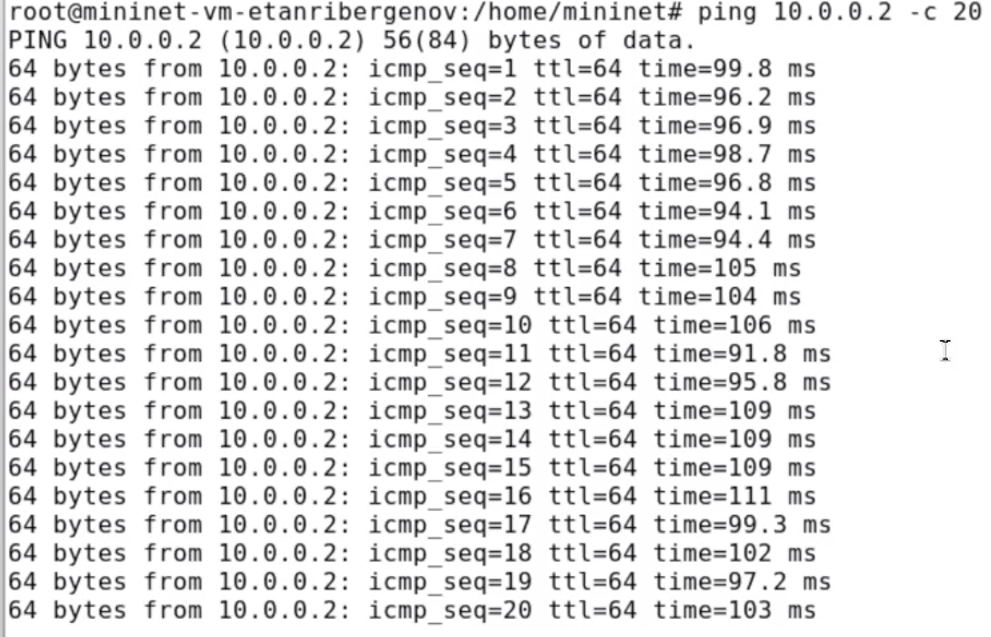{#fig:021}

2.5.4. Восстановил конфигурацию интерфейса по умолчанию на узле h1.

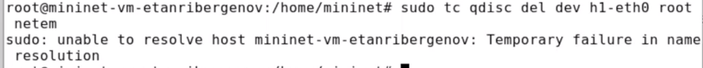{#fig:022}


2.6. Распределение задержки в интерфейсе подключения к эмулируемой глобальной сети.

NETEM позволяет пользователю указать распределение, которое описывает, как задержки изменяются в сети. В реальных сетях передачи данных задержки
неравномерны, поэтому при моделировании может быть удобно использовать некоторое случайное распределение, например, нормальное, парето или паретонормальное.

2.6.2. Задал нормальное распределение задержки на узле h1 в эмулируемой сети:

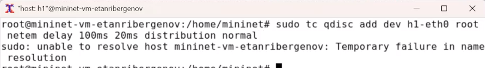{#fig:023}

2.6.3. Убедился, что все пакеты, покидающие хост h1 на интерфейсе h1-eth0, будут иметь время задержки, которое распределено в диапазоне 100 мс ±20 мс.
Использовал для этого команду ping на терминале хоста h1 с параметром -c 10.

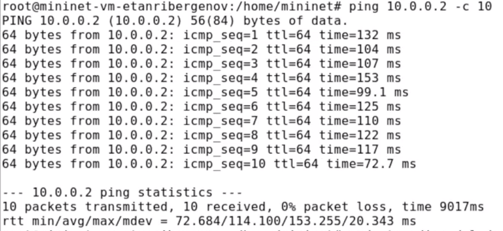{#fig:024}

2.6.4. Восстановил конфигурацию интерфейса по умолчанию на узле h1.

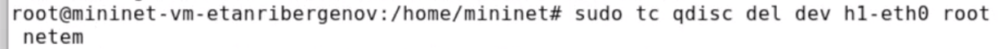{#fig:025}

2.6.5. Завершил работу mininet в интерактивном режиме.

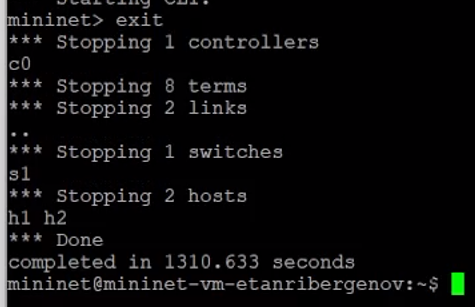{#fig:026}


**3. Воспроизведение экспериментов**

3.1. Предварительная подготовка.

3.1.1. Обновил репозитории программного обеспечения на виртуальной машине:

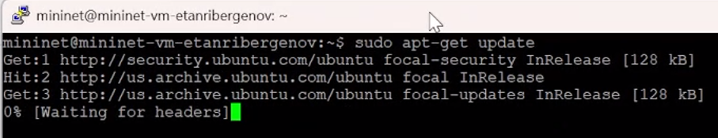{#fig:027}

3.1.2. Установил пакет geeqie — понадобится для просмотра файлов png:

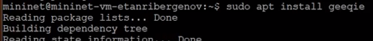{#fig:028}

3.1.3. Для каждого воспроизводимого эксперимента expname создал свой каталог, в котором будут размещаться файлы эксперимента:

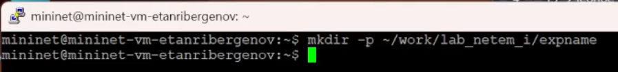{#fig:029}


3.2. Добавление задержки для интерфейса, подключающегося к эмулируемой глобальной сети.

С помощью API Mininet воспроизвёл эксперимент по добавлению задержки для интерфейса хоста, подключающегося к эмулируемой глобальной сети.

3.2.1. В виртуальной среде mininet в своём рабочем каталоге с проектами создал каталог simple-delay и перешёл в него:

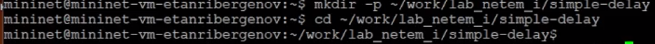{#fig:030}

3.2.2. Создал скрипт для эксперимента lab_netem_i.py:

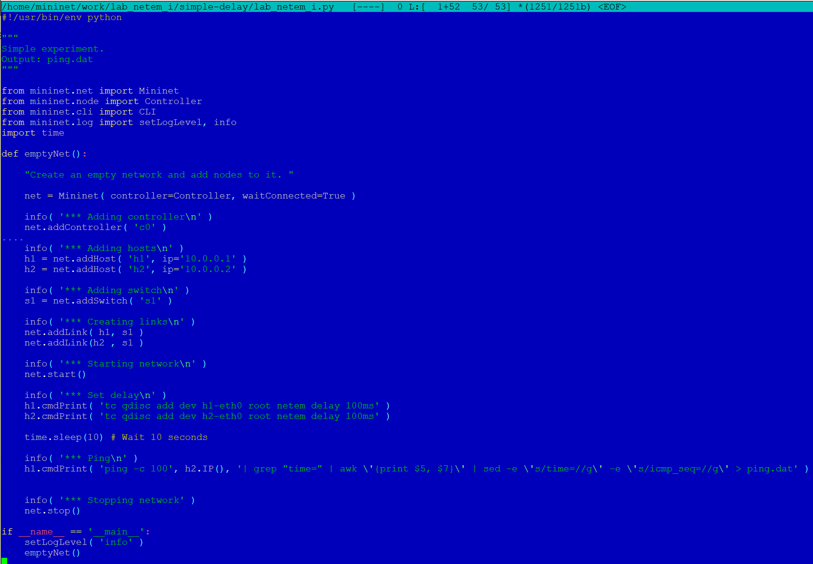{#fig:031}

3.2.3. В строках скрипта "h1/h2.cmdPrint(...)" задаётся значение задержки для интерфейса хоста. Файл с результатами эксперимента для последующего построения графиков формируется перенесом стандартного вывода в файл, в нём размещены: номер в очереди пакета и задержка.
3.2.4. Создал скрипт для визуализации ping_plot результатов эксперимента:

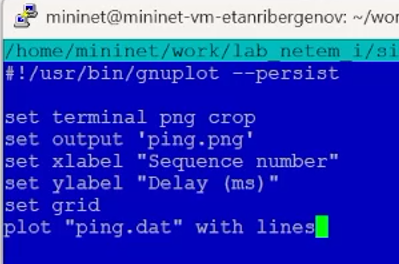{#fig:032}

3.2.5. Задал права доступа к файлу скрипта:

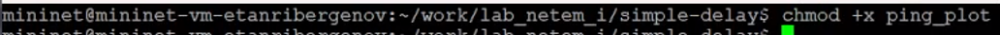{#fig:033}

3.2.6. Создал Makefile для управления процессом проведения эксперимента:

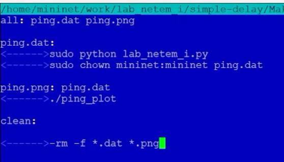{#fig:034}

3.2.7. Выполнил эксперимент:

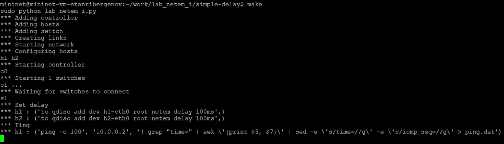{#fig:035}

3.2.8. Построенный в результате выполнения скриптов график:

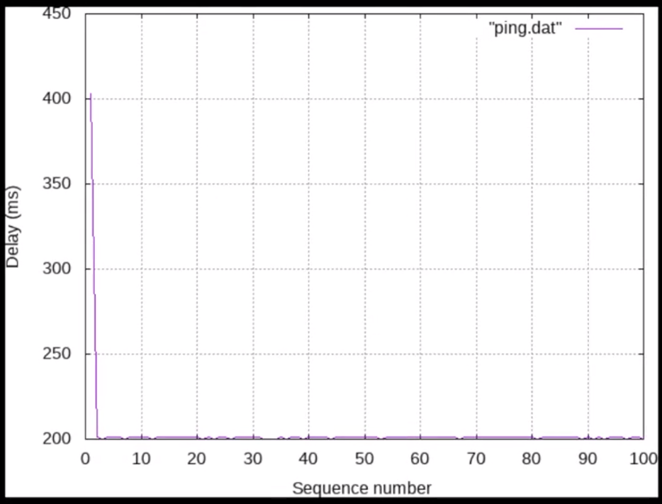{#fig:036}

3.2.9. Из файла ping.dat удалил первую строку и заново построил график:

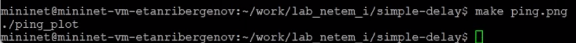{#fig:037}

3.2.10. Построенный в результате график:

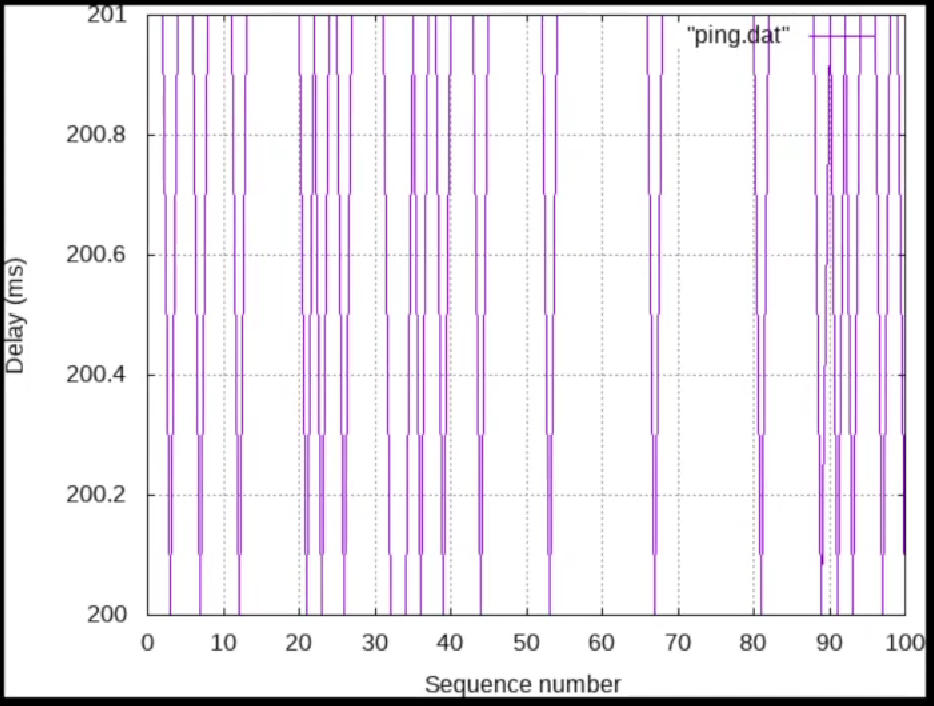{#fig:038}

3.2.11. Разработал скрипт для вычисления на основе данных файла ping.dat минимального, среднего, максимального и стандартного отклонения времени приёма-передачи.

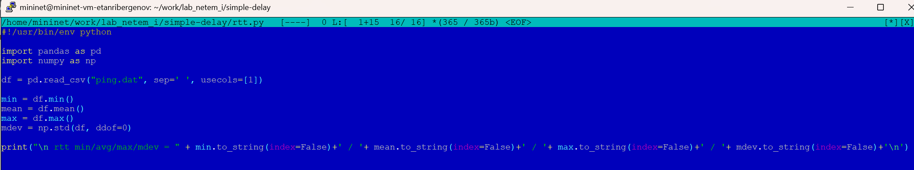{#fig:039}

Добавил правило запуска скрипта в Makefile. 

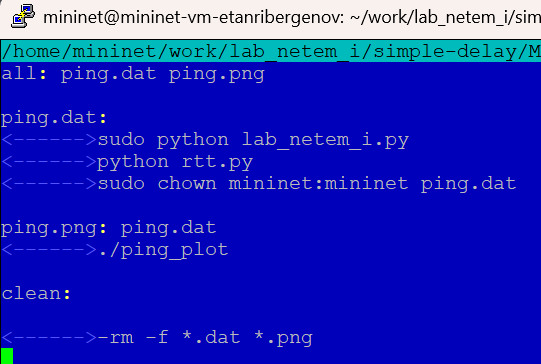{#fig:040}

Работа скрипта с выводом значений на экран:

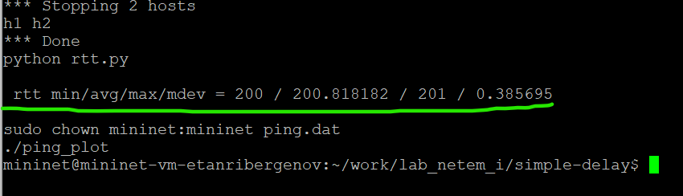{#fig:041}

3.2.12. Очистил каталог от результатов проведения экспериментов.


3.3. Задание для самостоятельной работы.

Самостоятельно реализовал воспроизводимые эксперименты по изменению задержки, джиттера, значения корреляции для джиттера и задержки, распределения времени задержки в эмулируемой глобальной сети. Построил графики.
Вычислил минимальное, среднее, максимальное и стандартное отклонение времени приёма-передачи для каждого случая.

3.3.1. 

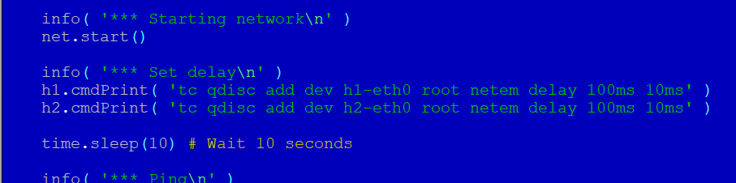{#fig:042}

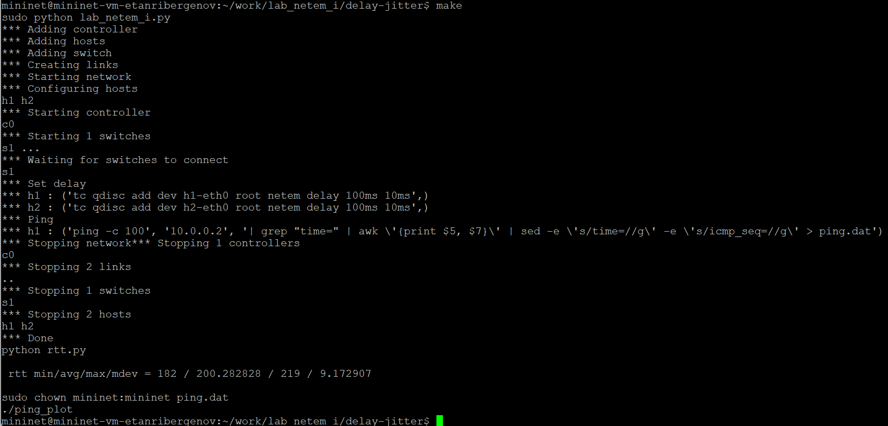{#fig:043}

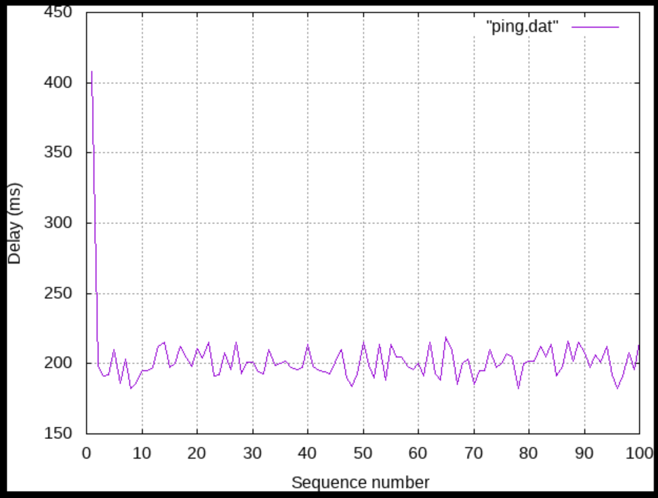{#fig:044}


3.3.2.

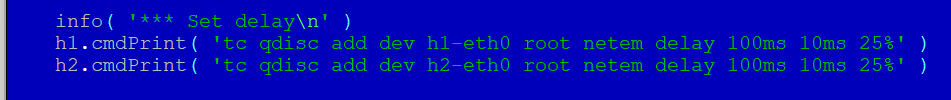{#fig:045}

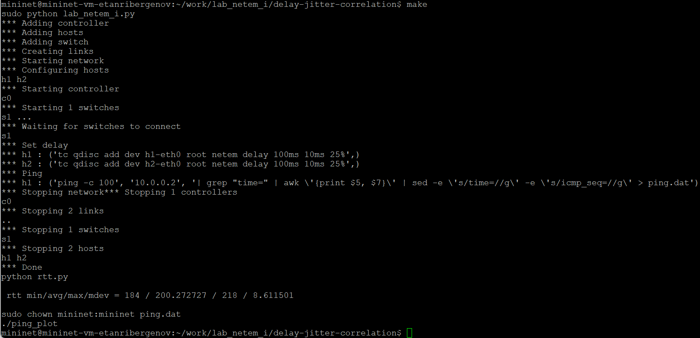{#fig:046}

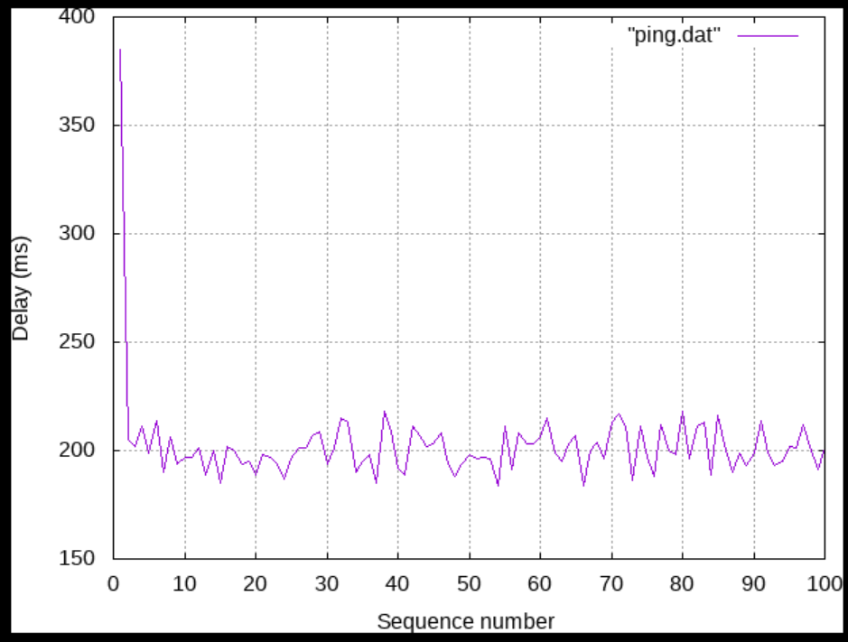{#fig:047}


3.3.3.

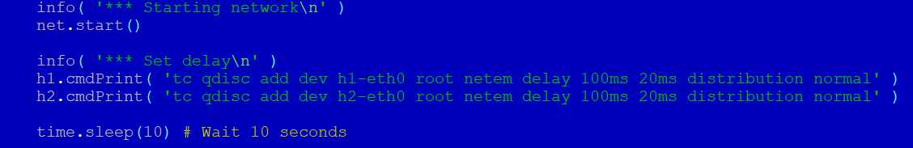{#fig:048}

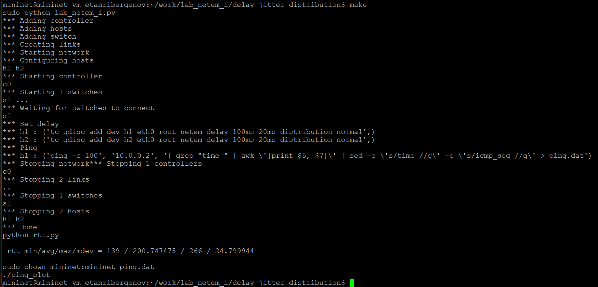{#fig:049}

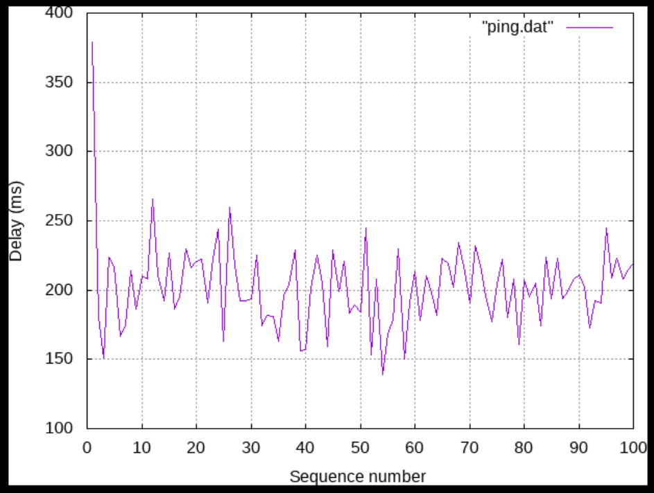{#fig:050}


# Выводы

 В результате выполенения лабораторной работы я ознакомился с NETEM — инструментом для тестирования производительности приложений в виртуальной сети, а также
получил навыки проведения интерактивного и воспроизводимого экспериментов по измерению задержки и её дрожания (jitter) в моделируемой сети в среде Mininet.