---
## Front matter
lang: ru-RU
title: Презентация по лабораторной работе №5
subtitle: Эмуляция и измерение потерь пакетов в глобальных сетях
author:
  - Танрибергенов Э.
institute:
  - Российский университет дружбы народов, Москва, Россия
date: 2026 г.

## i18n babel
babel-lang: russian
babel-otherlangs: english
## Fonts
mainfont: IBM Plex Serif
romanfont: IBM Plex Serif
sansfont: IBM Plex Sans
monofont: IBM Plex Mono
mathfont: STIX Two Math
mainfontoptions: Ligatures=Common,Ligatures=TeX,Scale=0.94
romanfontoptions: Ligatures=Common,Ligatures=TeX,Scale=0.94
sansfontoptions: Ligatures=Common,Ligatures=TeX,Scale=MatchLowercase,Scale=0.94
monofontoptions: Scale=MatchLowercase,Scale=0.94,FakeStretch=0.9
## Formatting pdf
toc: false
toc-title: Содержание
slide_level: 2
aspectratio: 169
section-titles: true
theme: metropolis
header-includes:
 - \metroset{progressbar=frametitle,sectionpage=progressbar,numbering=fraction}
---

# Информация

## Докладчик

  - Танрибергенов Эльдар
  - студент 4 курса из группы НПИбд-01-22
  - ФМиЕН, кафедра прикладной информатики и теории вероятностей
  - Российский университет дружбы народов


# Цели и задачи

## Цель работы

- Основной целью работы является получение навыков проведения интерактивных экспериментов в среде Mininet по исследованию параметров сети,
связанных с потерей, дублированием, изменением порядка и повреждением пакетов при передаче данных. Эти параметры влияют на производительность
протоколов и сетей.


## Задачи

1. Задать простейшую топологию, состоящую из двух хостов и коммутатора с назначенной по умолчанию mininet сетью 10.0.0.0/8.
2. Провести интерактивные эксперименты по исследованию параметров сети, связанных с потерей, дублированием, изменением порядка и повреждением пакетов при передаче данных.
3. Реализовать воспроизводимый эксперимент по добавлению правила отбрасывания пакетов в эмулируемой глобальной сети.


# Результаты


## Создание простейшей топологии с назначенной по умолчанию mininet сетью

:::::::::::::: {.columns align=center}
::: {.column width="30%"}

### Топология, состоящая из двух хостов и коммутатора с сетью 10.0.0.0/8

:::
::: {.column width="70%"}

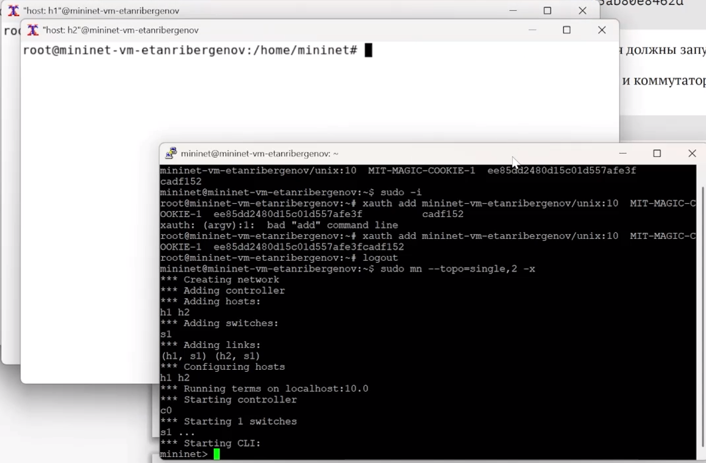{#fig:001 height="70%"}

:::
::::::::::::::


## Интерактивные эксперименты

### Изменение правил приёма-передачи на сетевых интерфейсах узлов 

- команда: 

``` sudo tc qdisc [add|del|replace|change|show] dev dev_id root netem opts  ```

Здесь:
- sudo: включить выполнение команды с более высокими привилегиями безопасности;
– tc: команда, используемая для взаимодействия с NETEM;
– qdisc: дисциплина очереди, представляющая собой набор правил, определяющих порядок, в котором обслуживаются пакеты, поступающие с выхода протокола IP;
– [add | del | replace | change | show] ([добавить | удалить | заменить | изменить | показать]): указание на использование одной из операций над qdisc;
– dev_id: параметр указывает интерфейс, подлежащий эмуляции (в данном случае указан корневой интерфейс — root);
– opts: параметр указывает величину задержки, потери пакетов, дублирования, повреждения и др.


## Интерактивные эксперименты

### Эмуляция глобальной сети с потерей пакетов в обоих направлениях: добавление потерь пакетов на интерфейсы узлов

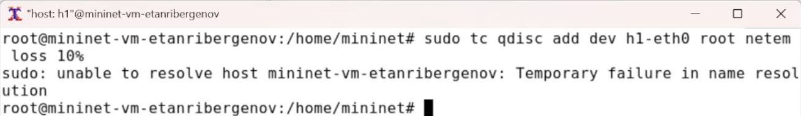{#fig:002 height="70%"}

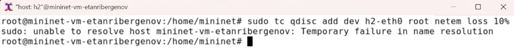{#fig:003}


## Интерактивные эксперименты

### Результат

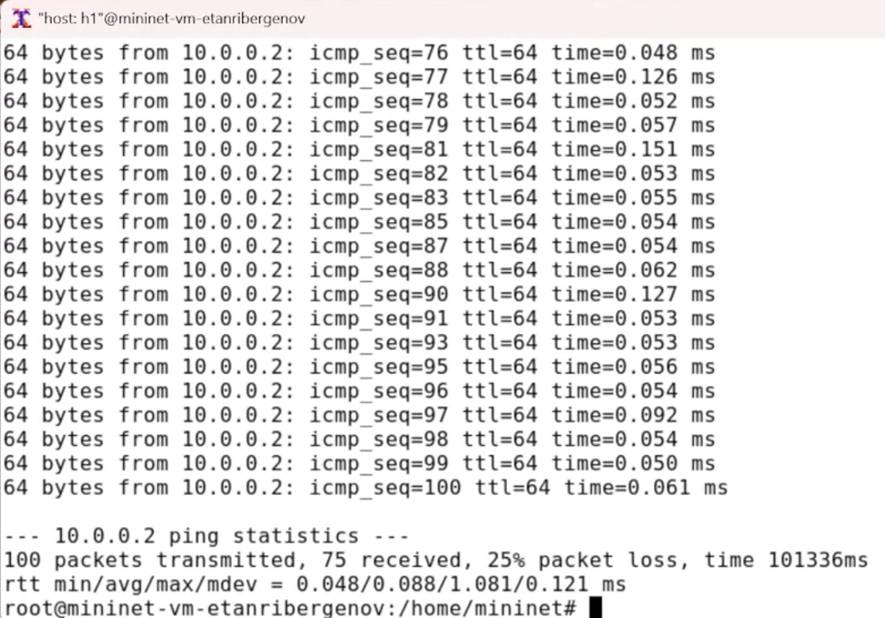{#fig:004 height="70%"}


## Интерактивные эксперименты

### Добавление значения корреляции для потери пакетов в эмулируемой глобальной сети

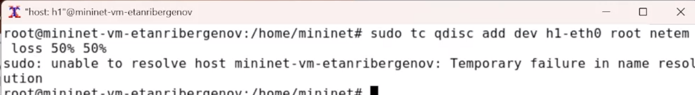{#fig:005}


## Интерактивные эксперименты

### Результат

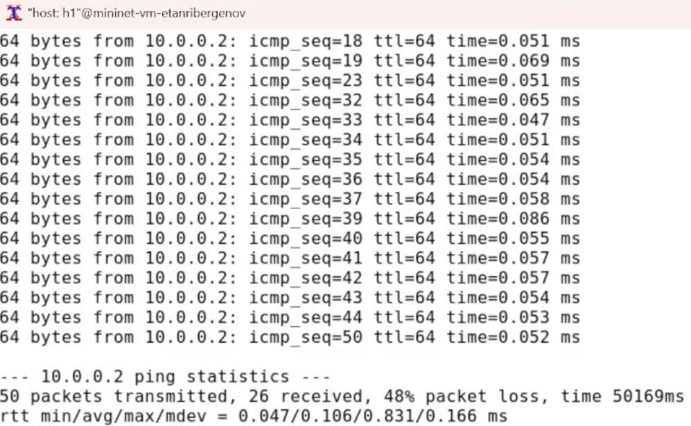{#fig:006 height="70%"}


## Интерактивные эксперименты

### Добавление повреждения пакетов в эмулируемой глобальной сети

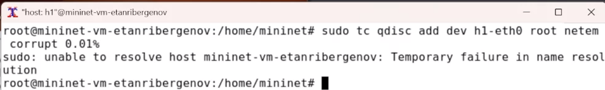{#fig:007}


## Интерактивные эксперименты

### Результат

:::::::::::::: {.columns align=center}
::: {.column width="30%"}
- На узле h2 запущен iPerf3 в режиме сервера
– На узле h1 запущен iPerf3 в режиме клиента
:::
::: {.column width="70%"}

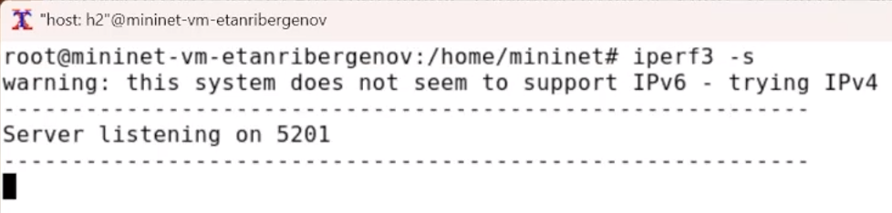{#fig:008 height="20%"}

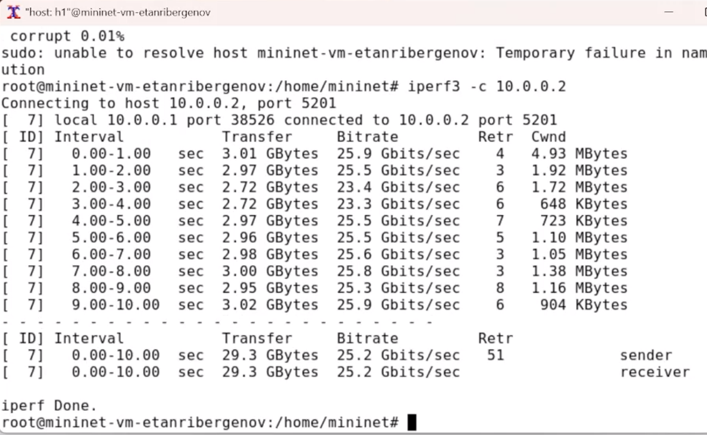{#fig:009 height="35%"}

:::
::::::::::::::


## Интерактивные эксперименты

### Добавление переупорядочивания пакетов в интерфейс подключения к эмулируемой глобальной сети

- 25% пакетов (со значением корреляции 50%) будут отправлены немедленно, а остальные 75% будут задержаны на 10 мс

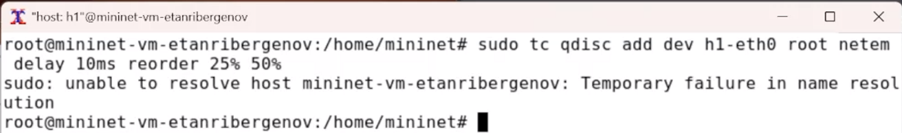{#fig:010}


## Интерактивные эксперименты

### Результат

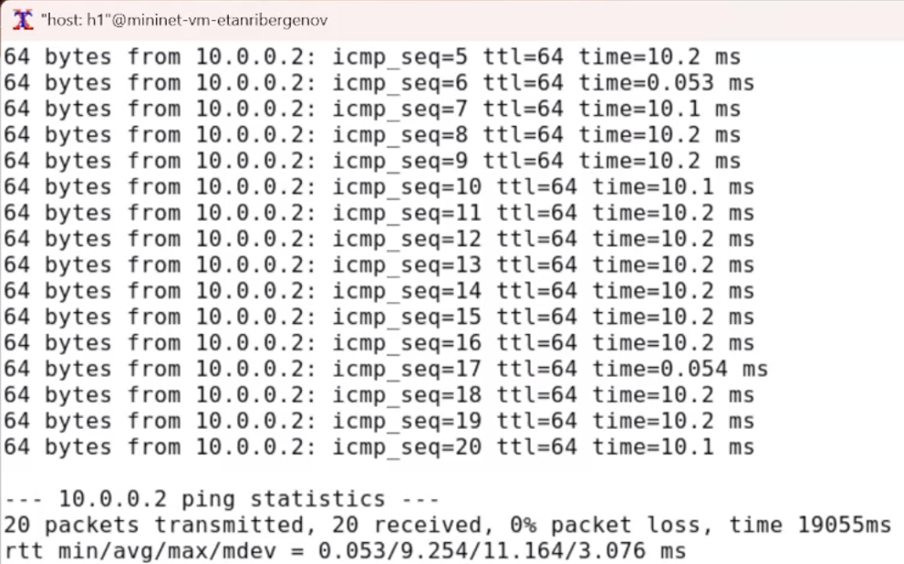{#fig:011 height="70%"}


## Интерактивные эксперименты

### Добавление дублирования пакетов в интерфейс подключения к эмулируемой глобальной сети

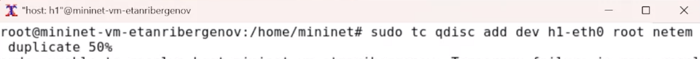{#fig:012}


## Интерактивные эксперименты

### Результат

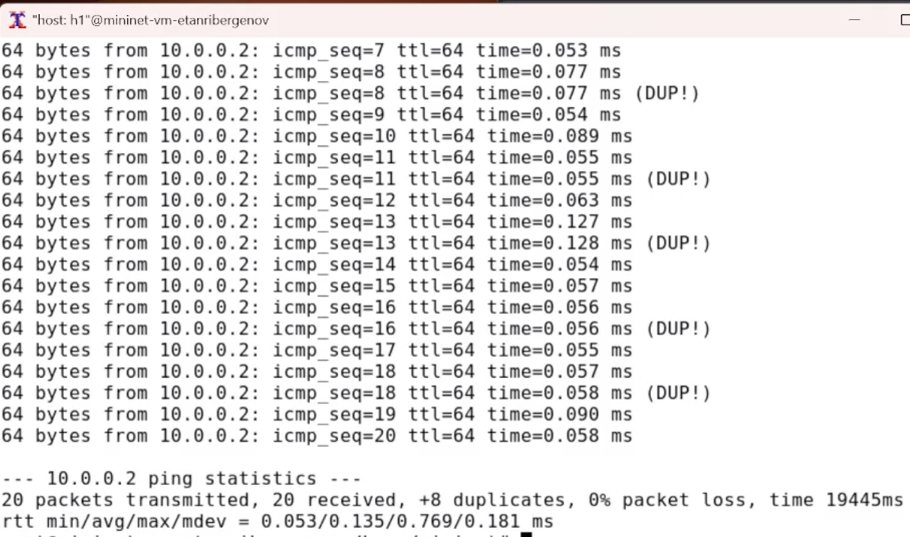{#fig:013 height="70%"}


## Воспроизводимый эксперимент

### Эксперимент с потерей пакетов

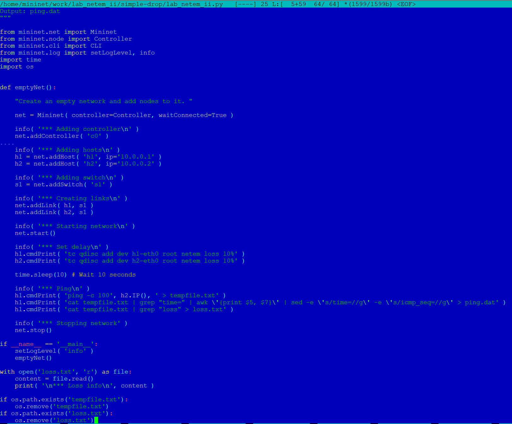{#fig:014 height="70%"}


## Воспроизводимый эксперимент

### Результат

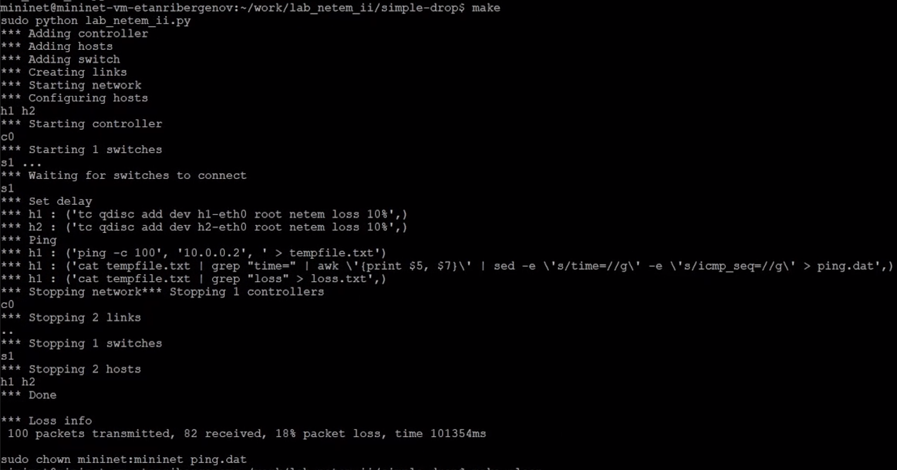{#fig:015 height="70%"}


# Выводы
  
## Вывод

 В результате выполенения лабораторной работы я получил навыки проведения интерактивных экспериментов в среде Mininet по исследованию параметров сети,
связанных с потерей, дублированием, изменением порядка и повреждением пакетов при передаче данных. Эти параметры влияют на производительность протоколов и сетей.