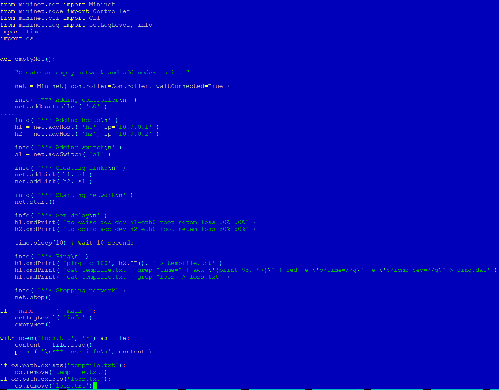
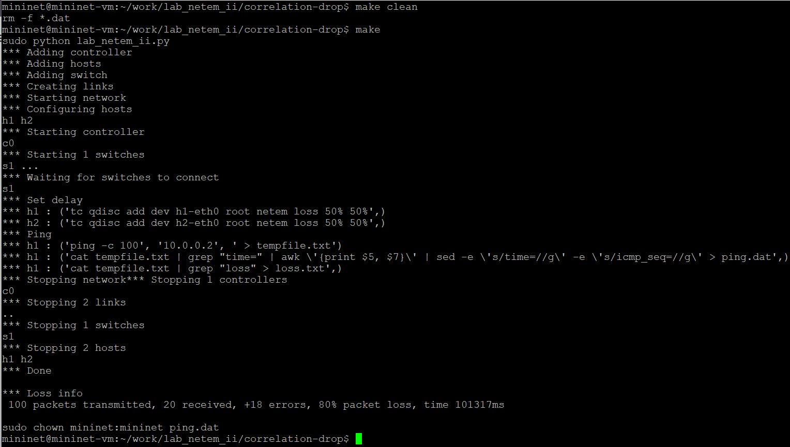
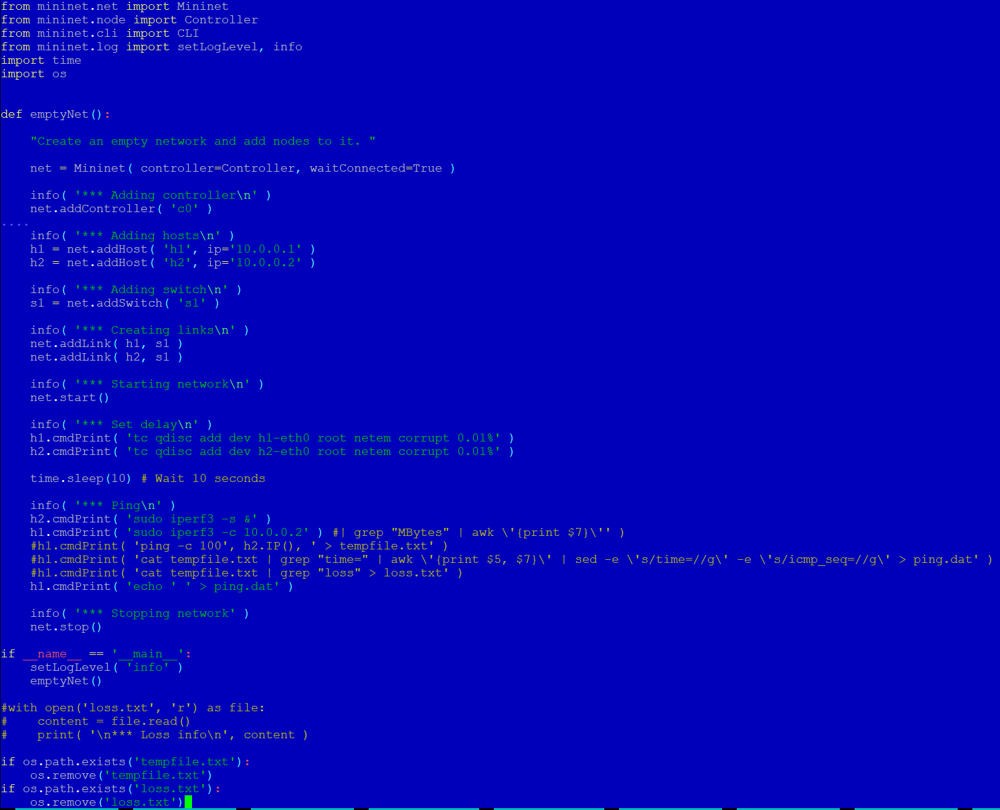
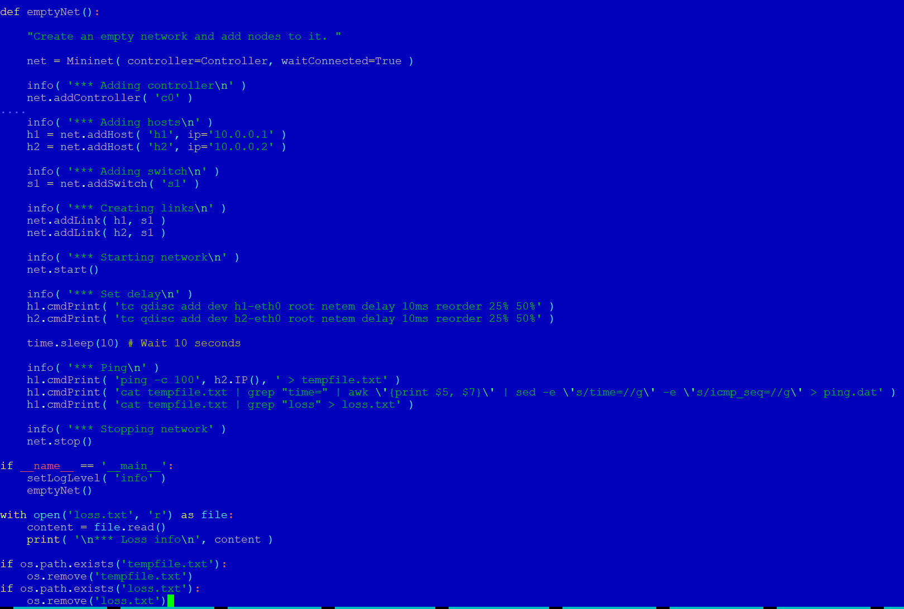
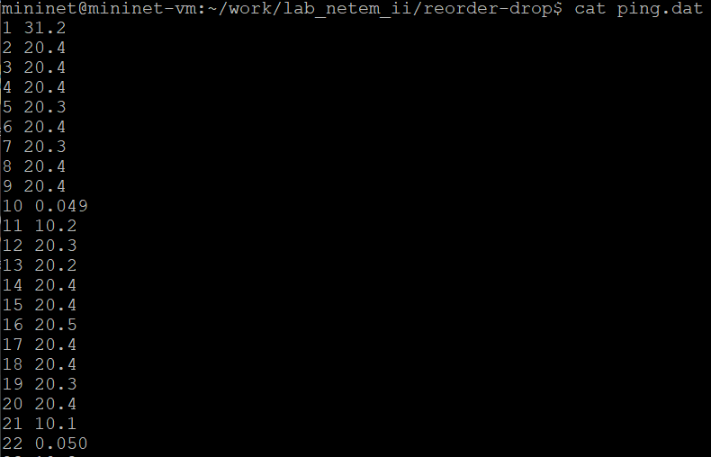

---
## Front matter
lang: ru-RU
title: Презентация по лабораторной работе №5
subtitle: Эмуляция и измерение потерь пакетов в глобальных сетях
author:
  - Танрибергенов Э.
institute:
  - Российский университет дружбы народов, Москва, Россия
date: 2026 г.

## i18n babel
babel-lang: russian
babel-otherlangs: english
## Fonts
mainfont: IBM Plex Serif
romanfont: IBM Plex Serif
sansfont: IBM Plex Sans
monofont: IBM Plex Mono
mathfont: STIX Two Math
mainfontoptions: Ligatures=Common,Ligatures=TeX,Scale=0.94
romanfontoptions: Ligatures=Common,Ligatures=TeX,Scale=0.94
sansfontoptions: Ligatures=Common,Ligatures=TeX,Scale=MatchLowercase,Scale=0.94
monofontoptions: Scale=MatchLowercase,Scale=0.94,FakeStretch=0.9
## Formatting pdf
toc: false
toc-title: Содержание
slide_level: 2
aspectratio: 169
section-titles: true
theme: metropolis
header-includes:
 - \metroset{progressbar=frametitle,sectionpage=progressbar,numbering=fraction}
---

# Информация

## Докладчик

  - Танрибергенов Эльдар
  - студент 4 курса из группы НПИбд-01-22
  - ФМиЕН, кафедра прикладной информатики и теории вероятностей
  - Российский университет дружбы народов

# Цели и задачи

## Цель работы

- Основной целью работы является знакомство с NETEM — инструментом для тестирования производительности приложений в виртуальной сети, а также
получение навыков проведения интерактивного и воспроизводимого экспериментов по измерению задержки и её дрожания (jitter) в моделируемой сети в среде Mininet.

## Задачи

- Реализовать воспроизводимые эксперименты по измерению задержки, джиттера, значения корреляции для джиттера и задержки, распределения времени задержки в эмулируемой глобальной сети
- Построить графики

# Результаты

## Воспроизводимые эксперименты: подготовка необходимых скриптов

:::::::::::::: {.columns align=center}
::: {.column width="30%"}

### Скрипт вычисления показателей задержки приёма-передачи на основе данных файла ping.dat

:::
::: {.column width="70%"}

{#fig:001}

:::
::::::::::::::

## Воспроизводимые эксперименты: подготовка необходимых скриптов

:::::::::::::: {.columns align=center}
::: {.column width="30%"}

### Скрипт для построения графика

- График рисуется с помощью среды gnuplot

:::
::: {.column width="70%"}

{#fig:002}

:::
::::::::::::::

## Воспроизводимые эксперименты: подготовка необходимых скриптов

:::::::::::::: {.columns align=center}
::: {.column width="30%"}

### Создание Makefile для управления процессом проведения эксперимента

:::
::: {.column width="70%"}

{#fig:003}

:::
::::::::::::::

## Воспроизводимый эксперимент №1

### Измерение задержки

{#fig:004 height="70%" width="70%"}

## Результат эксперимента №1

### Запуск скрипта Makefile

{#fig:005}

## График эксперимента №1

{#fig:006 height="70%" width="70%"}

## Воспроизводимый эксперимент №2

###  Измерение задержки c джиттером

{#fig:007}

## Результат эксперимента №2

### Запуск скрипта Makefile

{#fig:008 height="70%" width="70%"}

## График эксперимента №2

{#fig:009 height="70%" width="70%"}

## Воспроизводимый эксперимент №3

###  Измерение задержки c джиттером и корреляцией

{#fig:010}

## Результат эксперимента №3

### Запуск скрипта Makefile

{#fig:011 height="70%" width="70%"}

## График эксперимента №3

{#fig:012 height="70%" width="70%"}

## Воспроизводимый эксперимент №4

###  Измерение задержки c джиттером и нормальным распределением

{#fig:013}

## Результат эксперимента №4

### Запуск скрипта Makefile

{#fig:014 height="70%" width="70%"}

## График эксперимента №4

{#fig:015 height="70%" width="70%"}

# Выводы
  
## Вывод

 В результате выполенения лабораторной работы я ознакоммлся с NETEM — инструментом для тестирования производительности приложений в виртуальной сети, а также
получил навыки проведения интерактивного и воспроизводимого экспериментов по измерению задержки и её дрожания (jitter) в моделируемой сети в среде Mininet.