---
## Front matter
title: "Отчёт по лабораторной работе №5"
subtitle: "Дисциплина: Моделирование сетей передачи данных"
author: "Выполнил: Танрибергенов Эльдар (НПИбд-01-22)"

## Generic otions
lang: ru-RU
toc-title: "Содержание"

## Bibliography
bibliography: bib/cite.bib
csl: pandoc/csl/gost-r-7-0-5-2008-numeric.csl

## Pdf output format
toc: true # Table of contents
toc-depth: 2
lof: true # List of figures
lot: true # List of tables
fontsize: 12pt
linestretch: 1.5
papersize: a4
documentclass: scrreprt
## I18n polyglossia
polyglossia-lang:
  name: russian
  options:
	- spelling=modern
	- babelshorthands=true
polyglossia-otherlangs:
  name: english
## I18n babel
babel-lang: russian
babel-otherlangs: english
## Fonts
mainfont: IBM Plex Serif
romanfont: IBM Plex Serif
sansfont: IBM Plex Sans
monofont: IBM Plex Mono
mathfont: STIX Two Math
mainfontoptions: Ligatures=Common,Ligatures=TeX,Scale=0.94
romanfontoptions: Ligatures=Common,Ligatures=TeX,Scale=0.94
sansfontoptions: Ligatures=Common,Ligatures=TeX,Scale=MatchLowercase,Scale=0.94
monofontoptions: Scale=MatchLowercase,Scale=0.94,FakeStretch=0.9
mathfontoptions:
## Biblatex
biblatex: true
biblio-style: "gost-numeric"
biblatexoptions:
  - parentracker=true
  - backend=biber
  - hyperref=auto
  - language=auto
  - autolang=other*
  - citestyle=gost-numeric
## Pandoc-crossref LaTeX customization
figureTitle: "Рис."
tableTitle: "Таблица"
listingTitle: "Листинг"
lofTitle: "Список иллюстраций"
lotTitle: "Список таблиц"
lolTitle: "Листинги"
## Misc options
indent: true
header-includes:
  - \usepackage{indentfirst}
  - \usepackage{float} # keep figures where there are in the text
  - \floatplacement{figure}{H} # keep figures where there are in the text
---

# Цель работы

- Основной целью работы является получение навыков проведения интерактивных экспериментов в среде Mininet по исследованию параметров сети,
связанных с потерей, дублированием, изменением порядка и повреждением пакетов при передаче данных. Эти параметры влияют на производительность протоколов и сетей.


# Теоретическое введение

В дополнение к задержке многие глобальные и локальные сети подвержены
потере, переупорядочению, повреждению и дублированию пакетов. Потеря пакета — состояние, возникающее, когда пакет, проходящий через
сеть, не достигает пункта назначения. Потеря пакетов может иметь большое влияние на сети с высокой пропускной способностью и высокой задержкой.
Распространенной причиной потери пакетов является неспособность маршрутизаторов удерживать пакеты, поступающие со скоростью, превышающей
скорость отправления. Даже в тех случаях, когда высокая скорость поступления пакетов носит временный характер (например, кратковременные всплески трафика),
маршрутизатор ограничен объёмом буферной памяти, используемой для мгновенного хранения пакетов. Когда происходит потеря пакетов, протокол TCP
уменьшает окно перегрузки и, следовательно, пропускную способность вдвое.
Переупорядочивание пакетов — условие, возникающее, когда пакеты принимаются в порядке, отличном от того, в котором они были отправлены.
Переупорядочивание пакетов (неупорядоченная доставка пакетов) обычно является результатом того, что пакеты следуют по разным маршрутам для достижения пункта назначения. Переупорядочивание пакетов может ухудшить
пропускную способность TCP-соединений в сетях с высокой пропускной способностью и высокой задержкой. Для каждого сегмента, полученного не по порядку,
получатель TCP отправляет подтверждение (ACK) для последнего правильно принятого сегмента. Как только отправитель TCP получает три подтверждения
для одного и того же сегмента (тройной дубликат ACK), отправитель считает, что получатель неправильно принял пакет, следующий за пакетом, который
подтверждается три раза. Затем он продолжает уменьшать окно перегрузки и пропускную способность наполовину.
Повреждение пакета — повреждение битов, составляющих пакет, может (в основном) происходить на физическом уровне. Два соседних устройства соединены физическим каналом (например, волокном, медной витой парой
и т. д.). Физический уровень принимает необработанный битовый поток и доставляет его на канальный уровень. В случае повреждения некоторые биты
могут иметь значения, отличные от первоначально отправленных узломотправителем. Затем узел получателя просто отбрасывает пакет. В результате
процесс-отправитель TCP не получит подтверждения для соответствующего
сегмента и будет считать его потерянным сегментом. Процесс отправителя TCP
впоследствии уменьшит окно перегрузки и пропускную способность наполовину.
Дублирование пакетов — состояние, при котором несколько копий пакета присутствуют в сети и принимаются пунктом назначения. Дублирование пакетов
является результатом повторных передач, когда узел-отправитель повторно
передает неподтвержденные (NACK) пакеты.
Проблемы, возникающие при потере пакетов:
– Устаревшая информация. Эффект заметен в приложениях с высокой чувствительностью к задержкам и требующих мгновенного принятия решений при
определённых действиях пользователя, например, в видеоиграх.
– Медленная загрузка. Эффект заметен при просмотре мультимедийного
онлайн-контента (социальные сети, прямые трансляции и т.п.).
– Прерывание загрузки. Эффект заметен при низкой скорости передачи данных
и остановке приложения или работы ресурса при незавершении загрузки
каких-то данных.
– Закрытие соединений. Многие веб-ресурсы при отсутствии успешного завершения соединения и при долгом простое закрывают соединение по истечении
определённого времени.
– Неполная информация. На открываемых веб-страницах могут отображаться
не все элементы, неполные изображения или даже формат веб-сайта может
быть совершенно неправильным.
Некоторые распространенные причины потери пакетов:
– повреждённое оборудование (повреждение сетевой карты, портов или проводных соединений, неисправности маршрутизаторов или коммутаторов,
плохая проводка);
– ограничение ресурсов оборудования (мощность оборудования);
– перегрузка сети (узкие места в сети по маршруту следования пакетов);
– помехи и шумы в беспроводных сетях;
– ошибки в программном обеспечении сетевых устройств.


# Выполнение лабораторной работы

**1. Запуск лабораторной топологии**


1.1 Запустил виртуальную среду с mininet.

1.2. Из основной ОС подключился к виртуальной машине:

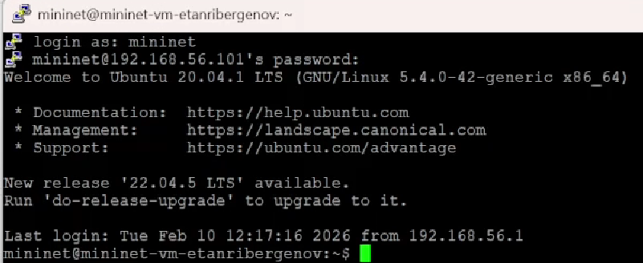{#fig:001}

1.3. В виртуальной машине mininet исправил права запуска X-соединения.
После выполнения этих действий графические приложения должны запускаться под пользователем mininet.

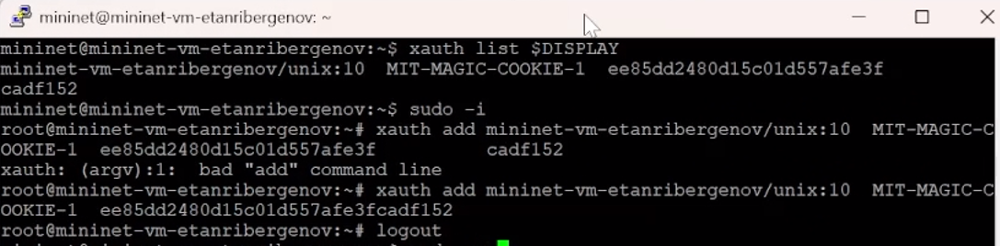{#fig:002}

1.4. Задал простейшую топологию, состоящую из двух хостов и коммутатора с назначенной по умолчанию mininet сетью 10.0.0.0/8:
После введения этой команды запустились терминалы двух хостов, коммутатора и контроллера. Терминалы коммутатора и контроллера закрыл.

{#fig:003}

1.5. На хостах h1 и h2 ввёл команду ifconfig, чтобы отобразить информацию, относящуюся к их сетевым интерфейсам и назначенным им IP-адресам.
В дальнейшем при работе с NETEM и командой tc будут использоваться интерфейсы h1-eth0 и h2-eth0.

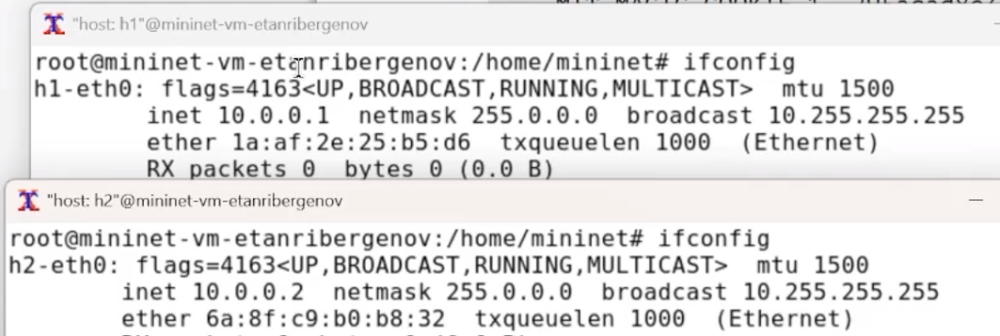{#fig:004}

1.6. Проверил подключение между хостами h1 и h2 с помощью команды ping с параметром -c 6.

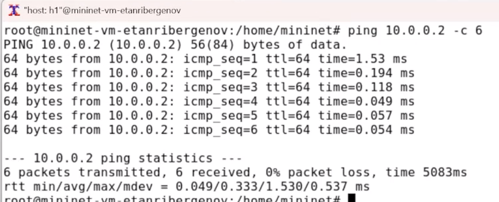{#fig:005}

1.7. Минимальное, среднее, максимальное и стандартное отклонение времени приёма-передачи (RTT)  =  0.049 / 0.333 / 1.530 / 0.537.
 Потерь пакетов нет.


**2. Интерактивные эксперименты**


2.1. Добавление потери пакетов на интерфейс, подключённый к эмулируемой глобальной сети
Пакеты могут быть потеряны в процессе передачи из-за таких факторов, как битовые ошибки и перегрузка сети. Скорость потери данных часто измеряется
как процентная доля потерянных пакетов по отношению к количеству отправленных пакетов.

2.1.1. На хосте h1 добавил 10% потерь пакетов к интерфейсу h1-eth0:

{#fig:006}

Здесь:
– sudo: выполнить команду с более высокими привилегиями;
– tc: вызвать управление трафиком Linux;
– qdisc: изменить дисциплину очередей сетевого планировщика;
– add: создать новое правило;
– dev h1-eth0: указать интерфейс, на котором будет применяться правило;
– netem: использовать эмулятор сети;
– loss 10%: 10% потерь пакетов.

2.1.2. Проверил, что на соединении от хоста h1 к хосту h2 имеются потери пакетов, используя команду ping с параметром -c 100 с хоста h1. Параметр -c
указывает общее количество пакетов для отправки. Обратите внимание на значения icmp_seq. Некоторые номера последовательности отсутствуют изза потери пакетов.
В сводном отчёте ping сообщает о проценте потерянных пакетов после завершения передачи.

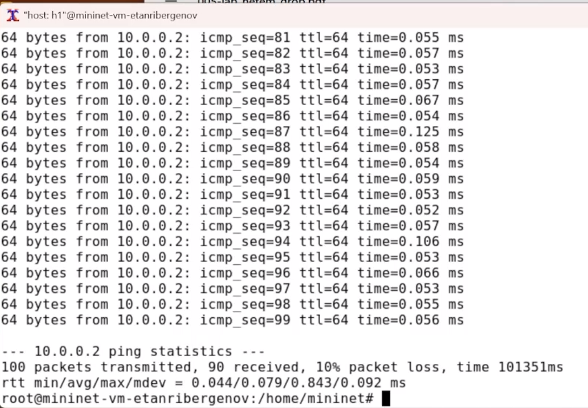{#fig:007}


2.1.3. Для эмуляции глобальной сети с потерей пакетов в обоих направлениях необходимо к соответствующему интерфейсу на хосте h2 также добавить 10% потерь пакетов:

{#fig:008}


2.1.4. Проверил, что соединение между хостом h1 и хостом h2 имеет больший процент потерянных данных (10% от хоста h1 к хосту h2 и 10% от хоста h2 к хосту
h1), повторив команду ping с параметром -c 100 на терминале хоста h1.

{#fig:009}

Доля потерянных пакетов среди всех отправленных - 25%. Отсутствуют разные значения icmp_seq, например: 80, 84, ...


2.1.5. Восстановил конфигурацию по умолчанию, удалив все правила, применённые к сетевому планировщику соответствующего интерфейса. 

Для отправителя h1:

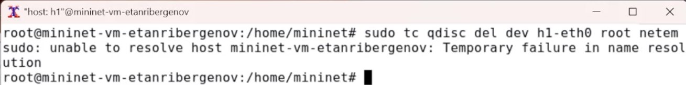{#fig:010}

Для получателя h2:

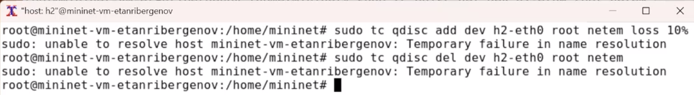{#fig:011}


2.1.6. Убедился, что соединение от хоста h1 к хосту h2 не имеет явной потери пакетов, запустив команду ping с терминала хоста h1 и затем нажав Ctrl + c , чтобы остановить тест.

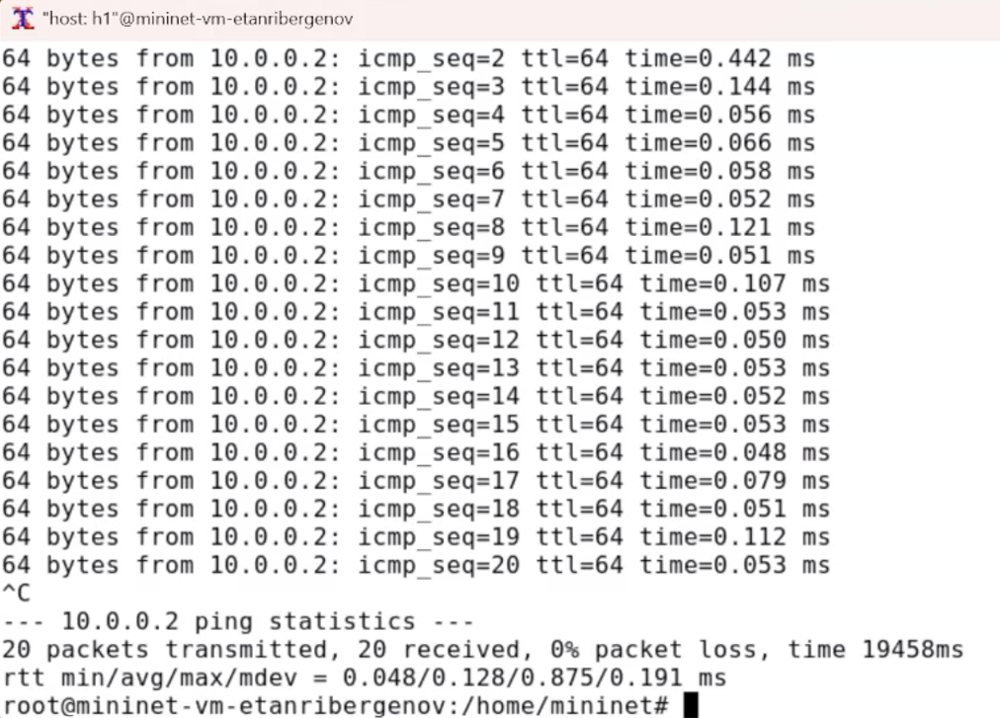{#fig:012}


2.2. Добавление значения корреляции для потери пакетов в эмулируемой глобальной сети

2.2.1. Добавил на интерфейсе узла h1 коэффициент потери пакетов 50% (такой высокий уровень потери пакетов маловероятен), и каждая последующая вероятность зависит на 50% от последней:

{#fig:013}


2.2.2. Проверил, что на соединении от хоста h1 к хосту h2 имеются потери пакетов,
используя команду ping с параметром -c 50 с хоста h1. Процент потери пакетов - 48%.

{#fig:014}


2.2.3. Восстановил для узла h1 конфигурацию по умолчанию, удалив все правила, применённые к сетевому планировщику соответствующего интерфейса:

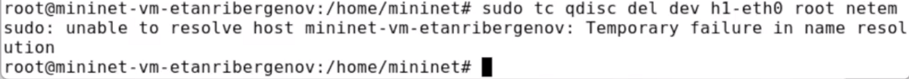{#fig:015}


2.3. Добавление повреждения пакетов в эмулируемой глобальной сети

2.2.2. Добавил на интерфейсе узла h1 0,01% повреждения пакетов:

{#fig:016}


2.2.3. Проверьте конфигурацию с помощью инструмента iPerf3 для проверки повторных передач. Для этого:

– запустил iPerf3 в режиме сервера в терминале хоста h2:

{#fig:017}

– запустил iPerf3 в клиентском режиме в терминале хоста h1:

{#fig:018}


– Общее количество повторно переданных пакетов - 51.
– Для остановки сервера iPerf3 нажал Ctrl + c в терминале хоста h2.

2.2.4. Восстановил для узла h1 конфигурацию по умолчанию, удалив все правила, применённые к сетевому планировщику соответствующего интерфейса.

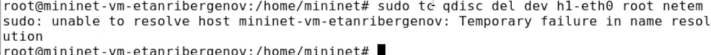{#fig:019}


2.4. Добавление переупорядочивания пакетов в интерфейс подключения к эмулируемой глобальной сети

2.4.2. Добавил на интерфейсе узла h1 следующее правило:

``` sudo tc qdisc add dev h1-eth0 root netem delay 10ms reorder 25% 50% ```

Здесь 25% пакетов (со значением корреляции 50%) будут отправлены немедленно, а остальные 75% будут задержаны на 10 мс.


{#fig:020}


2.4.3. Проверил, что на соединении от хоста h1 к хосту h2 имеются потери пакетов, используя команду ping с параметром -c 20 с хоста h1. Убедился, что часть
пакетов не будут иметь задержки (один из четырех, или 25%), а последующие несколько пакетов будут иметь задержку около 10 миллисекунд (три из четырех, или 75%).

{#fig:021}

2.4.4. Восстановил конфигурацию интерфейса по умолчанию на узле h1.

{#fig:022}


2.5. Добавление дублирования пакетов в интерфейс подключения к эмулируемой глобальной сети

2.5.2. Для интерфейса узла h1 задал правило c дублированием 50% пакетов (т.е. 50% пакетов должны быть получены дважды):

{#fig:023}

2.5.3. Проверил, что на соединении от хоста h1 к хосту h2 имеются дублированные
пакеты, используя команду ping с параметром -c 20 с хоста h1. Дубликаты
пакетов помечаются как DUP!. Измеренная скорость дублирования пакетов
будет приближаться к настроенной скорости по мере выполнения большего
количества попыток.

{#fig:024}

2.5.4. Восстановил конфигурацию интерфейса по умолчанию на узле h1.


**3. Воспроизведение экспериментов**


3.1. Предварительная подготовка

3.1.1. Для каждого воспроизводимого эксперимента expname создал свой каталог, в котором будут размещаться файлы эксперимента:

{#fig:025}


3.2. Добавление потери пакетов на интерфейс, подключённый к эмулируемой глобальной сети.

С помощью API Mininet воспроизведите эксперимент по добавлению потери пакетов для интерфейса хоста, подключающегося к эмулируемой глобальной сети.

3.2.1 В виртуальной среде mininet в своём рабочем каталоге с проектами создал каталог simple-drop и перешёл в него:

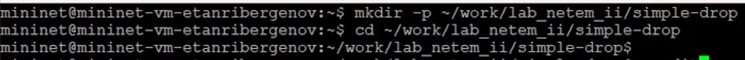{#fig:026}


3.2.2. Создал скрипт для эксперимента lab_netem_ii.py:

{#fig:027}


3.2.3. В строке ``` h1.cmdPrint( 'tc qdisc add dev h1-eth0 root netem loss 10%' ) ``` задаётся процент потери пакетов на интерфейсе узла h1. След. строка - для интерфейса узла h2.
3.2.4. Чтобы на экран выводилась информация о потерях пакетов я при помощи grep получил строку с этой информацией.

3.2.5. Создал Makefile для управления процессом проведения эксперимента:

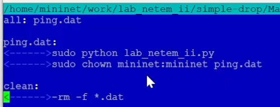{#fig:028}


3.2.6. Выполнил эксперимент:

{#fig:029}


3.2.7. Очистил каталог от результатов проведения экспериментов:

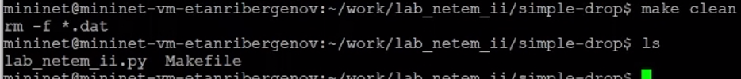{#fig:030}


3.3. Задание для самостоятельной работы

Самостоятельно реализуйте воспроизводимые эксперименты по исследованию параметров сети, связанных с потерей, изменением порядка и повреждением пакетов при передаче данных.

1.

{#fig:031}

{#fig:032}


2.

{#fig:033}

Здесь у меня возникла проблема: узлу h1 было отклонено подключение к серверу узла h2 по неизвестной мне причине.


3.

{#fig:034}

{#fig:035}

Здесь несколько пакетов передались с минимальной задержкой.


# Выводы

 В результате выполенения лабораторной работы я получил навыки проведения интерактивных экспериментов в среде Mininet по исследованию параметров сети,
связанных с потерей, дублированием, изменением порядка и повреждением пакетов при передаче данных. Эти параметры влияют на производительность протоколов и сетей.
