---
## Front matter
title: "Отчёт по лабораторной работе №6"
subtitle: "Дисциплина: Моделирование сетей передачи данных"
author: "Выполнил: Танрибергенов Эльдар (НПИбд-01-22)"

## Generic otions
lang: ru-RU
toc-title: "Содержание"

## Bibliography
bibliography: bib/cite.bib
csl: pandoc/csl/gost-r-7-0-5-2008-numeric.csl

## Pdf output format
toc: true # Table of contents
toc-depth: 2
lof: true # List of figures
lot: true # List of tables
fontsize: 12pt
linestretch: 1.5
papersize: a4
documentclass: scrreprt
## I18n polyglossia
polyglossia-lang:
  name: russian
  options:
	- spelling=modern
	- babelshorthands=true
polyglossia-otherlangs:
  name: english
## I18n babel
babel-lang: russian
babel-otherlangs: english
## Fonts
mainfont: IBM Plex Serif
romanfont: IBM Plex Serif
sansfont: IBM Plex Sans
monofont: IBM Plex Mono
mathfont: STIX Two Math
mainfontoptions: Ligatures=Common,Ligatures=TeX,Scale=0.94
romanfontoptions: Ligatures=Common,Ligatures=TeX,Scale=0.94
sansfontoptions: Ligatures=Common,Ligatures=TeX,Scale=MatchLowercase,Scale=0.94
monofontoptions: Scale=MatchLowercase,Scale=0.94,FakeStretch=0.9
mathfontoptions:
## Biblatex
biblatex: true
biblio-style: "gost-numeric"
biblatexoptions:
  - parentracker=true
  - backend=biber
  - hyperref=auto
  - language=auto
  - autolang=other*
  - citestyle=gost-numeric
## Pandoc-crossref LaTeX customization
figureTitle: "Рис."
tableTitle: "Таблица"
listingTitle: "Листинг"
lofTitle: "Список иллюстраций"
lotTitle: "Список таблиц"
lolTitle: "Листинги"
## Misc options
indent: true
header-includes:
  - \usepackage{indentfirst}
  - \usepackage{float} # keep figures where there are in the text
  - \floatplacement{figure}{H} # keep figures where there are in the text
---

# Цель работы

- Основной целью работы является знакомство с принципами работы дисциплины очереди Token Bucket Filter, которая формирует входящий/исходящий трафик для ограничения пропускной способности, а также получение навыков
моделирования и исследования поведения трафика посредством проведения интерактивного и воспроизводимого экспериментов в Mininet.


# Теоретическое введение

Token Bucket Filter (TBF) представляет собой алгоритм, используемый в сетях
с коммутацией пакетов для ограничения пропускной способности и пиковой
нагрузки трафика. Передача поступающих в очередь системы (queque)
пакетов данных осуществляется при наличии в специальном буфере (bucket)
необходимого числа разрешений на передачу (или токенов). Токены могут быть
представлены в виде пакетов или числа байтов, поступающих в буфер (корзину)
фиксированного размера с фиксированной скоростью.
Максимальная средняя скорость отправки потока данных из очереди системы
зависит от скорости прибытия в специализированный буфер разрешений на
передачу 𝑁 единиц данных. Очередной пакет может быть отправлен только
при получении числа разрешений, достаточного для передачи данных, объём
которых больше или равен размеру пакета. Если разрешений на передачу достаточно, то необходимое число токенов удаляется из специализированного
буфера, а пакет данных отправляется. Если пакет поступит в очередь системы
и не будет располагать необходимым количеством разрешений, то токены не
удаляются из специализированного буфера, а сам пакет данных может быть отброшен, поставлен в очередь или передан, но помечен как несоответствующий условиям передачи.
Дисциплина TBF реализована в виде буфера (queue), постоянно заполняющегося токенами с заданной скоростью. Наиболее важным параметром буфера
является его размер, определяющий количество хранимых токенов
Если данные прибывают со скоростью, равной скорости входящих токенов, то
каждый пакет имеет соответствующий токен и проходит очередь без задержки.
Если данные прибывают со скоростью, меньшей скорости поступления токенов,
то лишь часть существующих токенов будет уничтожаться, поэтому они станут
накапливаться до размера специализированного буфера. Далее накопленные
токены могут использоваться при всплесках, для передачи данных со скоростью, превышающей скорость пребывающих токенов.
Если данные прибывают быстрее, чем токены,то в буфере со временем не останется токенов, что заставит дисциплину приостановить передачу данных. Эта
ситуация называется «превышением». Если пакеты продолжают поступать, то
токены начинают уничтожаться. Данная ситуация позволяет административно ограничивать доступную полосу пропускания.
Накопленные токены позволяют пропускать короткие всплески, но при продолжительном превышении пакеты будут задерживаться, а в крайнем случае — уничтожаться.
Алгоритм TBF обладает свойством взрывоопасности (burstiness), когда корзина полностью заполнена (т.е. никакие пакеты не потребляют токены) и новые
пакеты будут потреблять токены сразу, без ограничений. Всплеск определяется
как количество токенов, которые могут поместиться в корзину, или как размер
(ёмкость) корзины. Для обеспечения ограничения и контроля над всплесками
при поступлении пакетов формируется ещё одна корзина, с размером, равным
максимально передаваемому элементу данных (Maximum Transmission Unit, MTU). Скорость обработки этого буфера намного превышает исходную (peak rate — пиковая скорость).

Основной синтаксис tbf, используемый с tc в Linux:

``` tc qdisc [add | ...] dev [dev_id] root tbf limit [BYTES] burst [BYTES] rate [BPS] [mtu BYTES] [ peakrate BPS ] [latency TIME ] ```

Здесь:
– tc: инструмент управления трафиком Linux;
– qdisc: дисциплина очереди (qdisc), представляющая собой набор правил,
определяющих порядок, в котором обслуживаются пакеты, поступающие
с выходных данных IP-протокола;
– [add | del | replace | change | show]: операция над qdisc;
– dev [dev_id]: задаёт интерфейс;
– tbf: указывает, что используется алгоритм Token Bucket Filter;
– limit [BYTES]: размер очереди пакетов в байтах;
– burst [BYTES]: количество байтов, которое может поместиться в корзину;
– rate [BPS]: скорость передачи данных, определяемая частотой, с которой токены добавляются в корзину;
– mtu [BYTES]: максимальная единица передачи в байтах;
– peakrate [BPS] (пиковая скорость [бит/с]): максимальная скорость передачи пакета;
– latency [TIME]: максимальное время ожидания пакета в очереди.


# Выполнение лабораторной работы

**1. Запуск лабораторной топологии**

1.1. Запустил виртуальную среду с mininet.
1.2. Из основной ОС подключился к виртуальной машине.

1.3. В виртуальной машине mininet исправил права запуска X-соединения. Скопировал значение куки (MIT magic cookie) своего пользователя mininet в файл для пользователя root. 
После выполнения этих действий графические приложения должны запускаться под пользователем mininet.

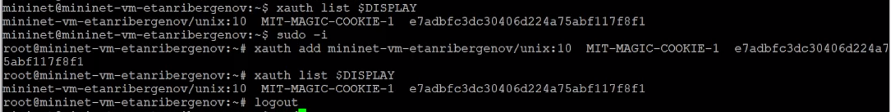{#fig:001}


1.4. Задал топологию сети, состоящую из двух хостов и двух коммутаторов с назначенной по умолчанию mininet сетью 10.0.0.0/8:

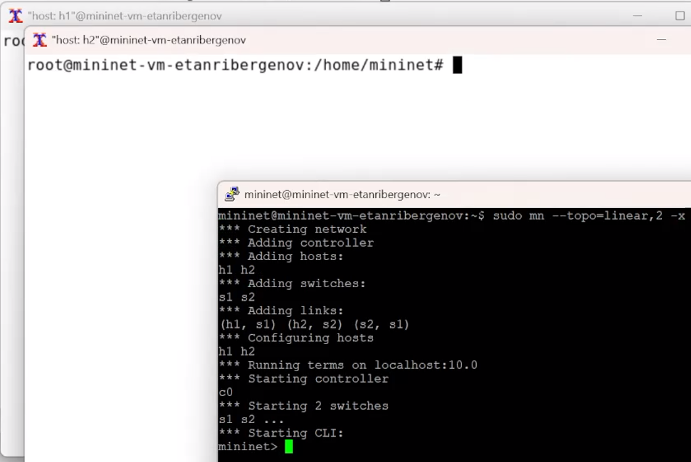{#fig:002}

После введения этой команды запустились терминалы двух хостов, двух коммутаторов и контроллера.


1.5. На хостах h1, h2 и на коммутаторах s1, s2 ввёл команду ifconfig, чтобы отобразить информацию, относящуюся к их сетевым интерфейсам и назначенным им IP-адресам. В дальнейшем при работе с NETEM и командой tc
будут использоваться интерфейсы h1-eth0, h2-eth0, s1-eth2.

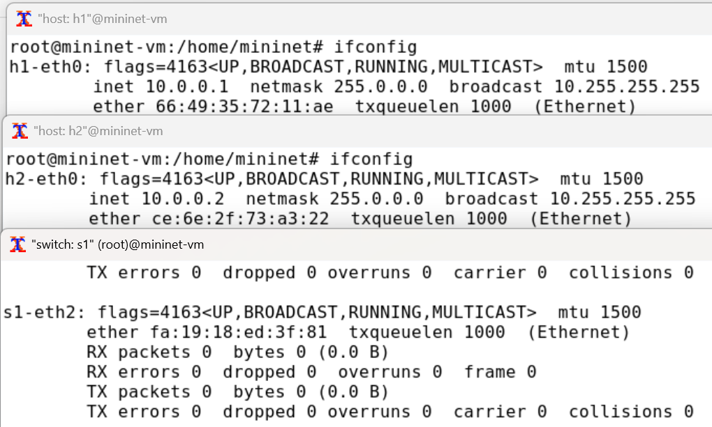{#fig:003}


1.6. Проверил подключение между хостами h1 и h2 с помощью команды ping с параметром -c 4.

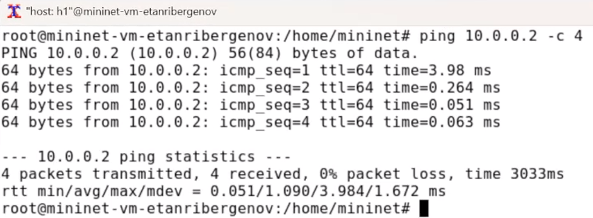{#fig:004}


1.7. В терминале хоста h2 запустил iPerf3 в режиме сервера:

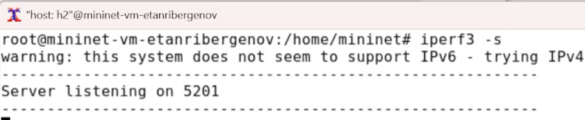{#fig:005}


1.8. В терминале хоста h1 запустил iPerf3 в режиме клиента:

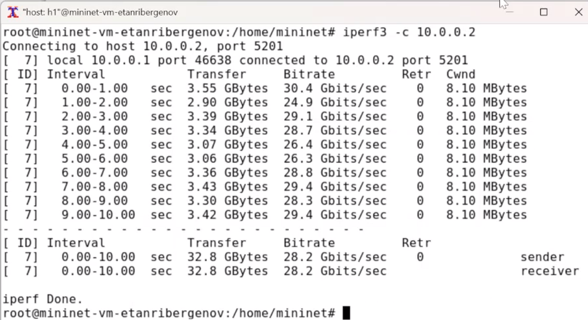{#fig:006}


1.9. После завершения работы iPerf3 на хосте h1 остановил iPerf3 на хосте h2, нажав Ctrl + c. Скорость передачи данных высокая: в среднем 29 Гбит/с.


**2. Интерактивные эксперименты.**

2.1. Ограничение скорости на конечных хостах.

Команду tc можно применить к сетевому интерфейсу устройства для формирования исходящего трафика. Требуется ограничить скорость отправки данных с конечного хоста с помощью фильтра Token Bucket Filter (tbf).

2.1.1. Изменил пропускную способность хоста h1, установив пропускную способность на 10 Гбит/с на интерфейсе h1-eth0 и параметры TBF-фильтра:

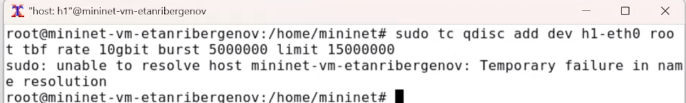{#fig:007}

Здесь:

– sudo: включить выполнение команды с более высокими привилегиями безопасности;
– tc: вызвать управление трафиком Linux;
– qdisc: изменить дисциплину очередей сетевого планировщика;
– add (добавить): создать новое правило;
– dev h1-eth0 root: интерфейс, на котором будет применяться правило;
– tbf: использовать алгоритм Token Bucket Filter;
– rate: указать скорость передачи (10 Гбит/с);
– burst: количество байтов, которое может поместиться в корзину (5 000 000);
– limit: размер очереди в байтах (15 000 000).


2.1.2. Фильтр tbf требует установки значения всплеска при ограничении скорости.
Это значение должно быть достаточно высоким, чтобы обеспечить установленную скорость. Она должна быть не ниже указанной частоты, делённой на HZ, где HZ — тактовая частота, настроенная как параметр ядра, и может быть
извлечена с помощью следующей команды:

``` egrep '^CONFIG_HZ_[0-9]+' /boot/config-`uname -r` ```

Для расчёта значения всплеска (burst) необходимо скорость передачи (10 Гбит/с или 10 Gbps = 10,000,000,000 bps) разделить на полученное таким образом значение HZ (на хосте h1 HZ = 250):
Burst = 10,000,000,000/250 = 40,000,000 bits = 40,000,000/8 bytes = 5,000,000 bytes.

Для расчёта значения всплеска (burst) необходимо скорость передачи (10 Гбит/с или 10 Gbps = 10,000,000,000 bps) разделить на полученное таким образом значение HZ (на хосте h1 HZ = 250):
Burst = 10,000,000,000/250 = 40,000,000 bits = 40,000,000/8 bytes = 5,000,000 bytes.

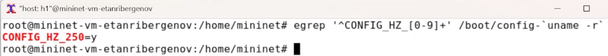{#fig:008}


2.1.3. С помощью iPerf3 проверил, что значение пропускной способности изменилось.

– В терминале хоста h2 запустил iPerf3 в режиме клиента:

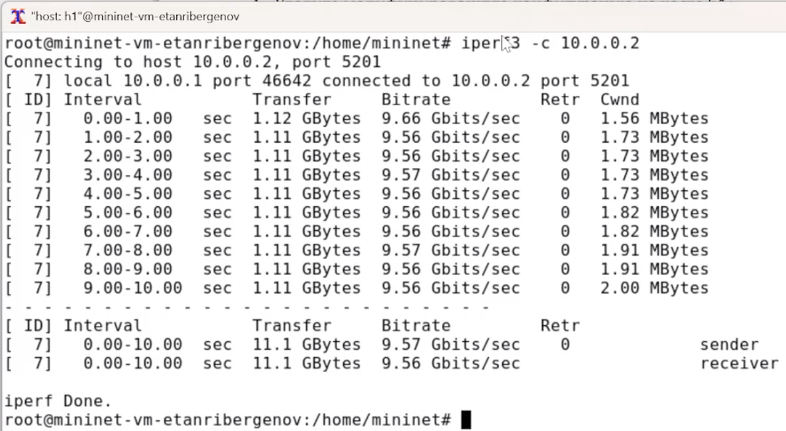{#fig:009}

– После завершения работы iPerf3 на хосте h1 остановил iPerf3 на хосте h2, нажав Ctrl + c. На этом этапе: пропускная способность - 10 Гбит/с, меньше ГБ данных в итоге передано за 10 сек., ниже значение размера окна (cwnd).

2.1.4. Удалил модифицированную конфигурацию на хосте h1:

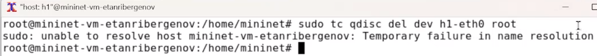{#fig:010}


**2.2. Ограничение скорости на коммутаторах.**


При ограничении скорости на интерфейсе s1-eth2 коммутатора s1 все сеансы связи между коммутатором s1 и коммутатором s2 будут фильтроваться в соответствии с применяемыми правилами.

2.2.1. Применил правило ограничения скорости tbf с параметрами rate = 10gbit, burst = 5,000,000, limit= 15,000,000 к интерфейсу s1-eth2 коммутатора s1, который соединяет его с коммутатором s2:

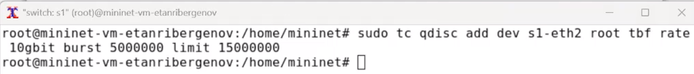{#fig:011}

2.2.2. Проверил конфигурацию с помощью инструмента iperf3 для измерения пропускной способности.

– В терминале хоста h2 запустил iPerf3 в режиме сервера.
– В терминале хоста h1 запустил iPerf3 в режиме клиента:

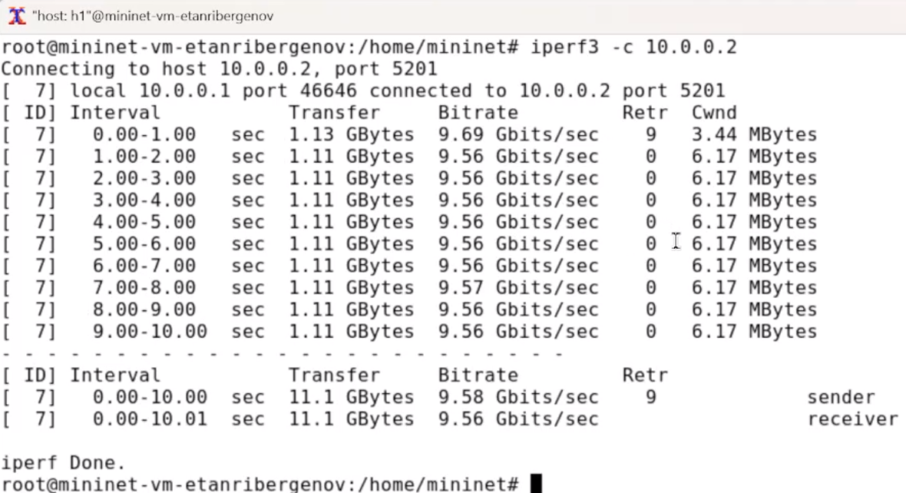{#fig:012}

– После завершения работы iPerf3 на хосте h1 остановил iPerf3 на хосте h2, нажав Ctrl + c. На этом этапе: всё также, как в предыдущем эксперименте, но появились повторно отправленные пакеты.

2.2.3. Удалил модифицированную конфигурацию на коммутаторе s1:

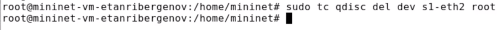{#fig:013}


**2.3. Объединение NETEM и TBF.**

NETEM используется для изменения задержки, джиттера, повреждения пакетов и т.д. TBF может использоваться для ограничения скорости. Утилита tc позволяет комбинировать несколько модулей. При этом первая дисциплина
очереди (qdisc1) присоединяется к корневой метке, последующие дисциплины очереди можно прикрепить к своим родителям, указав правильную метку.

2.3.1. Объединил NETEM и TBF, введя на интерфейсе s1-eth2 коммутатора s1 задержку, джиттер, повреждение пакетов и указав скорость:

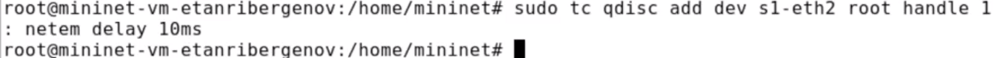{#fig:014}

Здесь ключевое слово handle задаёт дескриптор подключения, имеющий смысл очерёдности подключения разных дисциплин qdisc.


2.3.2. Убедился, что соединение от хоста h1 к хосту h2 имеет заданную задержку. Для этого запустите команду ping с параметром -c 4 с терминала хоста h1:

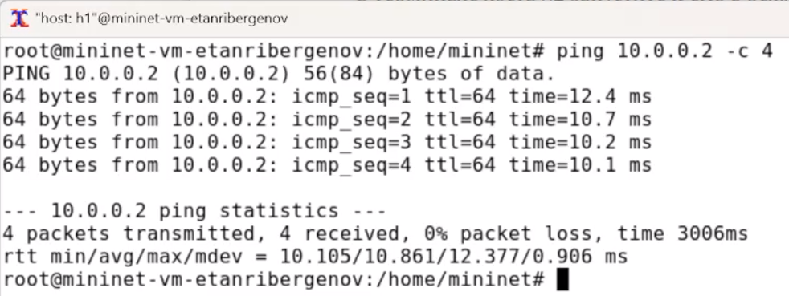{#fig:015}


2.3.3. Добавил второе правило на коммутаторе s1, которое задаёт ограничение скорости с помощью tbf с параметрами rate=2gbit, burst=1,000,000, limit=2,000,000:

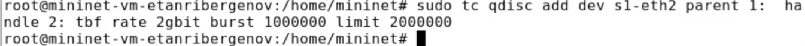{#fig:016}


2.3.4. Проверил конфигурацию с помощью инструмента iperf3 для измерения пропускной способности.

– В терминале хоста h2 запустил iPerf3 в режиме сервера.
– В терминале хоста h2 запустил iPerf3 в режиме клиента:

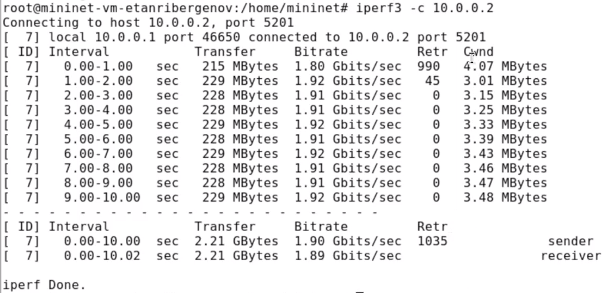{#fig:017}


– После завершения работы iPerf3 на хосте h1 остановил iPerf3 на хосте h2, нажав Ctrl + c. Пропускная способность указанная - 2 Гбит/с.

2.3.5. Удалил модифицированную конфигурацию на коммутаторе s1:

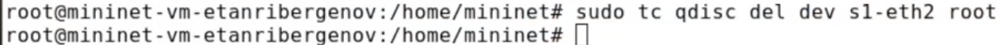{#fig:018}


**3. Воспроизводимые эксперименты.**

Провёл те же самые эксперименты, что были ранее, но при помощи скриптов (работа с API Mininet). И построил графики.

3.1.

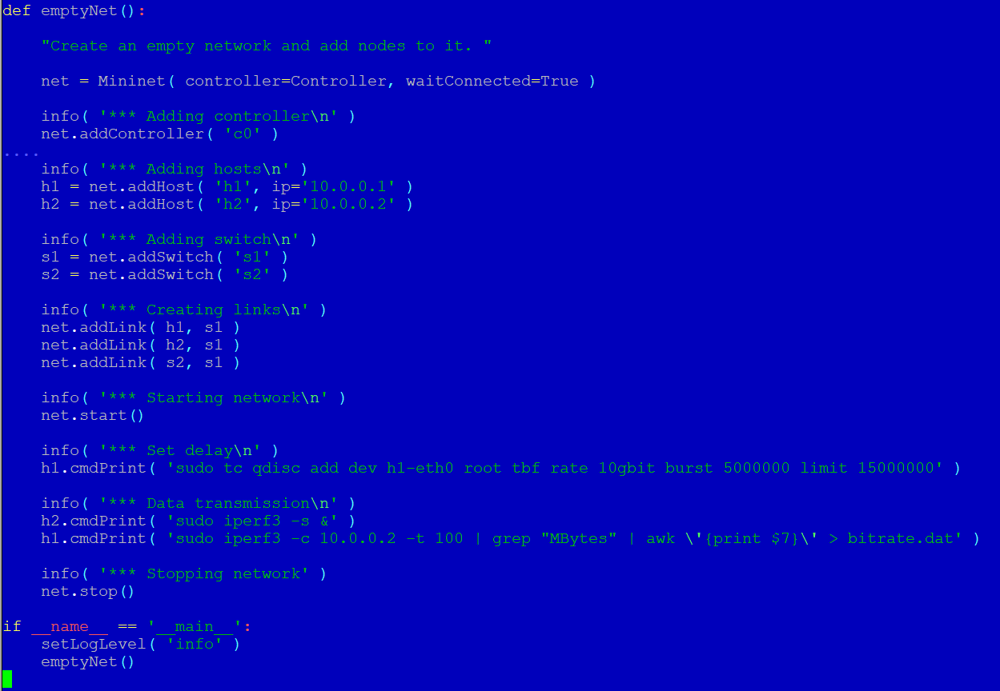{#fig:019}

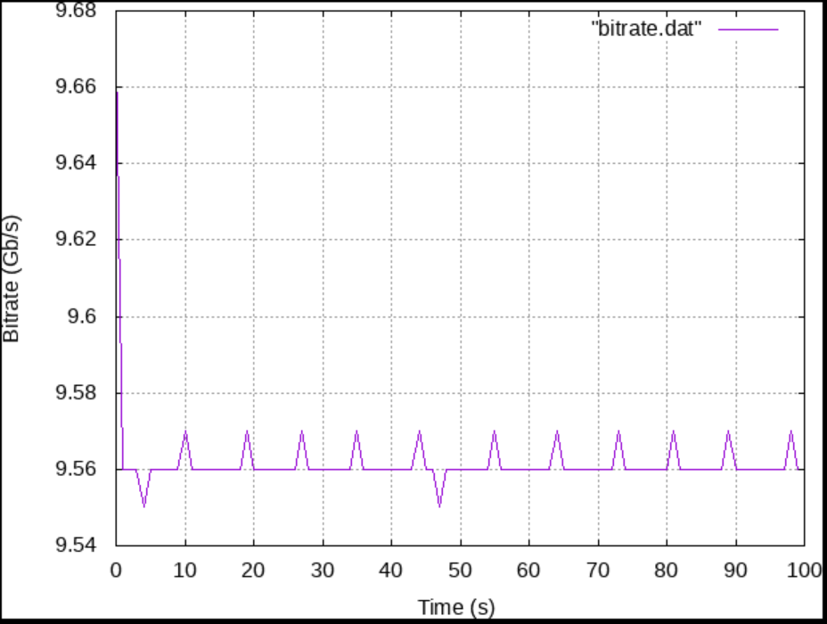{#fig:020}


3.2.

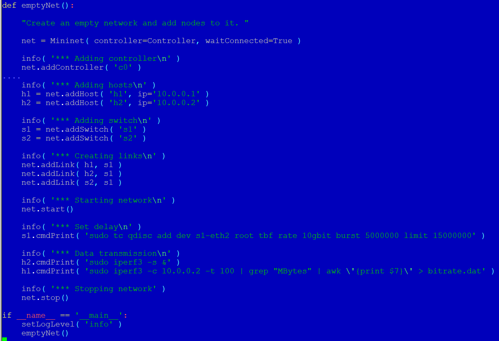{#fig:021}

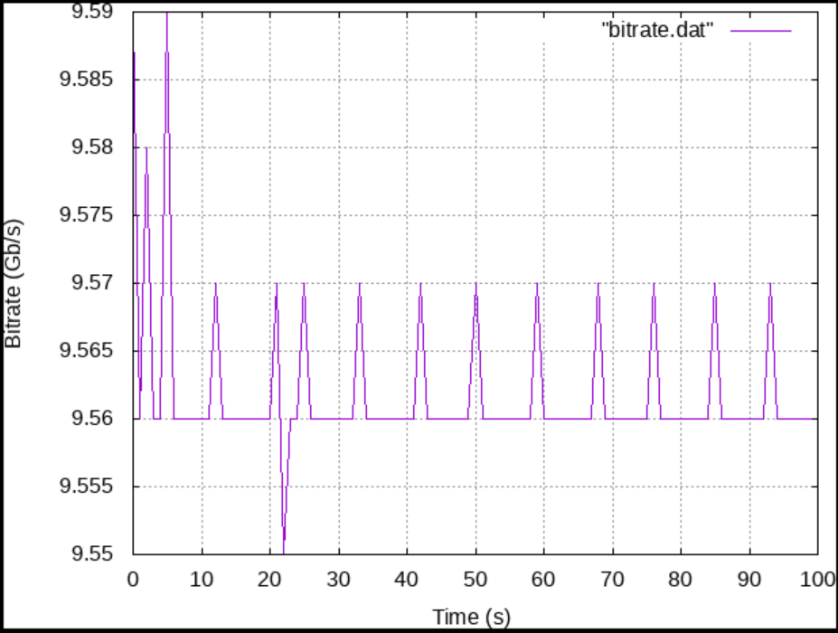{#fig:022}


3.3.

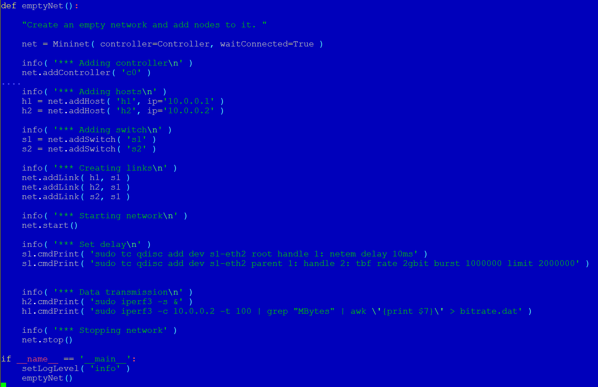{#fig:023}

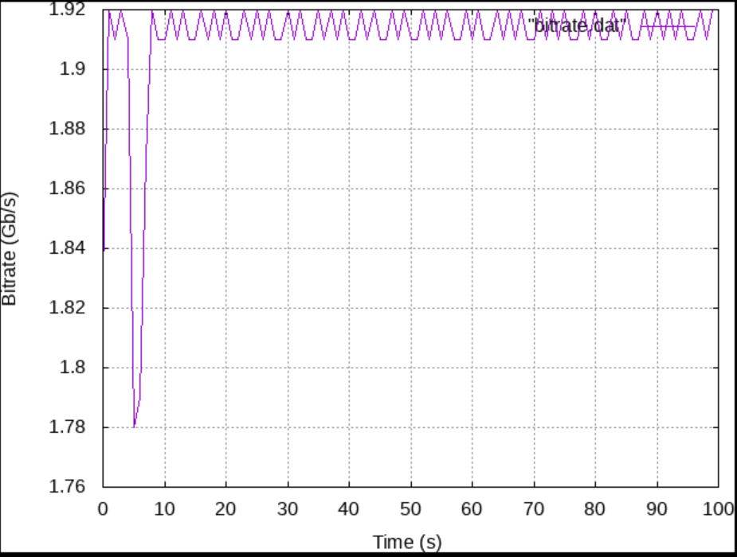{#fig:024}


# Выводы

 В результате выполенения лабораторной работы я ознакомился с принципами работы дисциплины очереди Token Bucket Filter, которая формирует входящий/исходящий трафик для ограничения пропускной способности, а также получмл навыки
моделирования и исследования поведения трафика посредством проведения интерактивного и воспроизводимого экспериментов в Mininet.

